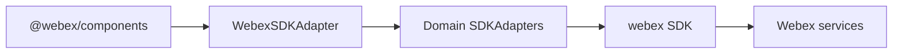
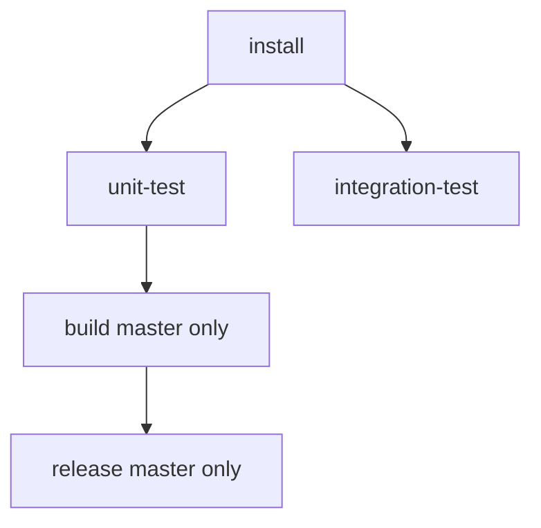

<!-- ───────────────────────────────
  Template:     ARCHITECTURE
  Template-ID:  architecture
  Generates:    ai-docs/ARCHITECTURE.md
  Library ver:  0.2.1
  Last updated: 2026-08-05
─────────────────────────────── -->

# ARCHITECTURE — @webex/sdk-component-adapter

> Entry: [`AGENTS.md`](../AGENTS.md) · Router: [`SPEC_INDEX.md`](SPEC_INDEX.md)

## Design Overview

This repository is a **single-package JavaScript adapter library**. It sits between `@webex/components` (React UI) and the Webex JS SDK (`webex` peer). Each domain adapter implements an interface from `@webex/component-adapter-interfaces` and translates SDK objects/events into adapter-shaped models exposed as **RxJS observables**.

The facade `WebexSDKAdapter` constructs all domain adapters from one authenticated SDK instance and orchestrates **connect/disconnect** (device registration, Mercury websocket, meetings plugin). Domain logic stays in per-resource adapters; shared caching and logging live in `src/cache.js` and `src/logger.js`.

Design rationale: keep UI frameworks decoupled from SDK details; let components subscribe to stable observable contracts while SDK versions evolve behind adapter mapping code.

## Component Inventory & Responsibilities

| Component | Responsibility | Docs |
|---|---|---|
| `src/WebexSDKAdapter.js` | Facade: sub-adapter wiring, connect/disconnect | `src/ai-docs/webex-sdk-adapter-spec.md` |
| `src/MeetingsSDKAdapter.js` | Meetings, media, controls | `src/ai-docs/meetings-sdk-adapter-spec.md` |
| `src/ActivitiesSDKAdapter.js` | Activities feed and posting | `src/ai-docs/activities-sdk-adapter-spec.md` |
| `src/PeopleSDKAdapter.js` | People search and presence | `src/ai-docs/people-sdk-adapter-spec.md` |
| `src/RoomsSDKAdapter.js` | Rooms and activity streams | `src/ai-docs/rooms-sdk-adapter-spec.md` |
| `src/MembershipsSDKAdapter.js` | Room/meeting membership | `src/ai-docs/memberships-sdk-adapter-spec.md` |
| `src/OrganizationsSDKAdapter.js` | Organization lookup | `src/ai-docs/organizations-sdk-adapter-spec.md` |
| `src/MetricsSDKAdapter.js` | Client metrics submission | `src/ai-docs/metrics-sdk-adapter-spec.md` |
| `src/cache.js`, `logger.js`, `utils.js`, `polyfills.js` | Shared utilities | `src/ai-docs/shared-utilities-spec.md` |

## Component Interaction

Narrative: Host constructs `WebexSDKAdapter(sdk)` with an authenticated SDK. Host calls `connect()` on the facade, which registers the device, opens Mercury, and connects the meetings adapter. UI code typically accesses `adapter.roomsAdapter`, `adapter.meetingsAdapter`, etc., and subscribes to observables returned by public methods.

## Execution & Flow

**Init & call flow (library):**

1. Host creates authenticated `webex` instance.
2. Host `new WebexSDKAdapter(webex)` — constructs domain adapters.
3. Host `await adapter.connect()` — device.register → mercury.connect → meetingsAdapter.connect.
4. Host subscribes to observables (e.g. `roomsAdapter.getRoom(id)`).
5. Host `await adapter.disconnect()` on teardown.

Evidence: `src/WebexSDKAdapter.js`, `src/index.js`.

## Dependencies

| Dependency | Type | How used | Failure / version handling |
|---|---|---|---|
| `webex` | peer | All SDK calls | Peer `^2.60.4`; host must supply compatible SDK |
| `rxjs` | peer | Observables, operators | Peer `^6.5.4`; external in bundle |
| `@webex/component-adapter-interfaces` | dependency | Adapter base classes | Pinned in package.json |
| `@webex/common` | dependency | Shared helpers | External in Rollup |
| Webex REST / Mercury | external | Via SDK | Network errors propagate or map to observable errors per adapter |

## Cross-Cutting Concerns

- **Security:** Access tokens live in host-provided SDK credentials — never logged by adapter (see `ai-docs/SECURITY.md`). `.env` for tests only.
- **Observability:** Structured debug logging via `src/logger.js` with category tags (ROOM, MEETING, etc.).

## Non-Functional Posture

**Footprint & compatibility:** Browser-targeted bundle (browserslist in package.json). UMD + ESM outputs; peers not bundled. Breaking public adapter interface changes require semver coordination with `@webex/components`.

## Dependency / Interaction Topology

| From | To | Kind | Purpose |
|---|---|---|---|
| WebexSDKAdapter | ActivitiesSDKAdapter | call | Delegate activities |
| WebexSDKAdapter | MeetingsSDKAdapter | call | Delegate meetings + connect hook |
| Domain adapters | webex SDK | call | Fetch/mutate cloud resources |
| RoomsSDKAdapter | Mercury (via SDK) | event | Real-time activity IDs |
| All adapters | cache.js | call | Dedupe SDK fetches |

## Object / Data Ownership

| Domain object | System-of-record | Read by |
|---|---|---|
| Room, Activity, Person | Webex cloud via SDK | Rooms/Activities/People adapters |
| Meeting state | SDK meetings plugin + adapter cache | Meetings adapter, controls |
| Cached SDK entities | In-memory `cache.js` | Activities, rooms adapters |

## Caching Catalog

| Cache | Backend | What it holds | TTL | Invalidation |
|---|---|---|---|---|
| `cache.js` singleton | In-memory Map | Conversations, activities | Session | Explicit remove; process restart |
| Per-ID ReplaySubjects | In-memory | Room/activity/person streams | Subscription lifetime | Adapter instance teardown |

## Observability Patterns

- Logger levels: error, warn, info, debug (`src/logger.js`).
- Log lines include domain tag + entity ID where applicable.
- Browser hook: `window.webexSDKAdapterSetLogLevel` for runtime level changes.

## Release & Versioning

- **semantic-release** on `master` branch (CircleCI `release` job).
- Published artifacts: npm package + GitHub release asset (ESM bundle).
- Version in `package.json`; changelog in `CHANGELOG.md` (reference only per keep-separate policy).

## CI Pipeline

Workflow `setup_test_release` (`.circleci/config.yml`):

- **install:** `npm install`, cache node_modules, persist workspace.
- **unit-test:** lint + Jest coverage (requires install).
- **integration-test:** Cypress (requires install, parallel with unit-test).
- **build:** `npm run build` → `dist/` (requires unit-test; **master only**).
- **release:** semantic-release (requires build; **master only**).

Evidence: `.circleci/config.yml`, `package.json`.

## Security Architecture

Trust boundary: host application supplies authenticated SDK. Adapter does not store long-lived secrets. See `ai-docs/SECURITY.md`.
