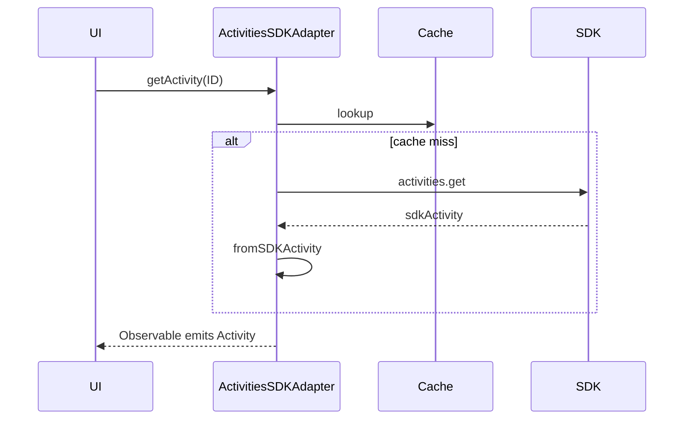
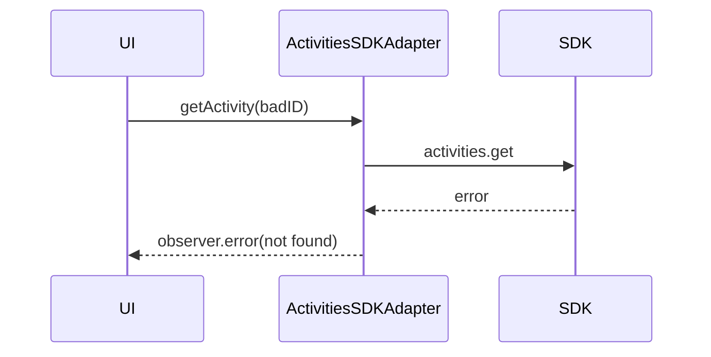

<!-- ───────────────────────────────
  Template:     Module Spec
  Template-ID:  module-spec
  Generates:    src/ai-docs/activities-sdk-adapter-spec.md
  Library ver:  0.2.1
  Last updated: 2026-08-05
─────────────────────────────── -->

# activities-sdk-adapter — SPEC

> [`AGENTS.md`](../../AGENTS.md) · [`SPEC_INDEX.md`](../../ai-docs/SPEC_INDEX.md)

## Metadata

| Field | Value |
|---|---|
| Module id | activities-sdk-adapter |
| Source path(s) | `src/ActivitiesSDKAdapter.js` |
| Doc kind | Module spec |
| Coverage score | 91% assessed 2026-08-05 |
| Generated from | `module-spec` @ SDLC template library `0.2.1` |
| generated_by / approved_by / updated_at | cursor-agent / pending PR approval / 2026-08-05 |
| Validation status | not-run |

## Evidence Rules

File path evidence only.

## Source Material Register

| Source material | Scope | Decision | Detail location |
|---|---|---|---|
| Code | behavior | verified | `src/ActivitiesSDKAdapter.js` |

## Overview

Maps Webex SDK activities to `@webex/component-adapter-interfaces` activity models. Caches per-ID observables and supports posting activities and attachment actions.

## Purpose / Responsibility

Owns activity fetch streams, postActivity, postAction, and adaptive card helpers.

## Stack

JavaScript, RxJS, Webex SDK activities API, shared cache.

## Folder / Package Structure

```
src/ActivitiesSDKAdapter.js
src/ActivitiesSDKAdapter.test.js
```

## Key Files (source of truth)

| File | Role |
|---|---|
| `src/ActivitiesSDKAdapter.js` | Implementation |
| `src/ActivitiesSDKAdapter.test.js` | Unit tests |

## Public Surface

| Symbol | Kind | Description |
|---|---|---|
| `ActivitiesSDKAdapter` | class | Activities adapter |
| `constructor(datasource)` | method | Init observable map |
| `getActivity(ID)` | method → Observable | Activity by ID |
| `postAction(activityID, inputs)` | method → Observable | Post attachment action |
| `postActivity(activity)` | method → Observable | Create activity |
| `hasAdaptiveCards(activity)` | method | Boolean |
| `getAdaptiveCard(activity, cardIndex)` | method | Card object |
| `fromSDKActivity(sdkActivity)` | named export | SDK → adapter mapper |

## Requires (dependencies)

| Dependency | Purpose |
|---|---|
| webex SDK | activities.create, fetch |
| `cache.js` | Activity/conversation cache |
| `logger.js` | Error logging |

## Requirements

| ID | WHAT | WHY | Evidence |
|---|---|---|---|
| R-A1 | getActivity returns shared ReplaySubject per ID | Avoid duplicate fetches | `src/ActivitiesSDKAdapter.js` |
| R-A2 | Fetch failure emits observable error with activity ID | Caller can show not-found UI | `src/ActivitiesSDKAdapter.js` |
| R-A3 | postActivity encrypts adaptive cards before create | SDK requires encrypted cards | `src/ActivitiesSDKAdapter.js` |

## Design Overview

Fetch-on-first-subscribe with cached ReplaySubject; posting uses RxJS from() + map + catchError.

## Data Flow

Subscriber → getActivity → fetchActivity (cache/SDK) → ReplaySubject.next → adapter-shaped Activity.

## Sequence Diagram(s)

**getActivity — fetch hit**



**getActivity — fetch failure**



## Class / Component Relationships

`ActivitiesSDKAdapter` extends `ActivitiesAdapter`; holds `activityObservables` map.

## Use Cases

| Actor | Steps | Outcome |
|---|---|---|
| Component | subscribe getActivity(id) | Renders activity |
| Component | postActivity(payload) | New activity in stream |

## Concurrency & Reactive Flow

ReplaySubject(1) multicasts; post flows complete after single emission.

## Error Handling & Failure Modes

| Failure | Behavior | Caller recovery |
|---|---|---|
| Invalid/missing activity ID on fetch | `activityObservables[ID].error(Error)` | Unsubscribe; show error state; retry with valid ID |
| postAction/postActivity SDK error | RxJS catchError rethrow | Host error handler on subscription |
| encryptCards failure | Promise rejection | Fix activity card payload |

Evidence: `src/ActivitiesSDKAdapter.js`, `src/ActivitiesSDKAdapter.test.js`

## Pitfalls

- Adaptive cards require conversation encryption key fetch first.
- Large card payloads may fail encryption — logged then rejected.

## Test-Case Strategy (module)

| Case | File |
|---|---|
| getActivity success | `ActivitiesSDKAdapter.test.js` |
| getActivity not found error | `ActivitiesSDKAdapter.test.js` |
| postActivity | `ActivitiesSDKAdapter.test.js` |

## Traceability

| Requirement | Test |
|---|---|
| R-A2 | `ActivitiesSDKAdapter.test.js` |
