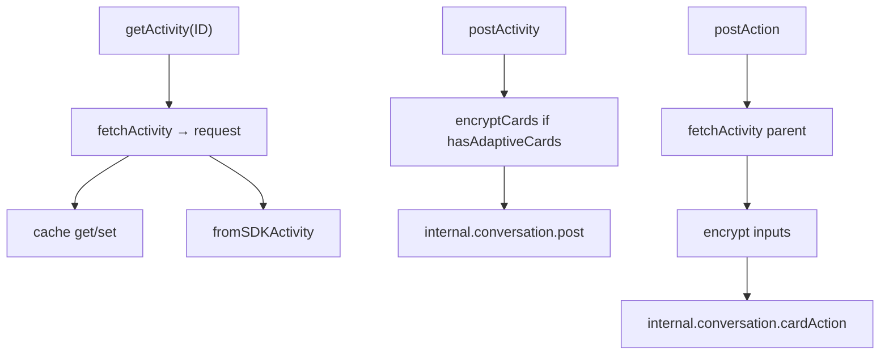
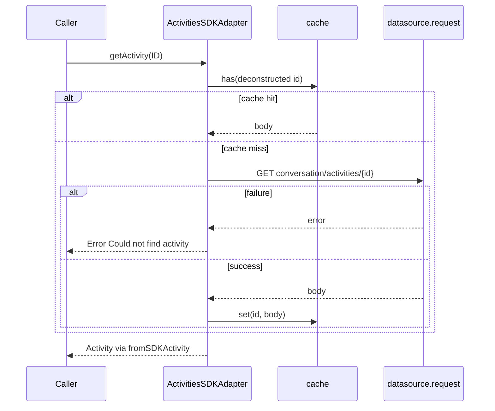
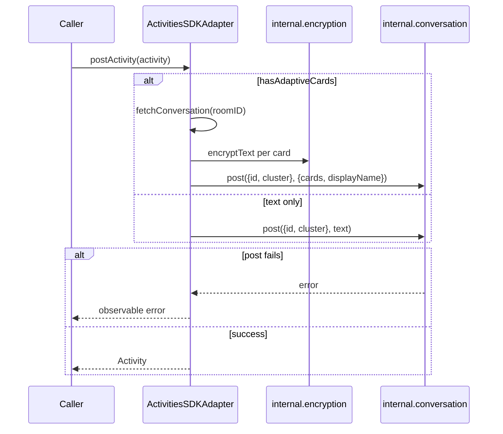
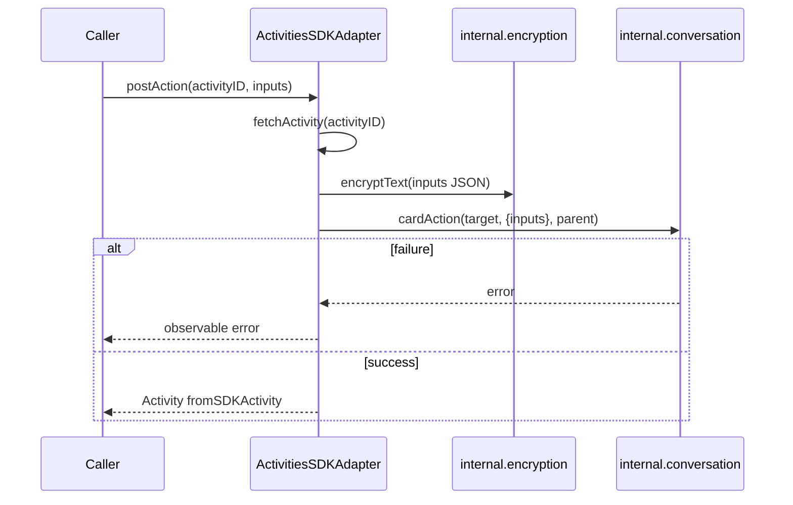
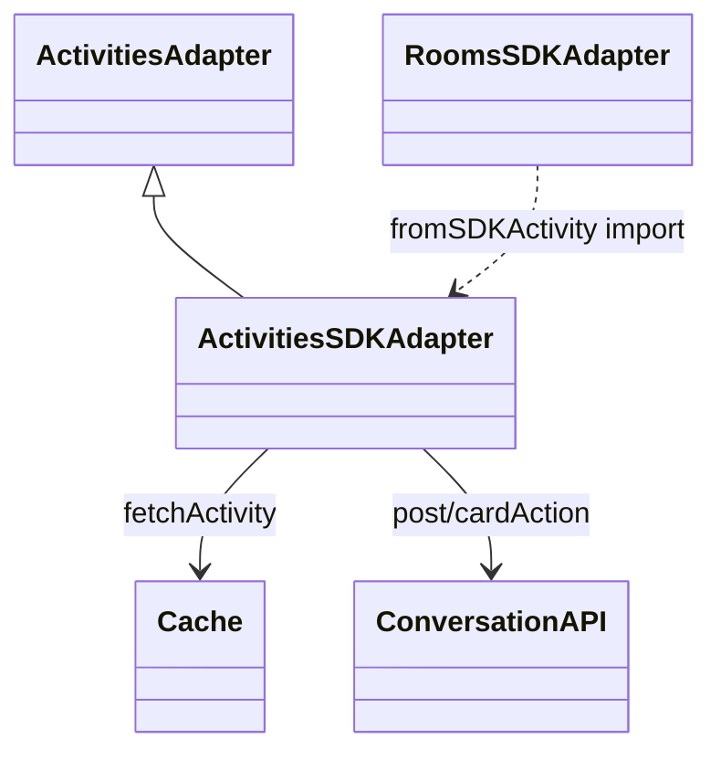

<!-- ───────────────────────────────
  Template:     Module Spec
  Template-ID:  module-spec
  Generates:    src/ai-docs/activities-sdk-adapter-spec.md
  Library ver:  0.2.1
  Last updated: 2026-08-05
─────────────────────────────── -->

# activities-sdk-adapter — SPEC

> [`AGENTS.md`](../../AGENTS.md) · [`SPEC_INDEX.md`](../../ai-docs/SPEC_INDEX.md) · [`ARCHITECTURE.md`](../../ai-docs/ARCHITECTURE.md)

## Metadata

| Field | Value |
|---|---|
| Module id | activities-sdk-adapter |
| Source path(s) | `src/ActivitiesSDKAdapter.js` |
| Doc kind | Module spec |
| Coverage score | 91% assessed 2026-08-05 — getActivity, postActivity, postAction, adaptive card helpers, and per-group sequences documented |
| Generated from | `module-spec` @ SDLC template library `0.2.1` |
| generated_by / approved_by / updated_at | cursor-agent / SDLC bootstrap PR #354 review / 2026-08-05 |
| Validation status | not-run |

## Evidence Rules

Every requirement cites concrete source evidence as `file path` only. Test evidence names `src/*.test.js` files.

## Source Material Register

| Source material | Scope | Decision | Detail location or disposition |
|---|---|---|---|
| Implementation | behavior | verified | Requirements, Error Handling, Sequence Diagram(s) |
| `@webex/component-adapter-interfaces` ActivitiesAdapter | contract | reference-only | Public Surface rows |

## Overview

`ActivitiesSDKAdapter` implements `ActivitiesAdapter`, fetching and posting conversation activities via the Webex SDK. It maps SDK activity payloads to adapter `Activity` objects, handles adaptive card encryption on post, and supports adaptive card submit actions via `postAction`.

## Purpose / Responsibility

Owns single-activity fetch (`getActivity`), activity post (`postActivity`), card action post (`postAction`), and adaptive card helper methods. Does **not** own room activity pagination or real-time room feeds (see `RoomsSDKAdapter`).

## Stack

JavaScript, RxJS 6, Webex SDK `request`, `internal.conversation`, `internal.encryption`, shared `cache` module.

## Folder / Package Structure

```
src/
├── ActivitiesSDKAdapter.js
├── ActivitiesSDKAdapter.test.js
└── ai-docs/
```

## Key Files (source of truth)

| File | Holds |
|---|---|
| `src/ActivitiesSDKAdapter.js` | getActivity, postActivity, postAction, fromSDKActivity |
| `src/ActivitiesSDKAdapter.test.js` | Unit tests |

## Public Surface

| Contract ID | Type | Surface | Purpose | Compatibility / deprecation | Schema / detail link | Root index |
|---|---|---|---|---|---|---|
| activities-adapter.class | SDK class | `ActivitiesSDKAdapter extends ActivitiesAdapter` | Domain adapter entry | stable | `src/ActivitiesSDKAdapter.js` | [`CONTRACTS.md`](../../ai-docs/CONTRACTS.md) |
| activities-adapter.getActivity | SDK method | `getActivity(ID: string): Observable<Activity>` | Fetch activity by Hydra message ID | stable | `src/ActivitiesSDKAdapter.js` | [`CONTRACTS.md`](../../ai-docs/CONTRACTS.md) |
| activities-adapter.postActivity | SDK method | `postActivity(activity: Activity): Observable<Activity>` | Post text or encrypted adaptive cards | stable | `src/ActivitiesSDKAdapter.js` | [`CONTRACTS.md`](../../ai-docs/CONTRACTS.md) |
| activities-adapter.postAction | SDK method | `postAction(activityID: string, inputs: object): Observable<Activity>` | Submit adaptive card action | stable | `src/ActivitiesSDKAdapter.js` | [`CONTRACTS.md`](../../ai-docs/CONTRACTS.md) |
| activities-adapter.hasAdaptiveCards | SDK method | `hasAdaptiveCards(activity: Activity): boolean` | True when `activity.cards.length > 0` | stable | `src/ActivitiesSDKAdapter.js` | [`CONTRACTS.md`](../../ai-docs/CONTRACTS.md) |
| activities-adapter.getAdaptiveCard | SDK method | `getAdaptiveCard(activity: Activity, cardIndex: number): object \| undefined` | Read card payload by index | stable | `src/ActivitiesSDKAdapter.js` | [`CONTRACTS.md`](../../ai-docs/CONTRACTS.md) |
| activities-adapter.fromSDKActivity | SDK export | `fromSDKActivity(sdkActivity): Activity` | SDK→adapter mapper (also used by Rooms) | stable | `src/ActivitiesSDKAdapter.js` | [`CONTRACTS.md`](../../ai-docs/CONTRACTS.md) |

## Requires (dependencies)

| Dependency | Purpose |
|---|---|
| `datasource.request` | GET activity by conversation service |
| `datasource.internal.conversation.post` / `cardAction` | Post message and card actions |
| `datasource.internal.encryption.encryptText` | Encrypt cards and action inputs |
| `src/cache.js` | Activity fetch cache by raw id |

## Requirements

| ID | WHAT | WHY | Source Evidence | Test / Example Evidence | Assumptions / Gaps | Confidence |
|---|---|---|---|---|---|---|
| ACT-R-001 | `getActivity` caches observables per ID in `ReplaySubject` | Avoid duplicate fetch pipelines for same activity | `src/ActivitiesSDKAdapter.js` | `src/ActivitiesSDKAdapter.test.js` | none | PRESENT |
| ACT-R-002 | `fetchActivity` uses cache hit before network request | Reduce duplicate REST calls | `src/ActivitiesSDKAdapter.js` | none found | Cache hit path untested | WEAK |
| ACT-R-003 | Fetch failure maps to `Error: Could not find activity with ID "…"` | Consistent caller-facing not-found signal | `src/ActivitiesSDKAdapter.js` | `src/ActivitiesSDKAdapter.test.js` | none | PRESENT |
| ACT-R-004 | `postActivity` encrypts cards when `hasAdaptiveCards(activity)` | Conversation encryption requirement for cards | `src/ActivitiesSDKAdapter.js` | `src/ActivitiesSDKAdapter.test.js` | none | PRESENT |
| ACT-R-005 | Malformed card JSON in fetch maps to fallback AdaptiveCard body | UI still renders parse failure message | `src/ActivitiesSDKAdapter.js` | none found | Fallback card untested | WEAK |
| ACT-R-006 | `postAction` encrypts inputs with parent activity encryption key | Secure card action submission | `src/ActivitiesSDKAdapter.js` | `src/ActivitiesSDKAdapter.test.js` | none | PRESENT |
| ACT-R-007 | `hasAdaptiveCards` returns true iff `activity.cards.length > 0` | Gate encryption path | `src/ActivitiesSDKAdapter.js` | none found | Trivial helper | PRESENT |

## Design Overview

Activities are loaded via REST `conversation/activities/{id}`, cached in module-level cache and per-ID `ReplaySubject`. Posts route through internal conversation API with optional card encryption keyed by room conversation. `fromSDKActivity` normalizes Hydra IDs and parses embedded card JSON.

## Data Flow



## Sequence Diagram(s)

Sequence coverage:

| Operation group | Diagram | Failure / recovery coverage |
|---|---|---|
| getActivity | Fetch by ID | alt: network/404 → observable error |
| postActivity | Post text or encrypted cards | alt: encrypt/post failure → rethrow |
| postAction | Card action submit | alt: fetch/encrypt/action failure → rethrow |

### getActivity



### postActivity



### postAction



## Class / Component Relationships



## Use Cases

- **UC-1 Read message:** `getActivity(messageID)` → single Activity emission. Evidence: `src/ActivitiesSDKAdapter.test.js`.
- **UC-2 Send message/cards:** `postActivity({roomID, text, cards})` → encrypted post when cards present. Evidence: `src/ActivitiesSDKAdapter.test.js`.
- **UC-3 Card submit:** `postAction(activityID, inputs)` → encrypted action. Evidence: `src/ActivitiesSDKAdapter.test.js`.

## Concurrency & Reactive Flow

- Per-activity `ReplaySubject` created once; internal subscribe drives emissions — late subscribers receive replayed value.
- `postActivity` / `postAction` return cold defer/from observables per call.

## Error Handling & Failure Modes

| Condition | Signal (error/code/result) | Caller recovery |
|---|---|---|
| Activity fetch fails | `Error: Could not find activity with ID "…"` on observable | Verify ID; handle not found in UI |
| `postActivity` encrypt or post fails | Observable error (logged, rethrown) | Retry post; validate room/card payload |
| `postAction` parent fetch or encrypt fails | Observable error (logged, rethrown) | Ensure parent activity exists and is card message |
| Unparseable card JSON on read | Fallback AdaptiveCard in `cards` array | Display parse error text to user |

## Pitfalls

- **`getActivity` ReplaySubject never completes** — long-lived cache entry for ID.
- **`hasAdaptiveCards` assumes `activity.cards` exists** — caller must supply array (may throw if undefined).
- **Card encryption requires conversation fetch** — extra round trip on every card post.

## Test-Case Strategy (module)

| Behavior / Requirement | Existing test evidence | Gap |
|---|---|---|
| ACT-R-001, ACT-R-003 | `src/ActivitiesSDKAdapter.test.js` getActivity | Cache hit ACT-R-002 |
| ACT-R-004 | postActivity with cards | Malformed card parse ACT-R-005 |
| ACT-R-006 | postAction | none |
| ACT-R-007 | none found | hasAdaptiveCards edge cases |

## Traceability

- Repo architecture: [`ai-docs/ARCHITECTURE.md`](../../ai-docs/ARCHITECTURE.md) · Registry: [`ai-docs/SPEC_INDEX.md`](../../ai-docs/SPEC_INDEX.md)
- Coverage state & contracts baseline: `.sdd/manifest.json`
