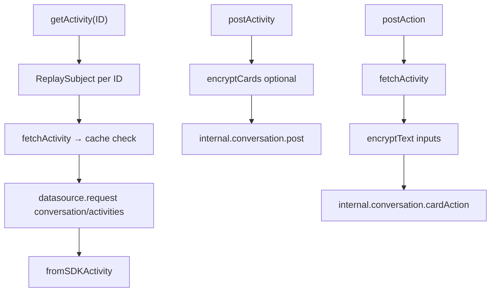
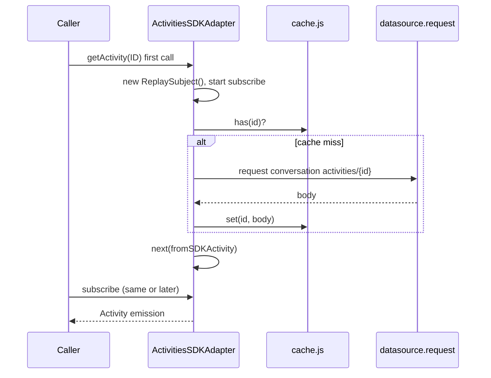
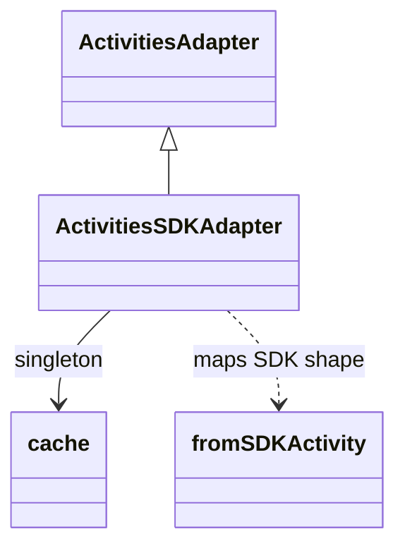

<!-- ───────────────────────────────
  Template:     Module Spec
  Template-ID:  module-spec
  Generates:    src/ai-docs/activities-sdk-adapter-spec.md
  Library ver:  0.2.1
  Last updated: 2026-08-05
─────────────────────────────── -->

# activities-sdk-adapter — SPEC

> [`AGENTS.md`](../../AGENTS.md) · [`SPEC_INDEX.md`](../../ai-docs/SPEC_INDEX.md) · [`ARCHITECTURE.md`](../../ai-docs/ARCHITECTURE.md)

## Metadata

| Field | Value |
|---|---|
| Module id | activities-sdk-adapter |
| Source path(s) | `src/ActivitiesSDKAdapter.js` |
| Doc kind | Module spec |
| Coverage score | 90% assessed 2026-08-05 — getActivity eager fetch, conversation API paths, cache, and post flows documented |
| Generated from | `module-spec` @ SDLC template library `0.2.1` |
| generated_by / approved_by / updated_at | cursor-agent / pending PR approval / 2026-08-05 |
| Validation status | not-run |

## Evidence Rules

Every requirement cites concrete source evidence as `file path` only. Test evidence names `src/*.test.js` files.

## Source Material Register

| Source material | Scope | Decision | Detail location or disposition |
|---|---|---|---|
| Implementation | behavior | verified | Requirements and Design Overview in this spec |
| `@webex/component-adapter-interfaces` ActivitiesAdapter | contract | reference-only | Public Surface rows |

## Overview

`ActivitiesSDKAdapter` implements `ActivitiesAdapter`, mapping Webex conversation activities to adapter-shaped `Activity` objects exposed as RxJS observables. Activity fetch uses the SDK HTTP `request` API against the **conversation** service (not `activities.get`). Posted activities and card actions route through `internal.conversation.post` and `internal.conversation.cardAction`. A module-level `cache.js` singleton deduplicates activity fetches by deconstructed activity id.

## Purpose / Responsibility

Owns activity read (by ID), post, adaptive-card action submit, and SDK-to-adapter activity mapping. Does **not** own room-scoped realtime or paginated history (see `RoomsSDKAdapter`).

## Stack

JavaScript, RxJS 6, `@webex/common` Hydra ID helpers, Webex JS SDK conversation/encryption plugins, shared `cache.js` and `logger.js`.

## Folder / Package Structure

```
src/
├── ActivitiesSDKAdapter.js    # Adapter + fromSDKActivity export
├── ActivitiesSDKAdapter.test.js
├── cache.js                   # Activity fetch cache
└── ai-docs/
```

## Key Files (source of truth)

| File | Holds |
|---|---|
| `src/ActivitiesSDKAdapter.js` | All public methods and `fromSDKActivity` mapper |
| `src/ActivitiesSDKAdapter.test.js` | Unit tests |
| `src/cache.js` | Activity id cache used by `fetchActivity` |

## Public Surface

| Contract ID | Symbol | Kind | Signature/Type | Stability | Detail link | Defined at |
|---|---|---|---|---|---|---|
| activities-adapter.class | `ActivitiesSDKAdapter` | class | extends `ActivitiesAdapter` | stable | [`CONTRACTS.md`](../../ai-docs/CONTRACTS.md) | `src/ActivitiesSDKAdapter.js` |
| activities-adapter.getActivity | `getActivity(ID)` | method → Observable | `(activityID: string) => Observable<Activity>` | stable | this spec | `src/ActivitiesSDKAdapter.js` |
| activities-adapter.postActivity | `postActivity(activity)` | method → Observable | `(activity: Activity) => Observable<Activity>` | stable | this spec | `src/ActivitiesSDKAdapter.js` |
| activities-adapter.postAction | `postAction(activityID, inputs)` | method → Observable | `(activityID: string, inputs: object) => Observable<Activity>` | stable | this spec | `src/ActivitiesSDKAdapter.js` |
| activities-adapter.hasAdaptiveCards | `hasAdaptiveCards(activity)` | method | `(activity: Activity) => boolean` | stable | this spec | `src/ActivitiesSDKAdapter.js` |
| activities-adapter.getAdaptiveCard | `getAdaptiveCard(activity, cardIndex)` | method | `(activity: Activity, index: number) => object\|undefined` | stable | this spec | `src/ActivitiesSDKAdapter.js` |
| activities-adapter.fromSDKActivity | `fromSDKActivity(sdkActivity)` | function (export) | `(sdkActivity: object) => Activity` | stable | this spec | `src/ActivitiesSDKAdapter.js` |

## Requires (dependencies)

| Dependency | Purpose |
|---|---|
| Webex JS SDK `datasource.request` | Fetch activity via conversation service |
| `datasource.internal.conversation.post` | Post new activity to room |
| `datasource.internal.conversation.cardAction` | Submit adaptive card action |
| `datasource.internal.encryption.encryptText` | Encrypt cards and action inputs |
| `cache.js` | Memoize fetched activities by id |
| `@webex/common` `constructHydraId` / `deconstructHydraId` | ID translation |

## Requirements

| ID | WHAT | WHY | Evidence | Test evidence | Gaps | Confidence |
|---|---|---|---|---|---|---|
| ACT-R-001 | First `getActivity(ID)` call eagerly starts fetch via internal subscription — not deferred until external subscriber | Multicast ReplaySubject must populate before late subscribers miss emission | `src/ActivitiesSDKAdapter.js` | `src/ActivitiesSDKAdapter.test.js` (positive: emits on subscription) | No test proving fetch starts before subscribe | PRESENT |
| ACT-R-002 | Activity fetch uses `datasource.request({service: 'conversation', resource: 'activities/{id}'})`, not `activities.get` | Conversation service is the implemented transport | `src/ActivitiesSDKAdapter.js` | `src/ActivitiesSDKAdapter.test.js` | Request shape not asserted in tests | PRESENT |
| ACT-R-003 | Per-ID observable cache uses unbounded `new ReplaySubject()` (no buffer size), not `ReplaySubject(1)` | Comment documents intentional unbounded replay for activity objects | `src/ActivitiesSDKAdapter.js` | none found | Buffer semantics untested | PRESENT |
| ACT-R-004 | `fetchActivity` reads/writes `cache.js` by deconstructed activity id | Avoid duplicate network fetches for same activity | `src/ActivitiesSDKAdapter.js`, `src/cache.js` | none found | Cache hit path untested in adapter tests | PRESENT |
| ACT-R-005 | Fetch failure emits RxJS error `Could not find activity with ID "{ID}"` | Callers can show not-found UI | `src/ActivitiesSDKAdapter.js` | `src/ActivitiesSDKAdapter.test.js` (negative: invalid ID) | none | PRESENT |
| ACT-R-006 | `postActivity` posts via `datasource.internal.conversation.post({id, cluster}, object)` after optional card encryption | Matches SDK conversation plugin contract | `src/ActivitiesSDKAdapter.js` | `src/ActivitiesSDKAdapter.test.js` (positive + negative SDK error) | none | PRESENT |
| ACT-R-007 | `postAction` fetches parent activity, encrypts inputs, calls `internal.conversation.cardAction` | Card actions require encrypted payload bound to parent encryption key | `src/ActivitiesSDKAdapter.js` | `src/ActivitiesSDKAdapter.test.js` (positive + negative) | none | PRESENT |
| ACT-R-008 | Malformed adaptive card JSON in SDK activity yields fallback TextBlock card and warn log | Prevents UI crash on bad server cards | `src/ActivitiesSDKAdapter.js` | none found | parseSDKCards fallback untested | PRESENT |

## Design Overview

`getActivity` memoizes one `ReplaySubject` per activity ID. On first access the adapter immediately subscribes to a deferred fetch pipeline — external subscribers receive emissions from the shared subject whether they attach before or after the fetch completes. Post flows are cold observables (`defer`) that complete after one emission or error. Card posting branches on `hasAdaptiveCards` to encrypt cards using the room conversation encryption key.

## Data Flow



## Sequence Diagram(s)

Sequence coverage:

| Operation group | Diagram | Failure / recovery coverage |
|---|---|---|
| getActivity | Eager fetch on first call | alt: fetch error → subject.error |
| postActivity | Post with optional encryption | alt: SDK rejection → rethrow |
| postAction | Card action pipeline | alt: cardAction rejection → catchError rethrow |



## Class / Component Relationships



## Use Cases

- **UC-1 Load message:** Host subscribes to `getActivity(messageID)` → adapter fetches via conversation API → emits mapped activity. Evidence: `src/ActivitiesSDKAdapter.js`, `src/ActivitiesSDKAdapter.test.js`.
- **UC-2 Send message:** Host calls `postActivity` with text or encrypted cards → observable emits posted activity. Evidence: `src/ActivitiesSDKAdapter.js`.
- **UC-3 Card action:** Host submits adaptive card inputs via `postAction` → encrypted action posted → mapped activity emitted. Evidence: `src/ActivitiesSDKAdapter.js`.

## Error Handling & Failure Modes

| Condition | Signal | Caller recovery |
|---|---|---|
| Activity not found / request failure | Observable error on `getActivity` | Display not-found; retry with valid ID |
| postActivity SDK failure | Error propagated via `catchError` rethrow | Surface error to user; do not assume post succeeded |
| postAction failure | Error propagated | Retry or disable action UI |
| Card JSON parse failure | Fallback card in mapped activity | User sees parse error message in card body |

## Concurrency & Reactive Flow

- `getActivity` uses eager internal subscription to unbounded `ReplaySubject` per ID; multiple external subscribers share the same subject.
- `postActivity` and `postAction` are cold one-shot observables per invocation.
- Cache is process-wide singleton — concurrent fetches for same id may race before cache set; last writer wins.

## Pitfalls

- **Fetch starts on first `getActivity` call, not on subscribe** — calling `getActivity` without subscribing still triggers network I/O.
- **Unbounded ReplaySubject** — late subscribers receive all historical `next` values; not limited to last value.
- **Do not use `activities.get`** — implementation exclusively uses conversation service HTTP request path.

## Test-Case Strategy (module)

| Behavior / Requirement | Existing test evidence | Gap |
|---|---|---|
| ACT-R-001 | `src/ActivitiesSDKAdapter.test.js` — positive: emits on subscription | Negative: verify fetch invoked before subscribe |
| ACT-R-002 | none found | Assert `request` service/resource arguments |
| ACT-R-005 | `src/ActivitiesSDKAdapter.test.js` — negative: invalid activity ID | none |
| ACT-R-006 | `src/ActivitiesSDKAdapter.test.js` — positive post; negative SDK reject | none |
| ACT-R-007 | `src/ActivitiesSDKAdapter.test.js` — positive action; negative cardAction reject | none |
| ACT-R-008 | none found | Inject malformed card JSON in fetch mock |

## Traceability

- Repo architecture: [`ai-docs/ARCHITECTURE.md`](../../ai-docs/ARCHITECTURE.md) · Registry: [`ai-docs/SPEC_INDEX.md`](../../ai-docs/SPEC_INDEX.md)
- Coverage state & contracts baseline: `.sdd/manifest.json`
