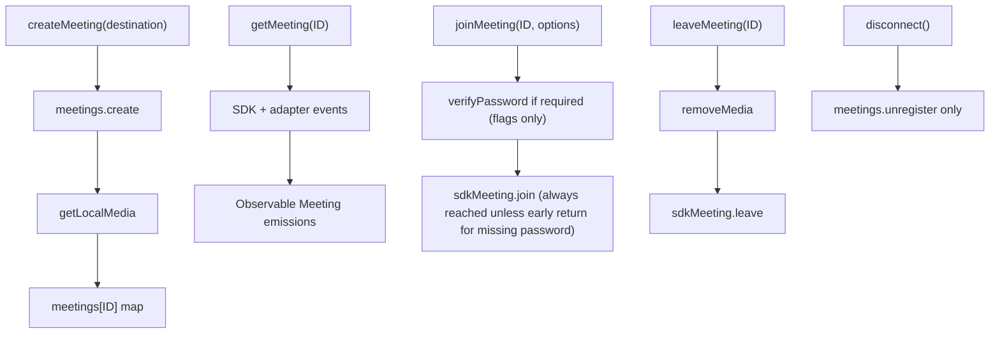
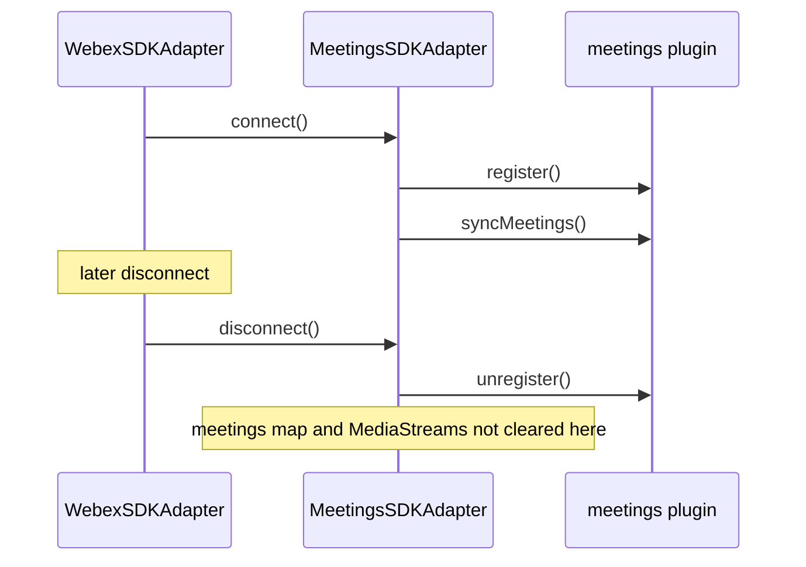
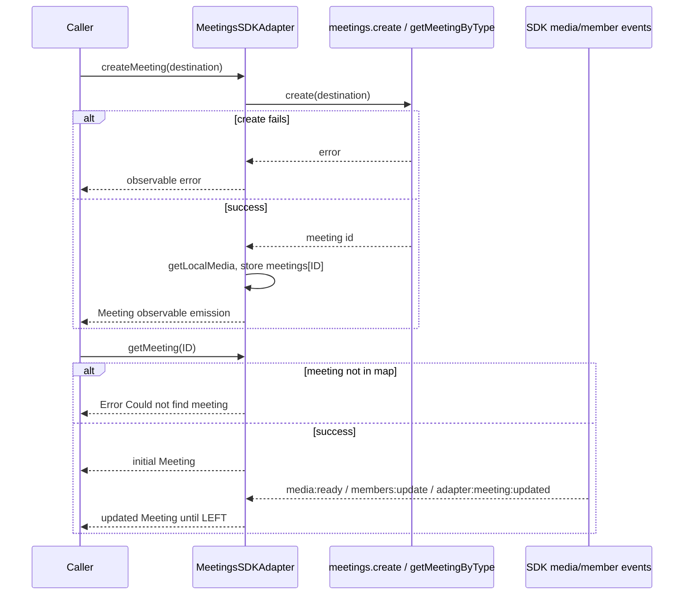
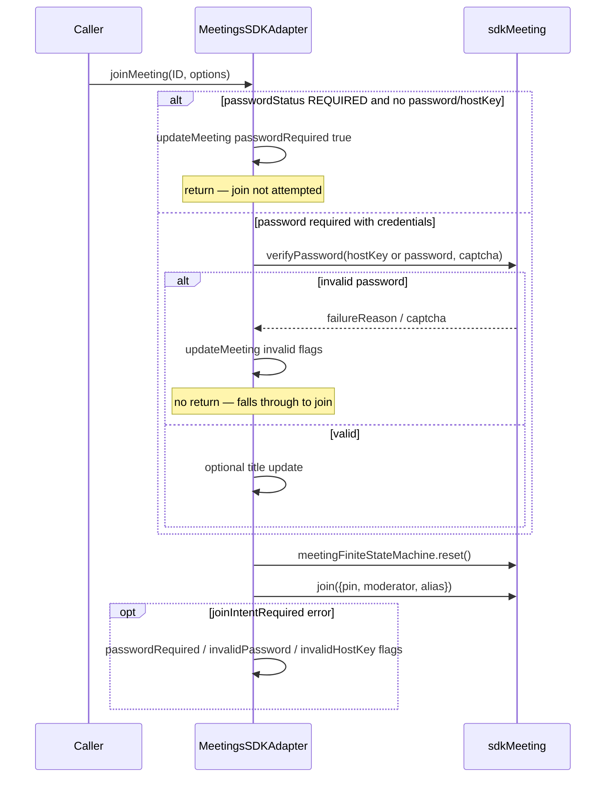
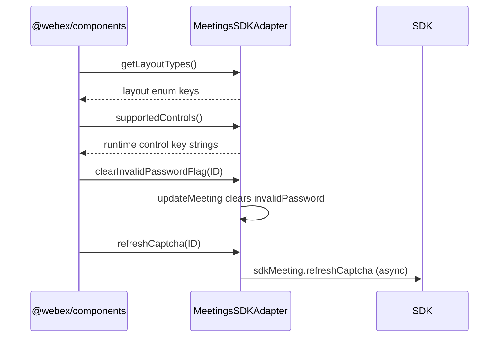
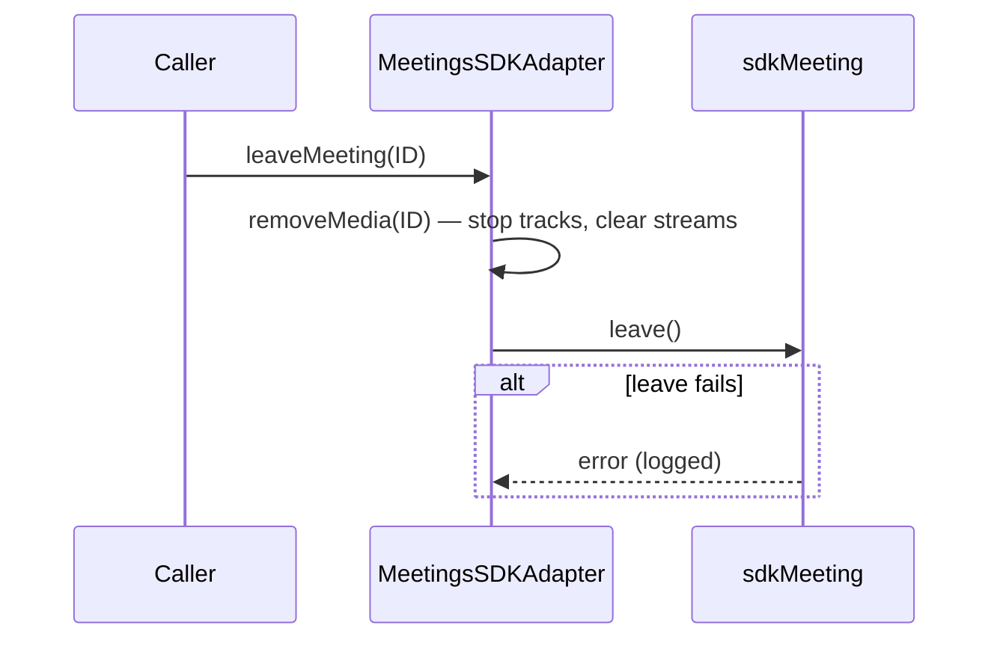
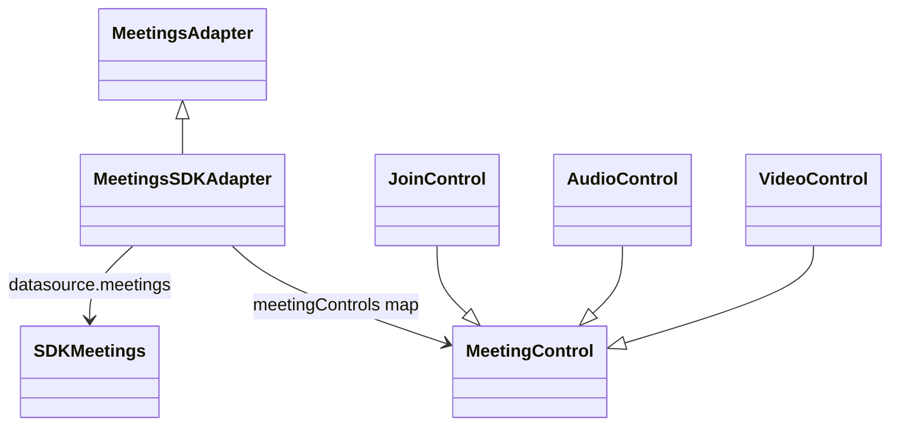
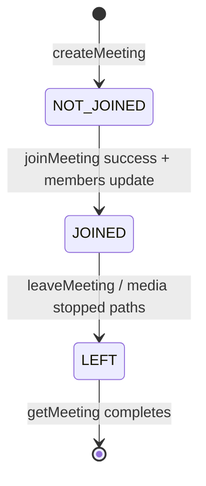

<!-- ───────────────────────────────
  Template:     Module Spec
  Template-ID:  module-spec
  Generates:    src/ai-docs/meetings-sdk-adapter-spec.md
  Library ver:  0.2.1
  Last updated: 2026-08-05
─────────────────────────────── -->

# meetings-sdk-adapter — SPEC

> [`AGENTS.md`](../../AGENTS.md) · [`SPEC_INDEX.md`](../../ai-docs/SPEC_INDEX.md) · [`ARCHITECTURE.md`](../../ai-docs/ARCHITECTURE.md)

## Metadata

| Field | Value |
|---|---|
| Module id | meetings-sdk-adapter |
| Source path(s) | `src/MeetingsSDKAdapter.js`, `src/MeetingsSDKAdapter/controls/` |
| Doc kind | Module spec |
| Coverage score | 92% assessed 2026-08-05 — create/get/join/leave, controls, media lifecycle, disconnect semantics, and inherited surfaces documented |
| Generated from | `module-spec` @ SDLC template library `0.2.1` |
| generated_by / approved_by / updated_at | cursor-agent / Akula Uday / 2026-08-05 |
| Validation status | not-run |

## Evidence Rules

Every requirement cites concrete source evidence as `file path` only. Test evidence names `src/*.test.js` files.

## Source Material Register

| Source material | Scope | Decision | Detail location or disposition |
|---|---|---|---|
| Implementation | behavior | verified | Requirements, State Machine, Error Handling, Sequence Diagram(s) |
| `@webex/component-adapter-interfaces` MeetingsAdapter | contract | reference-only | Public Surface including inherited unsupported `incomingMeeting` |

## Overview

`MeetingsSDKAdapter` implements `MeetingsAdapter`, managing Webex meeting creation, join/leave, in-memory meeting state, media streams, and UI control objects. It registers the SDK meetings plugin on `connect()` and unregisters on `disconnect()` without clearing in-memory maps or stopping media tracks.

## Purpose / Responsibility

Owns meeting lifecycle observables, local/remote media attachment, meeting controls, and password/host-key join flows. Does **not** own facade Mercury/device registration or room/people domain data beyond title lookup.

## Stack

JavaScript, RxJS 6, Webex SDK `meetings` plugin, browser MediaStream APIs, `@webex/component-adapter-interfaces` meeting types and controls.

## Folder / Package Structure

```
src/
├── MeetingsSDKAdapter.js
├── MeetingsSDKAdapter/
│   └── controls/          # Join, audio, video, share, exit, roster, settings, switch-*
├── MeetingsSDKAdapter.test.js
└── ai-docs/
```

## Key Files (source of truth)

| File | Holds |
|---|---|
| `src/MeetingsSDKAdapter.js` | Meeting CRUD, media, controls map, connect/disconnect |
| `src/MeetingsSDKAdapter/controls/*.js` | Control action/display implementations |
| `src/MeetingsSDKAdapter.test.js` | Unit tests for meeting flows |

## Public Surface

| Contract ID | Type | Surface | Purpose | Compatibility / deprecation | Schema / detail link | Root index |
|---|---|---|---|---|---|---|
| meetings-adapter.class | SDK class | `MeetingsSDKAdapter extends MeetingsAdapter` | Domain adapter entry | stable | `src/MeetingsSDKAdapter.js` | [`CONTRACTS.md`](../../ai-docs/CONTRACTS.md) |
| meetings-adapter.connect | SDK method | `connect(): Promise<void>` | Register meetings plugin + syncMeetings | stable | `src/MeetingsSDKAdapter.js` | [`CONTRACTS.md`](../../ai-docs/CONTRACTS.md) |
| meetings-adapter.disconnect | SDK method | `disconnect(): Promise<void>` | `meetings.unregister()` only — does not removeMedia or clear caches | stable | `src/MeetingsSDKAdapter.js` | [`CONTRACTS.md`](../../ai-docs/CONTRACTS.md) |
| meetings-adapter.createMeeting | SDK method | `createMeeting(destination: string): Observable<Meeting>` | Create meeting at destination | stable | `src/MeetingsSDKAdapter.js` | [`CONTRACTS.md`](../../ai-docs/CONTRACTS.md) |
| meetings-adapter.getMeeting | SDK method | `getMeeting(ID: string): Observable<Meeting>` | Hot meeting state stream until LEFT | stable | `src/MeetingsSDKAdapter.js` | [`CONTRACTS.md`](../../ai-docs/CONTRACTS.md) |
| meetings-adapter.joinMeeting | SDK method | `joinMeeting(ID: string, options?: { password?, hostKey?, name?, captcha? }): Promise<void>` | Join with optional password/host key/name/captcha | stable | `src/MeetingsSDKAdapter.js` | [`CONTRACTS.md`](../../ai-docs/CONTRACTS.md) |
| meetings-adapter.leaveMeeting | SDK method | `leaveMeeting(ID: string): Promise<void>` | removeMedia then sdkMeeting.leave | stable | `src/MeetingsSDKAdapter.js` | [`CONTRACTS.md`](../../ai-docs/CONTRACTS.md) |
| meetings-adapter.incomingMeeting | SDK inherited | `incomingMeeting(destination): Observable<Meeting>` | **Not overridden** — base class unsupported-operation error | stable; inherited from interface | `@webex/component-adapter-interfaces` | [`CONTRACTS.md`](../../ai-docs/CONTRACTS.md) |
| meetings-adapter.getLayoutTypes | SDK method | `getLayoutTypes(): string[]` | Layout enum keys (Overlay, Grid, …) | stable | `src/MeetingsSDKAdapter.js` | [`CONTRACTS.md`](../../ai-docs/CONTRACTS.md) |
| meetings-adapter.clearPasswordRequiredFlag | SDK method | `clearPasswordRequiredFlag(ID: string): Promise<void>` | Reset `passwordRequired` UI flag | stable | `src/MeetingsSDKAdapter.js` | [`CONTRACTS.md`](../../ai-docs/CONTRACTS.md) |
| meetings-adapter.clearInvalidPasswordFlag | SDK method | `clearInvalidPasswordFlag(ID: string): Promise<void>` | Reset `invalidPassword` flag | stable | `src/MeetingsSDKAdapter.js` | [`CONTRACTS.md`](../../ai-docs/CONTRACTS.md) |
| meetings-adapter.clearInvalidHostKeyFlag | SDK method | `clearInvalidHostKeyFlag(ID: string): Promise<void>` | Reset `invalidHostKey` flag | stable | `src/MeetingsSDKAdapter.js` | [`CONTRACTS.md`](../../ai-docs/CONTRACTS.md) |
| meetings-adapter.refreshCaptcha | SDK method | `refreshCaptcha(ID: string): Promise<void>` | Refresh captcha on meeting object | stable | `src/MeetingsSDKAdapter.js` | [`CONTRACTS.md`](../../ai-docs/CONTRACTS.md) |
| meetings-adapter.supportedControls | SDK method | `supportedControls(): string[]` | Runtime control key list | stable | `src/MeetingsSDKAdapter.js` | [`CONTRACTS.md`](../../ai-docs/CONTRACTS.md) |
| meetings-adapter.meetingControls | SDK property | plain object map | Control instances keyed by runtime string | stable | `src/MeetingsSDKAdapter.js` | [`CONTRACTS.md`](../../ai-docs/CONTRACTS.md) |
| meetings-adapter.control.join-meeting | SDK control | `join-meeting` → JoinControl | Join meeting action/display | stable | `src/MeetingsSDKAdapter/controls/JoinControl.js` | [`CONTRACTS.md`](../../ai-docs/CONTRACTS.md) |
| meetings-adapter.control.mute-audio | SDK control | `mute-audio` → AudioControl | Toggle local audio | stable | `src/MeetingsSDKAdapter/controls/AudioControl.js` | [`CONTRACTS.md`](../../ai-docs/CONTRACTS.md) |
| meetings-adapter.control.mute-video | SDK control | `mute-video` → VideoControl | Toggle local video | stable | `src/MeetingsSDKAdapter/controls/VideoControl.js` | [`CONTRACTS.md`](../../ai-docs/CONTRACTS.md) |
| meetings-adapter.control.leave-meeting | SDK control | `leave-meeting` → ExitControl | Leave meeting | stable | `src/MeetingsSDKAdapter/controls/ExitControl.js` | [`CONTRACTS.md`](../../ai-docs/CONTRACTS.md) |
| meetings-adapter.control.member-roster | SDK control | `member-roster` → RosterControl | Toggle roster panel | stable | `src/MeetingsSDKAdapter/controls/RosterControl.js` | [`CONTRACTS.md`](../../ai-docs/CONTRACTS.md) |
| meetings-adapter.control.share-screen | SDK control | `share-screen` → ShareControl | Local share toggle | stable | `src/MeetingsSDKAdapter/controls/ShareControl.js` | [`CONTRACTS.md`](../../ai-docs/CONTRACTS.md) |
| meetings-adapter.control.settings | SDK control | `settings` → SettingsControl | Settings modal toggle | stable | `src/MeetingsSDKAdapter/controls/SettingsControl.js` | [`CONTRACTS.md`](../../ai-docs/CONTRACTS.md) |
| meetings-adapter.control.switch-camera | SDK control | `switch-camera` → SwitchCameraControl | Switch camera device | stable | `src/MeetingsSDKAdapter/controls/SwitchCameraControl.js` | [`CONTRACTS.md`](../../ai-docs/CONTRACTS.md) |
| meetings-adapter.control.switch-microphone | SDK control | `switch-microphone` → SwitchMicrophoneControl | Switch microphone device | stable | `src/MeetingsSDKAdapter/controls/SwitchMicrophoneControl.js` | [`CONTRACTS.md`](../../ai-docs/CONTRACTS.md) |
| meetings-adapter.control.switch-speaker | SDK control | `switch-speaker` → SwitchSpeakerControl | Switch speaker device | stable | `src/MeetingsSDKAdapter/controls/SwitchSpeakerControl.js` | [`CONTRACTS.md`](../../ai-docs/CONTRACTS.md) |
| meetings-adapter.controls-barrel.MeetingControl | barrel export | `MeetingsSDKAdapter/controls/index.js` | Base control class re-export | stable | `src/MeetingsSDKAdapter/controls/index.js` | [`CONTRACTS.md`](../../ai-docs/CONTRACTS.md) |
| meetings-adapter.controls-barrel.JoinControl | barrel export | `MeetingsSDKAdapter/controls/index.js` | JoinControl re-export | stable | `src/MeetingsSDKAdapter/controls/index.js` | [`CONTRACTS.md`](../../ai-docs/CONTRACTS.md) |
| meetings-adapter.controls-barrel.AudioControl | barrel export | `MeetingsSDKAdapter/controls/index.js` | AudioControl re-export | stable | `src/MeetingsSDKAdapter/controls/index.js` | [`CONTRACTS.md`](../../ai-docs/CONTRACTS.md) |
| meetings-adapter.controls-barrel.VideoControl | barrel export | `MeetingsSDKAdapter/controls/index.js` | VideoControl re-export | stable | `src/MeetingsSDKAdapter/controls/index.js` | [`CONTRACTS.md`](../../ai-docs/CONTRACTS.md) |
| meetings-adapter.controls-barrel.ExitControl | barrel export | `MeetingsSDKAdapter/controls/index.js` | ExitControl re-export | stable | `src/MeetingsSDKAdapter/controls/index.js` | [`CONTRACTS.md`](../../ai-docs/CONTRACTS.md) |
| meetings-adapter.controls-barrel.RosterControl | barrel export | `MeetingsSDKAdapter/controls/index.js` | RosterControl re-export | stable | `src/MeetingsSDKAdapter/controls/index.js` | [`CONTRACTS.md`](../../ai-docs/CONTRACTS.md) |
| meetings-adapter.controls-barrel.SettingsControl | barrel export | `MeetingsSDKAdapter/controls/index.js` | SettingsControl re-export | stable | `src/MeetingsSDKAdapter/controls/index.js` | [`CONTRACTS.md`](../../ai-docs/CONTRACTS.md) |
| meetings-adapter.controls-barrel.SwitchCameraControl | barrel export | `MeetingsSDKAdapter/controls/index.js` | SwitchCameraControl re-export | stable | `src/MeetingsSDKAdapter/controls/index.js` | [`CONTRACTS.md`](../../ai-docs/CONTRACTS.md) |
| meetings-adapter.controls-barrel.SwitchMicrophoneControl | barrel export | `MeetingsSDKAdapter/controls/index.js` | SwitchMicrophoneControl re-export | stable | `src/MeetingsSDKAdapter/controls/index.js` | [`CONTRACTS.md`](../../ai-docs/CONTRACTS.md) |
| meetings-adapter.controls-barrel.SwitchSpeakerControl | barrel export | `MeetingsSDKAdapter/controls/index.js` | SwitchSpeakerControl re-export | stable | `src/MeetingsSDKAdapter/controls/index.js` | [`CONTRACTS.md`](../../ai-docs/CONTRACTS.md) |

Note: `ShareControl` is wired on the adapter at runtime (`share-screen` key) but is **not** exported from the controls barrel (`src/MeetingsSDKAdapter/controls/index.js`).

Compatibility notes:

- Control runtime keys match `supportedControls()` exactly: `join-meeting`, `mute-audio`, `mute-video`, `leave-meeting`, `member-roster`, `share-screen`, `settings`, `switch-camera`, `switch-microphone`, `switch-speaker`.
- `disconnect()` does **not** release MediaStream handles or clear `meetings` / `getMeetingObservables` — callers must `leaveMeeting(ID)` for media cleanup.

## Requires (dependencies)

| Dependency | Purpose |
|---|---|
| `datasource.meetings` plugin | create, register, sync, join, leave, media |
| `datasource.people` / `rooms` | Meeting title resolution in `fetchMeetingTitle` |
| Browser `navigator.mediaDevices` | Local stream acquisition |
| RxJS 6 | Observables for getMeeting/createMeeting |
| `@webex/component-adapter-interfaces` | MeetingState, control types |

## Requirements

| ID | WHAT | WHY | Source Evidence | Test / Example Evidence | Assumptions / Gaps | Confidence |
|---|---|---|---|---|---|---|
| MTG-R-001 | `connect()` calls `meetings.register()` then `meetings.syncMeetings()` | Plugin must register before meeting operations | `src/MeetingsSDKAdapter.js` | `src/MeetingsSDKAdapter.test.js` | none | PRESENT |
| MTG-R-002 | `disconnect()` calls only `meetings.unregister()` — no `removeMedia`, no map clears | Current implementation delegates unregister to SDK | `src/MeetingsSDKAdapter.js` | none found | Disconnect media leak risk documented in Pitfalls | PRESENT |
| MTG-R-003 | `leaveMeeting(ID)` calls `removeMedia(ID)` before `sdkMeeting.leave()` | Release tracks and reset local media fields on leave | `src/MeetingsSDKAdapter.js` | `src/MeetingsSDKAdapter.test.js` | none | PRESENT |
| MTG-R-004 | `getMeeting(ID)` errors when meeting not in `meetings` map | Observable error for unknown meeting ID | `src/MeetingsSDKAdapter.js` | `src/MeetingsSDKAdapter.test.js` | none | PRESENT |
| MTG-R-005 | When `passwordStatus === 'REQUIRED'`, `joinMeeting` calls `verifyPassword` before `join()`; invalid verification updates failure/captcha flags but **does not return** — execution falls through to `sdkMeeting.join()` anyway (sharp edge) | Surface invalid-password UI while join may still be attempted | `src/MeetingsSDKAdapter.js` | `src/MeetingsSDKAdapter.test.js` | Tests assert flags, not that join is skipped on invalid password | PRESENT |
| MTG-R-006 | `joinMeeting` on `joinIntentRequired` sets passwordRequired/invalidPassword/invalidHostKey flags | Surface auth UI state without throwing | `src/MeetingsSDKAdapter.js` | none found | none | PRESENT |
| MTG-R-007 | `getMeeting` stream completes after `MeetingState.LEFT` via `takeWhile` | Stop emitting after terminal leave state | `src/MeetingsSDKAdapter.js` | none found | none | PRESENT |
| MTG-R-008 | `incomingMeeting` not overridden — inherited unsupported error from base adapter | Callers must not rely on incoming meeting flow in this repo | `src/MeetingsSDKAdapter.js` | none found | Exact base error message not asserted locally | WEAK |
| MTG-R-009 | `supportedControls()` returns keys matching `meetingControls` map | UI discovers controls by exact runtime strings | `src/MeetingsSDKAdapter.js` | `src/MeetingsSDKAdapter.test.js` | none | PRESENT |

## Design Overview

Meetings are created via SDK `meetings.create`, enriched with local media permissions, and stored in `this.meetings`. `getMeeting` merges initial snapshot with SDK/adapter events (media ready/stopped, member updates, adapter:meeting:updated). Controls delegate to adapter methods using `resolveMeetingID` / `resolveDeviceSwitchArgs` from `utils.js`. In-memory state is updated through `updateMeeting` + `deepMerge`.

## Data Flow



## Sequence Diagram(s)

Sequence coverage:

| Operation group | Diagram | Failure / recovery coverage |
|---|---|---|
| connect / disconnect | Meetings plugin register lifecycle | disconnect does not clear in-memory maps or stop media |
| createMeeting / getMeeting | Create + observe meeting stream | alt: create error → throw; missing ID → getMeeting error |
| joinMeeting | Join with optional password flow | alt: missing password → early return; invalid verifyPassword → flags then join still attempted |
| leaveMeeting | Leave + media cleanup | alt: leave SDK error logged, not rethrown |
| sync helpers | Layout, flag clear, captcha refresh, supportedControls | synchronous reads/writes on adapter state — no network |

### connect / disconnect



### createMeeting / getMeeting



### joinMeeting



### sync helpers (layout, flags, captcha, controls)

Merged diagram — `getLayoutTypes`, `clearPasswordRequiredFlag`, `clearInvalidPasswordFlag`, `clearInvalidHostKeyFlag`, `refreshCaptcha`, and `supportedControls` are synchronous adapter helpers with no SDK network I/O; they read or mutate in-memory meeting state / control map.



### leaveMeeting



## Class / Component Relationships



## Use Cases

- **UC-1 Schedule/join:** `createMeeting(dest)` → local media prompts → `joinMeeting(ID, {password, name})`. Evidence: `src/MeetingsSDKAdapter.test.js`.
- **UC-2 Live meeting UI:** `getMeeting(ID)` → subscribe to state/media updates → drive controls. Evidence: `src/MeetingsSDKAdapter.js`.
- **UC-3 Leave:** `leaveMeeting(ID)` → media released → SDK leave. Evidence: `src/MeetingsSDKAdapter.js`.

## State Model

- `this.meetings[ID]` — in-memory `Meeting` objects with local/remote media handles, settings preview, password/captcha flags.
- `this.getMeetingObservables[ID]` — refCounted hot observables per meeting ID.
- `this.meetingControls` — static map of control instances keyed by runtime string.

## Business Rules & Invariants

- Meeting must exist in `this.meetings` before `getMeeting` emits — enforced in `getMeeting` initial observer.
- Password required meetings return early from `joinMeeting` only when password/hostKey is **missing**; invalid `verifyPassword` updates UI flags but **does not block** the subsequent `sdkMeeting.join()` call — enforced in `joinMeeting` fall-through.
- Local audio/video mute toggles throw if already muting/unmuting or media disabled — enforced in `handleLocalAudio` / `handleLocalVideo`.
- `getMeeting` observable terminates when `state === MeetingState.LEFT` — enforced via `takeWhile`.

## Concurrency & Reactive Flow

- `getMeeting` uses `publishReplay(1)` + `refCount()` per ID; multiple subscribers share event merge pipeline.
- `addMedia` on JOINED state is fire-and-forget (not awaited in member update handler) — emissions may briefly lag state.
- `joinMeeting` / `leaveMeeting` are async imperative APIs; meeting updates emit via `updateMeeting` → SDK emit → observable subscribers.

## State Machine



Meeting `state` derives from `sdkMeeting.joinedWith.state` on `members:update` events, defaulting to `NOT_JOINED`.

## Error Handling & Failure Modes

| Condition | Signal (error/code/result) | Caller recovery |
|---|---|---|
| `createMeeting` SDK failure | Observable error (logged, rethrown) | Show create failure; do not assume meeting exists |
| `getMeeting` unknown ID | `Error: Could not find meeting with ID "…"` on observable | Create meeting first or verify ID |
| `joinMeeting` missing password when required | Silent return after setting `passwordRequired: true` | Prompt user; call clear* flags after retry |
| Invalid password/host key | `invalidPassword` / `invalidHostKey` / captcha fields on meeting; **`sdkMeeting.join()` may still run** | Re-prompt credentials; do not assume join was skipped; optional `refreshCaptcha` |
| `joinIntentRequired` | Flags on meeting object, error logged | Re-auth flow in host UI |
| `leaveMeeting` SDK error | Logged only | Assume leave may be incomplete; check meeting state |
| `incomingMeeting` on this adapter | Base class unsupported-operation error | Use supported create/join flow instead |
| `updateMeeting` missing meeting | Thrown `Error: Could not find meeting` | Guard calls with known ID |

## Pitfalls

- **`disconnect()` only unregisters meetings plugin** — MediaStream tracks may remain active until `leaveMeeting`.
- **iOS 15.1 video blocked** — `getLocalMedia` returns ERROR permission for video on that UA.
- **`verifyPassword` failure does not return** — invalid password updates meeting flags but execution continues to `sdkMeeting.join()`; host UI should not treat flag-only updates as proof join was skipped.
- **`getMeeting` errors if createMeeting not completed** — map entry required before subscribe.

## Module Do's / Don'ts

- DO call `leaveMeeting(ID)` to stop MediaStream tracks and clear local media fields.
- DO use exact control keys from `supportedControls()` (`join-meeting`, not `join`).
- DON'T assume `disconnect()` releases media or clears `meetings` / `getMeetingObservables`.
- DON'T call `incomingMeeting` — not implemented in this adapter.

## Host Integration & Theming

Host (`@webex/components`) passes authenticated SDK to facade, awaits `connect()`, then uses meeting observables and control display observables. Control actions accept meeting ID string or context object per PR #346 (`resolveMeetingID`, `resolveDeviceSwitchArgs`).

## Key Design Trade-off

In-memory meeting state (`this.meetings`) enables rich adapter-side media and UI flags but survives `disconnect()` until explicitly left or overwritten. This favors fast re-subscription and control responsiveness over automatic teardown on facade disconnect — hosts must orchestrate leave before disconnect when media cleanup matters.

## Test-Case Strategy (module)

| Behavior / Requirement | Existing test evidence | Gap |
|---|---|---|
| MTG-R-001 | `src/MeetingsSDKAdapter.test.js` connect | none |
| MTG-R-003, MTG-R-004 | leave/getMeeting tests | disconnect does not clear maps — untested |
| MTG-R-005, MTG-R-006 | join password flows | Multi-subscriber getMeeting |
| MTG-R-009 | supportedControls keys | Incoming meeting inherited error |

## Traceability

- Repo architecture: [`ai-docs/ARCHITECTURE.md`](../../ai-docs/ARCHITECTURE.md) · Registry: [`ai-docs/SPEC_INDEX.md`](../../ai-docs/SPEC_INDEX.md)
- Coverage state & contracts baseline: `.sdd/manifest.json`
