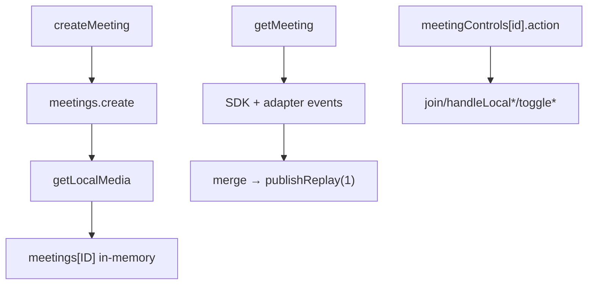
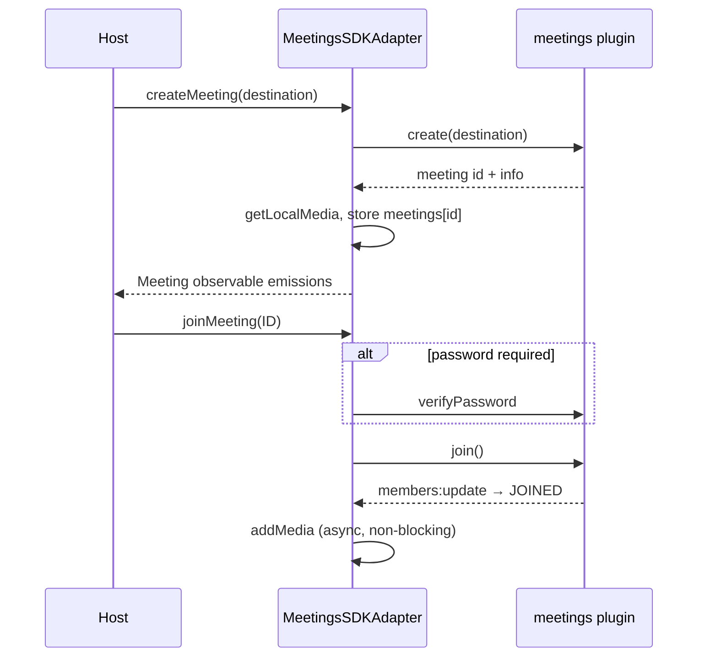
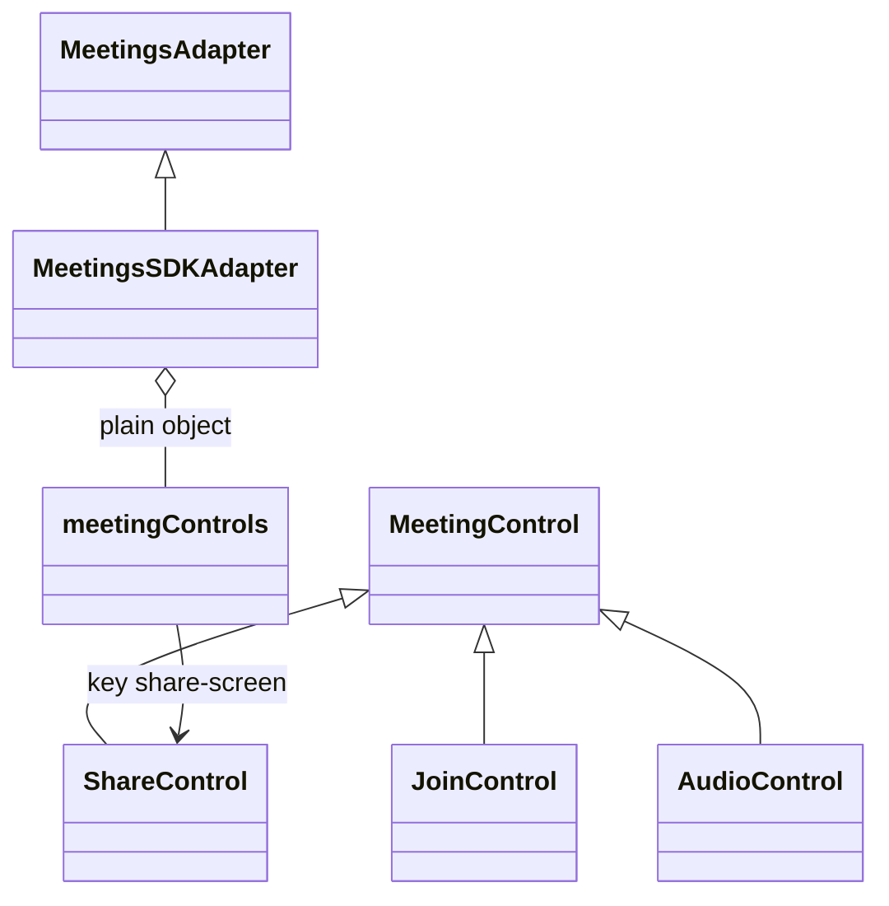
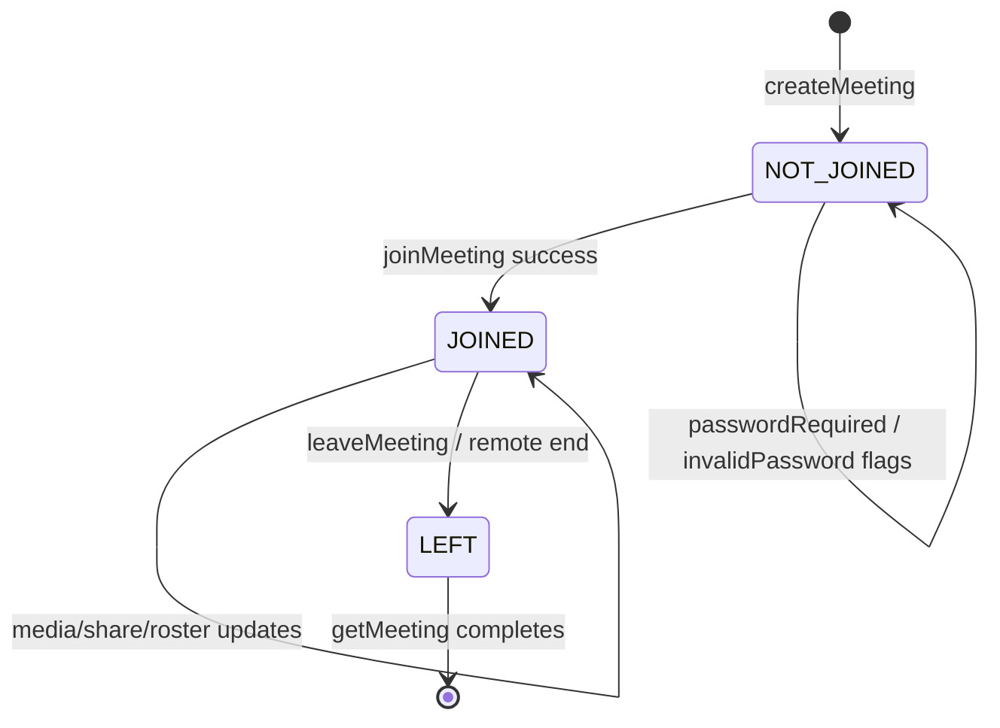

<!-- ───────────────────────────────
  Template:     Module Spec
  Template-ID:  module-spec
  Generates:    src/ai-docs/meetings-sdk-adapter-spec.md
  Library ver:  0.2.1
  Last updated: 2026-08-05
─────────────────────────────── -->

# meetings-sdk-adapter — SPEC

> [`AGENTS.md`](../../AGENTS.md) · [`SPEC_INDEX.md`](../../ai-docs/SPEC_INDEX.md) · [`ARCHITECTURE.md`](../../ai-docs/ARCHITECTURE.md)

## Metadata

| Field | Value |
|---|---|
| Module id | meetings-sdk-adapter |
| Source path(s) | `src/MeetingsSDKAdapter.js`, `src/MeetingsSDKAdapter/controls/` |
| Doc kind | Module spec |
| Coverage score | 92% assessed 2026-08-05 — meetingControls plain object, share-screen control, state machine, media lifecycle, and error paths documented |
| Generated from | `module-spec` @ SDLC template library `0.2.1` |
| generated_by / approved_by / updated_at | cursor-agent / pending PR approval / 2026-08-05 |
| Validation status | not-run |

## Evidence Rules

Every requirement cites concrete source evidence as `file path` only. Test evidence names `src/*.test.js` and control test files.

## Source Material Register

| Source material | Scope | Decision | Detail location or disposition |
|---|---|---|---|
| Implementation | behavior | verified | Requirements, Business Rules, State Machine in this spec |
| `@webex/component-adapter-interfaces` MeetingsAdapter | contract | reference-only | Public Surface rows |

## Overview

`MeetingsSDKAdapter` is the largest domain adapter: WebRTC meeting create/join/leave, in-memory meeting state, media attach/detach, and UI-oriented meeting controls. `meetingControls` is a **plain object** keyed by control id strings (not a `Map`). Control classes live under `MeetingsSDKAdapter/controls/`; `MeetingControl` base is exported from the controls barrel, while `ShareControl` is wired at runtime under key `share-screen` but is **not** re-exported from the barrel index.

## Purpose / Responsibility

Owns meeting lifecycle observables, local/remote media state, meeting control actions, and SDK meetings plugin connect/disconnect. Does **not** own room messaging or org lookup.

## Stack

JavaScript, RxJS 6, Webex SDK meetings plugin, browser MediaStream APIs, control classes extending `MeetingControl`.

## Folder / Package Structure

```
src/
├── MeetingsSDKAdapter.js
├── MeetingsSDKAdapter.test.js
├── MeetingsSDKAdapter/
│   ├── controls/
│   │   ├── MeetingControl.js      # Base class (exported)
│   │   ├── ShareControl.js        # Runtime only (share-screen key)
│   │   ├── JoinControl.js, AudioControl.js, …
│   │   └── index.js               # Barrel exports (no ShareControl)
│   └── testHelper.js
└── ai-docs/
```

## Key Files (source of truth)

| File | Holds |
|---|---|
| `src/MeetingsSDKAdapter.js` | Core adapter, meetingControls object, media/state |
| `src/MeetingsSDKAdapter/controls/index.js` | Exported control classes including `MeetingControl` |
| `src/MeetingsSDKAdapter/controls/ShareControl.js` | Share screen control (`share-screen` key) |
| `src/MeetingsSDKAdapter.test.js` | Primary unit tests |
| `src/MeetingsSDKAdapter/controls/*.test.js` | Per-control tests |

## Public Surface

| Contract ID | Symbol | Kind | Signature/Type | Stability | Detail link | Defined at |
|---|---|---|---|---|---|---|
| meetings-adapter.class | `MeetingsSDKAdapter` | class | extends `MeetingsAdapter` | stable | [`CONTRACTS.md`](../../ai-docs/CONTRACTS.md) | `src/MeetingsSDKAdapter.js` |
| meetings-adapter.connect | `connect()` | async method | `() => Promise<void>` | stable | this spec | `src/MeetingsSDKAdapter.js` |
| meetings-adapter.disconnect | `disconnect()` | async method | `() => Promise<void>` | stable | this spec | `src/MeetingsSDKAdapter.js` |
| meetings-adapter.createMeeting | `createMeeting(destination)` | method → Observable | `(destination: string) => Observable<Meeting>` | stable | this spec | `src/MeetingsSDKAdapter.js` |
| meetings-adapter.getMeeting | `getMeeting(ID)` | method → Observable | `(meetingID: string) => Observable<Meeting>` | stable | this spec | `src/MeetingsSDKAdapter.js` |
| meetings-adapter.supportedControls | `supportedControls()` | method | `() => string[]` | stable | this spec | `src/MeetingsSDKAdapter.js` |
| meetings-adapter.getLayoutTypes | `getLayoutTypes()` | method | `() => string[]` | stable | this spec | `src/MeetingsSDKAdapter.js` |
| meetings-adapter.meetingControls | `meetingControls` | property (plain object) | `{ [controlId: string]: MeetingControl }` | stable | this spec | `src/MeetingsSDKAdapter.js` |
| meetings-adapter.control.share-screen | `meetingControls['share-screen']` | ShareControl instance | runtime key `share-screen` | stable | this spec | `src/MeetingsSDKAdapter.js` |
| meetings-adapter.export.MeetingControl | `MeetingControl` | class export | base control class | stable | `src/MeetingsSDKAdapter/controls/index.js` | `src/MeetingsSDKAdapter/controls/index.js` |
| meetings-adapter.joinMeeting | `joinMeeting(ID, options?)` | async method | password/hostKey flow | stable | this spec | `src/MeetingsSDKAdapter.js` |
| meetings-adapter.leaveMeeting | `leaveMeeting(ID)` | async method | `() => Promise<void>` | stable | this spec | `src/MeetingsSDKAdapter.js` |

Control keys in `meetingControls`: `join-meeting`, `mute-audio`, `mute-video`, `share-screen`, `leave-meeting`, `member-roster`, `settings`, `switch-camera`, `switch-speaker`, `switch-microphone`.

## Requires (dependencies)

| Dependency | Purpose |
|---|---|
| Webex SDK `meetings` plugin | create, join, leave, media |
| Browser `MediaStream` / `mediaDevices` | Local A/V capture |
| `@webex/component-adapter-interfaces` `MeetingState` | State enum |
| `./utils` `chainWith`, `deepMerge`, `resolveMeetingID` | RxJS helpers and control arg resolution |
| Facade `connect()` → `meetings.register/syncMeetings` | Meeting collection sync |

## Requirements

| ID | WHAT | WHY | Evidence | Test evidence | Gaps | Confidence |
|---|---|---|---|---|---|---|
| MTG-R-001 | `meetingControls` is a plain object literal keyed by control id strings, not a `Map` | Object.keys used by `supportedControls()` | `src/MeetingsSDKAdapter.js` | `src/MeetingsSDKAdapter.test.js` supportedControls | none | PRESENT |
| MTG-R-002 | `share-screen` runtime key maps to `ShareControl` instance; included in `supportedControls()` | Screen share UI control | `src/MeetingsSDKAdapter.js` | `src/MeetingsSDKAdapter.test.js` (lists share-screen) | ShareControl barrel export absent by design | PRESENT |
| MTG-R-003 | `MeetingControl` exported from controls barrel; `ShareControl` imported directly in adapter only | Public extension point vs internal wiring | `src/MeetingsSDKAdapter/controls/index.js`, `src/MeetingsSDKAdapter.js` | none found | Export surface not tested | PRESENT |
| MTG-R-004 | `connect()` calls `meetings.register()` then `meetings.syncMeetings()` | Plugin registration before meeting ops | `src/MeetingsSDKAdapter.js` | none found | connect untested | PRESENT |
| MTG-R-005 | `createMeeting` stores meeting in `this.meetings` map and emits `adapter:meeting:updated` | In-memory source for getMeeting | `src/MeetingsSDKAdapter.js` | `src/MeetingsSDKAdapter.test.js` createMeeting | none | PRESENT |
| MTG-R-006 | `getMeeting` uses `publishReplay(1)` + `refCount()` + `takeWhile` until `MeetingState.LEFT` | Multicast meeting updates until left | `src/MeetingsSDKAdapter.js` | `src/MeetingsSDKAdapter.test.js` getMeeting sections | none | PRESENT |
| MTG-R-007 | Joined state triggers async `addMedia` without blocking state emission | UI sees JOINED before media attach completes | `src/MeetingsSDKAdapter.js` | none found | addMedia failure logged only | PRESENT |
| MTG-R-008 | Local mute/share/settings mutate via `updateMeeting` deep merge and SDK calls | Consistent meeting object updates | `src/MeetingsSDKAdapter.js` | handleLocalAudio/Video tests | none | PRESENT |
| MTG-R-009 | Missing meeting on `getMeeting` errors synchronously in initial observable | Fail fast for unknown ID | `src/MeetingsSDKAdapter.js` | `src/MeetingsSDKAdapter.test.js` | none | PRESENT |

## Design Overview

Meetings maintain authoritative in-memory objects in `this.meetings` keyed by meeting ID, synchronized with SDK meeting instances via event listeners (`media:ready`, `members:update`, share events, adapter-emitted updates). Control classes encapsulate display observables and delegate actions back to adapter methods (`handleLocalShare`, `joinMeeting`, etc.). Media permission probing uses a custom Observable with ASKING/DENIED/DISABLED states. **Concurrent media operations are not globally serialized** — callers may invoke controls concurrently; adapter methods use per-meeting state checks (e.g., muting-in-progress guards) rather than a queue.

## Data Flow



## Sequence Diagram(s)

Sequence coverage:

| Operation group | Diagram | Failure / recovery coverage |
|---|---|---|
| createMeeting | create → local media → store | alt: create error → throw |
| joinMeeting | password verify → join | alt: joinIntentRequired → password flags |
| getMeeting media | JOINED → addMedia async | alt: addMedia error logged |



## Class / Component Relationships



## Use Cases

- **UC-1 Schedule/join:** createMeeting → getMeeting subscribe → join control → media flows. Evidence: `src/MeetingsSDKAdapter.test.js`.
- **UC-2 Share screen:** `meetingControls['share-screen'].action(meetingID)` → handleLocalShare. Evidence: `src/MeetingsSDKAdapter/controls/ShareControl.js`.
- **UC-3 Leave:** leaveMeeting removes media and calls SDK leave. Evidence: `src/MeetingsSDKAdapter.test.js`.

## State Model

In-memory `this.meetings[ID]` holds adapter `Meeting` shape: local/remote streams, permissions, roster visibility, settings preview clones, password/captcha flags, and `state` from `MeetingState`. SDK meeting object referenced via `fetchMeeting(ID)`.

## Business Rules & Invariants

- **BR-1:** `handleLocalAudio` / `handleLocalVideo` reject concurrent mute/unmute while `muting` flag set — enforced in `src/MeetingsSDKAdapter.js` via state inspection before SDK calls.
- **BR-2:** Local SDK mute/unmute (`muteAudio`/`unmuteAudio`) only when remote media indicates active session (`remoteAudio`/`remoteVideo` present) — enforced in handleLocalAudio/Video.
- **BR-3:** `getMeeting` observable completes after emitting `MeetingState.LEFT` (`takeWhile` inclusive) — enforced in `src/MeetingsSDKAdapter.js`.
- **BR-4:** Password-required meetings block join until `verifyPassword` succeeds or flags set on `joinIntentRequired` — enforced in `joinMeeting`.
- **BR-5:** `supportedControls()` returns exactly the keys present on `meetingControls` plain object — enforced via `Object.keys(this.meetingControls)`.
- **BR-6:** iOS 15.1 skips video local media probe (`permission: ERROR`) — enforced in `getLocalMedia`.

## State Machine

Meeting adapter state derives from SDK member self state:



Invalid transitions: calling mute controls when media disabled throws in updateMeeting guard paths.

## Concurrency & Reactive Flow

- `getMeeting` per-ID hot observable via `publishReplay(1)` and `refCount()`; shared across subscribers until LEFT.
- `addMedia` on JOINED is fire-and-forget (promise catch logs only) — does not block state emissions.
- Multiple control actions may race; audio/video handlers use muting flags rather than global locks.
- **Not serialized:** parallel control invocations on same meeting are not queued by the adapter.

## Error Handling & Failure Modes

| Condition | Signal | Caller recovery |
|---|---|---|
| Unknown meeting ID on getMeeting | Observable error | Create meeting first |
| createMeeting SDK failure | Observable error rethrown | Retry or show error |
| joinMeeting failure (non-password) | Logged; meeting flags may update | User retry join |
| getStream permission denied | permission DENIED/DISABLED/DISMISSED on meeting object | Prompt user to enable devices |
| handleLocalShare unstable connection | Logged error; stream stopped | Retry share |

## Module Do's / Don'ts

- DO use `meetingControls[controlId]` or control class display observables for UI binding.
- DO call adapter `connect()` (via facade) before relying on synced meeting collection.
- DON'T assume `ShareControl` is importable from controls barrel — import path is direct file or use runtime key.
- DON'T mutate `meetings[ID]` outside `updateMeeting` / event handlers.

## Key Design Trade-off

In-memory meeting objects favor responsive UI updates over strict SDK-state mirroring — adapter emits on `adapter:meeting:updated` and merges partial updates with `deepMerge`, so transient inconsistency with SDK is possible during async media operations.

## Pitfalls

- **`meetingControls` is not a Map** — use object key access; `Object.keys` for enumeration.
- **`ShareControl` not in barrel export** — only `share-screen` key on adapter instance.
- **Facade connect required** for meetings plugin register/sync before create/join reliability.
- **MediaStream handles** must be released via `disconnect()` / leave — adapter stops tracks in `removeMedia`.

## Test-Case Strategy (module)

| Behavior / Requirement | Existing test evidence | Gap |
|---|---|---|
| MTG-R-001, MTG-R-002 | `src/MeetingsSDKAdapter.test.js` supportedControls — positive list includes share-screen | Negative: unknown control key |
| MTG-R-005 | `src/MeetingsSDKAdapter.test.js` createMeeting positive/negative | none |
| MTG-R-008 | `src/MeetingsSDKAdapter.test.js` handleLocalAudio/Video suites | Concurrent mute race |
| MTG-R-006 | `src/MeetingsSDKAdapter.test.js` getMeeting / leave tests | addMedia failure path |
| ShareControl | `src/MeetingsSDKAdapter/controls/ShareControl.test.js` | none |
| JoinControl | `src/MeetingsSDKAdapter/controls/JoinControl.test.js` | none |

## Traceability

- Repo architecture: [`ai-docs/ARCHITECTURE.md`](../../ai-docs/ARCHITECTURE.md) · Registry: [`ai-docs/SPEC_INDEX.md`](../../ai-docs/SPEC_INDEX.md)
- Coverage state & contracts baseline: `.sdd/manifest.json`
