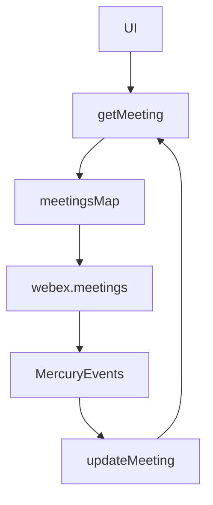
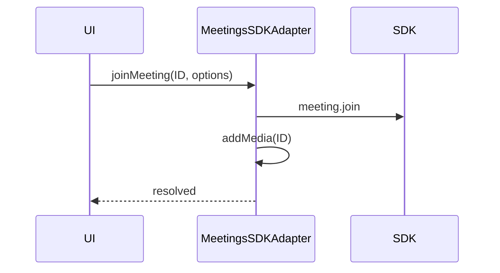
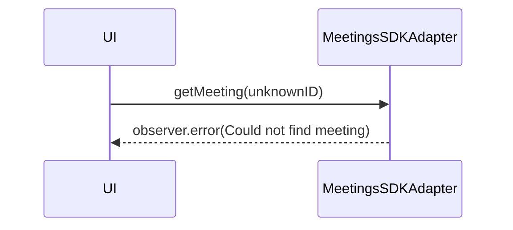
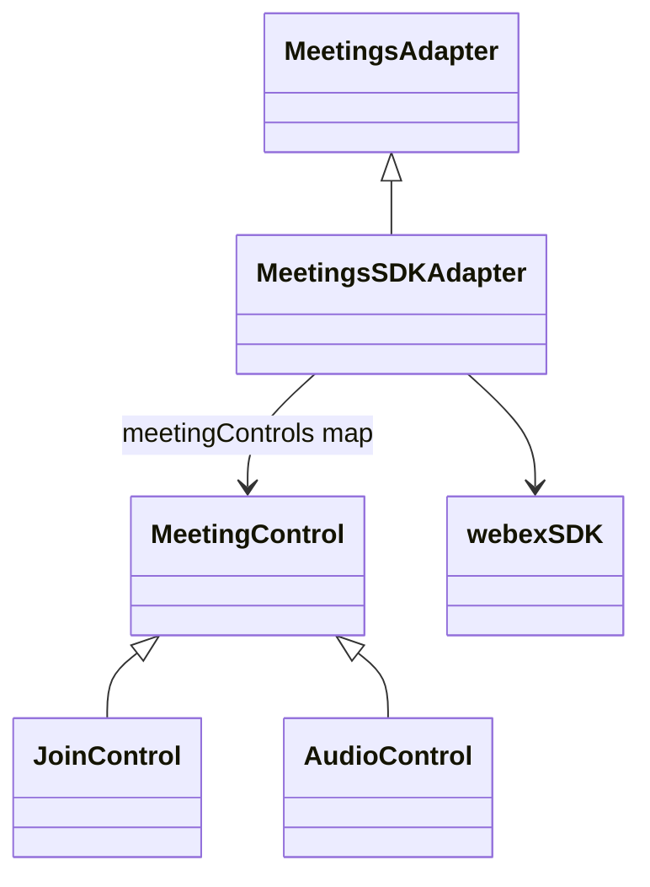

<!-- ───────────────────────────────
  Template:     Module Spec
  Template-ID:  module-spec
  Generates:    src/ai-docs/meetings-sdk-adapter-spec.md
  Library ver:  0.2.1
  Last updated: 2026-08-05
─────────────────────────────── -->

# meetings-sdk-adapter — SPEC

> [`AGENTS.md`](../../AGENTS.md) · [`SPEC_INDEX.md`](../../ai-docs/SPEC_INDEX.md)

## Metadata

| Field | Value |
|---|---|
| Module id | meetings-sdk-adapter |
| Source path(s) | `src/MeetingsSDKAdapter.js`, `src/MeetingsSDKAdapter/` |
| Doc kind | Module spec |
| Coverage score | 91% assessed 2026-08-05 — public methods and controls documented |
| Generated from | `module-spec` @ SDLC template library `0.2.1` |
| generated_by / approved_by / updated_at | cursor-agent / pending PR approval / 2026-08-05 |
| Validation status | not-run |

## Evidence Rules

File path evidence only.

## Source Material Register

| Source material | Scope | Decision | Detail location |
|---|---|---|---|
| Code | behavior | verified | `src/MeetingsSDKAdapter.js`, controls |
| README usage | reference-only | not migrated | keep-separate |

## Overview

Largest domain adapter: meeting lifecycle (create, join, leave), local/remote media, screen share, layout, settings preview devices, and **meeting controls** for `@webex/components` UI actions.

## Purpose / Responsibility

Own Webex meetings plugin integration, adapter-shaped Meeting observables, and control display/action pairs.

## Stack

JavaScript, RxJS, Webex meetings plugin, MediaStream APIs, control classes in `MeetingsSDKAdapter/controls/`.

## Folder / Package Structure

```
src/MeetingsSDKAdapter.js
src/MeetingsSDKAdapter/
├── controls/
│   ├── index.js          # Control exports
│   ├── MeetingControl.js
│   ├── JoinControl.js, ExitControl.js, …
│   └── *Control.test.js
src/MeetingsSDKAdapter.test.js
```

## Key Files (source of truth)

| File | Role |
|---|---|
| `src/MeetingsSDKAdapter.js` | Core meeting logic |
| `src/MeetingsSDKAdapter/controls/` | UI control bindings |
| `src/MeetingsSDKAdapter.test.js` | Unit tests |

## Public Surface

### MeetingsSDKAdapter class

| Symbol | Kind | Description |
|---|---|---|
| `MeetingsSDKAdapter` | class | Meetings adapter |
| `connect()` | async | Register meetings plugin, sync meetings |
| `disconnect()` | async | Unregister plugin |
| `createMeeting(destination)` | Observable | Create meeting + media probe |
| `joinMeeting(ID, options?)` | Promise | Join with password/hostKey/name |
| `leaveMeeting(ID)` | Promise | Leave and clear media |
| `getMeeting(ID)` | Observable | Meeting state stream |
| `getLocalMediaState(localMedia, disabledLocalMedia)` | object | Mute state flags |
| `toggleRoster(ID)` | Promise | Participants panel |
| `toggleSettings(ID)` | Promise | Settings modal |
| `switchCamera(ID, cameraID)` | Promise | Switch camera in settings |
| `switchMicrophone(ID, microphoneID)` | Promise | Switch mic in settings |
| `changeLayout(ID, layoutType)` | Promise | Video layout |
| `ignoreVideoAccessPrompt(ID)` | void | Join without camera |
| `ignoreAudioAccessPrompt(ID)` | void | Join without mic |
| `supportedControls()` | string[] | Control keys |
| `getLayoutTypes()` | string[] | Layout names |
| `clearPasswordRequiredFlag(ID)` | Promise | Clear password flag |
| `clearInvalidPasswordFlag(ID)` | Promise | Clear invalid password |
| `clearInvalidHostKeyFlag(ID)` | Promise | Clear invalid host key |
| `refreshCaptcha(ID)` | Promise | Refresh captcha |
| `meetingControls` | Map | key → control instance |

### Control exports (`controls/index.js`)

| Control | Key |
|---|---|
| JoinControl | join-meeting |
| ExitControl | leave-meeting |
| AudioControl | mute-audio |
| VideoControl | mute-video |
| RosterControl | member-roster |
| SettingsControl | settings |
| SwitchCameraControl | switch-camera |
| SwitchMicrophoneControl | switch-microphone |
| SwitchSpeakerControl | switch-speaker |

Each control: `action(...)`, `display(meetingID)` → Observable.

## Requires (dependencies)

| Dependency | Purpose |
|---|---|
| webex meetings plugin | Meeting CRUD/join/media |
| Browser media APIs | getUserMedia, devices |
| `src/utils.js` | resolveMeetingID, device switch helpers |
| `src/logger.js` | MEETING-tagged logs |

## Requirements

| ID | WHAT | WHY | Evidence |
|---|---|---|---|
| R-MT1 | getMeeting errors when ID not in collection | Caller shows meeting-not-found | `src/MeetingsSDKAdapter.js` |
| R-MT2 | connect registers plugin on facade connect | Meetings require plugin registration | `src/MeetingsSDKAdapter.js`, `src/WebexSDKAdapter.js` |
| R-MT3 | getStream emits permission states not subscriber.error for media denial | UI shows permission UX | `src/MeetingsSDKAdapter.js` |
| R-MT4 | Controls delegate to adapter methods | Single behavior source | `src/MeetingsSDKAdapter/controls/` |

## Design Overview

In-memory `meetings` map mirrors SDK collection; getMeeting merges SDK events into adapter Meeting model. Controls are thin delegates for component-adapter-interfaces MeetingControl pattern.

## Data Flow

createMeeting → SDK create + local media probe → emit Meeting → getMeeting subscribers receive updates via `adapter:meeting:updated` and SDK events.



## Sequence Diagram(s)

**joinMeeting flow**



**getMeeting — not found**



## Class / Component Relationships



## Use Cases

| Actor | Steps | Outcome |
|---|---|---|
| User | createMeeting(destination) | Preview join UI |
| User | joinMeeting | In-call state |
| User | AudioControl.action | Mute toggled |

## State Model

Meeting objects track state (JOINED, LEFT, etc.), local/remote media, password flags, layout, roster/settings visibility — updated via `updateMeeting`.

## Concurrency & Reactive Flow

getMeeting long-lived observable until LEFT; multiple media async operations serialized per meeting ID in practice.

## Error Handling & Failure Modes

| Failure | Behavior | Caller recovery |
|---|---|---|
| Meeting ID not found on getMeeting | `observer.error(Error)` | Verify ID; createMeeting first |
| joinMeeting / leaveMeeting SDK error | logged; meeting flags may update | Retry join; show error toast |
| switchCamera/Mic without permission | thrown Error | Request permissions |
| getStream media denied | emit permission DENIED/DISMISSED object | Show permission prompt |
| updateMeeting missing ID | thrown Error | Guard before update |

Evidence: `src/MeetingsSDKAdapter.js`, `src/MeetingsSDKAdapter.test.js`, control tests.

## Key Design Trade-off

Media permission failures use **emitted state objects** instead of observable errors for getStream — so UI can render permission prompts without tearing down the subscription. getMeeting uses **hard errors** for invalid IDs — caller must not subscribe with unknown IDs.

## Module Do's / Don'ts

- Do use controls for component-system integration.
- Don't call SDK meetings APIs directly from UI — go through adapter.

## Pitfalls

- ShareControl used internally but not exported from controls/index.js.
- Screen share requires stable connection — errors logged on unstable share.

## Test-Case Strategy (module)

| Area | File |
|---|---|
| create/join/leave | `MeetingsSDKAdapter.test.js` |
| getMeeting not found | `MeetingsSDKAdapter.test.js` |
| Each control display/action | `controls/*Control.test.js` |

## Traceability

| Requirement | Test |
|---|---|
| R-MT1 | `MeetingsSDKAdapter.test.js` |
| R-MT4 | `JoinControl.test.js`, etc. |
