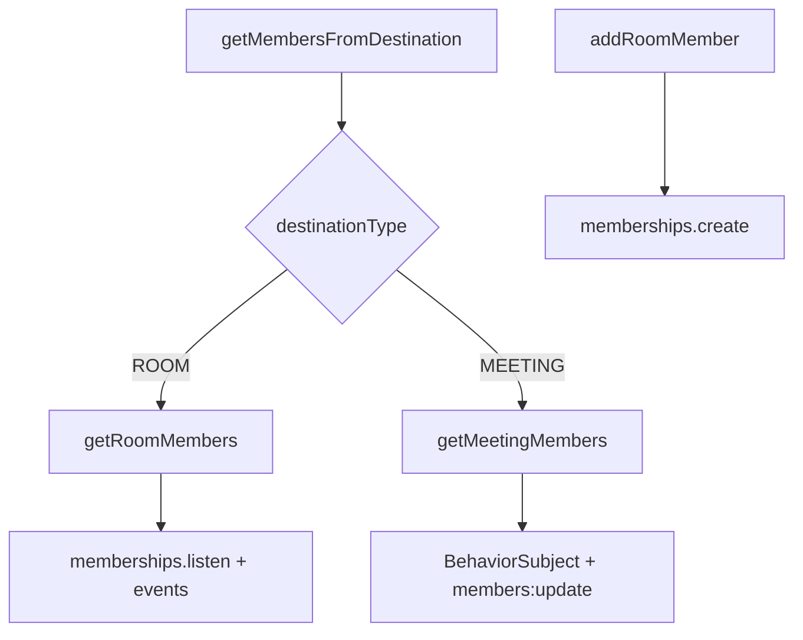
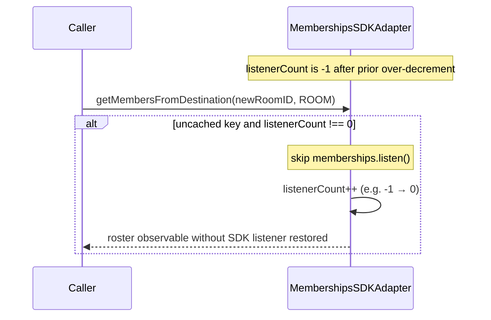
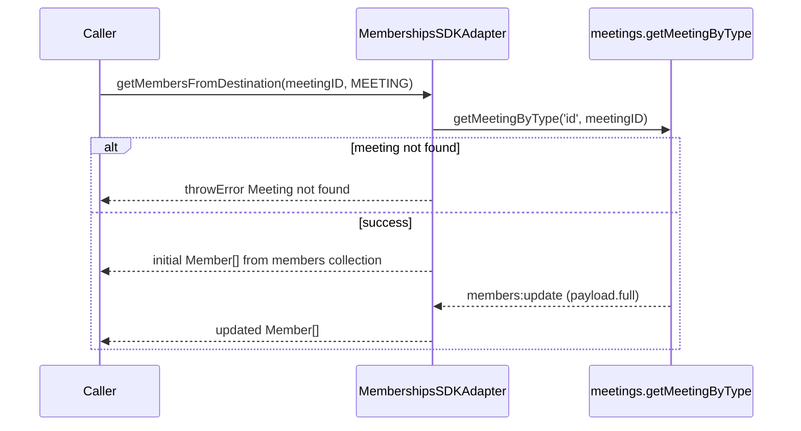
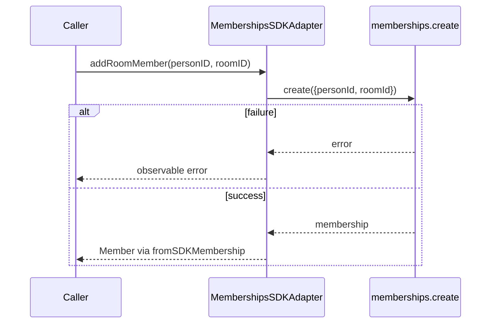
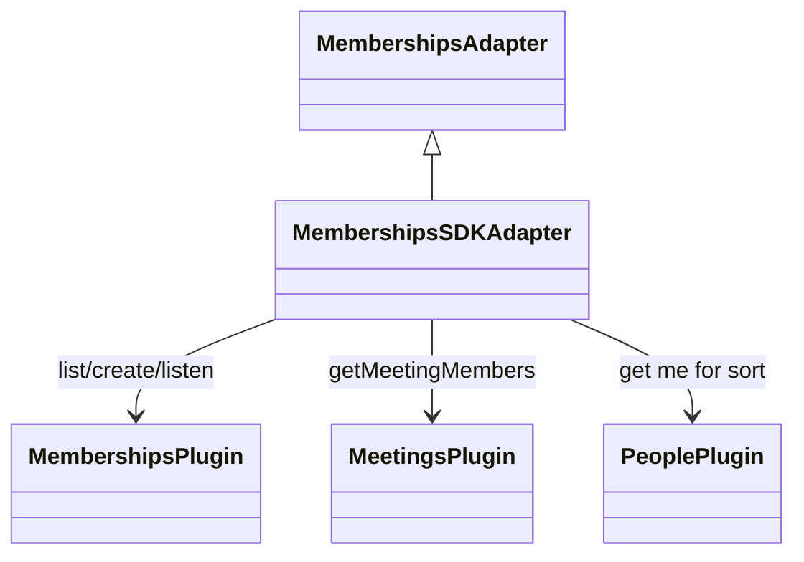

<!-- ───────────────────────────────
  Template:     Module Spec
  Template-ID:  module-spec
  Generates:    src/ai-docs/memberships-sdk-adapter-spec.md
  Library ver:  0.2.1
  Last updated: 2026-08-05
─────────────────────────────── -->

# memberships-sdk-adapter — SPEC

> [`AGENTS.md`](../../AGENTS.md) · [`SPEC_INDEX.md`](../../ai-docs/SPEC_INDEX.md) · [`ARCHITECTURE.md`](../../ai-docs/ARCHITECTURE.md)

## Metadata

| Field | Value |
|---|---|
| Module id | memberships-sdk-adapter |
| Source path(s) | `src/MembershipsSDKAdapter.js` |
| Doc kind | Module spec |
| Coverage score | 91% assessed 2026-08-05 — room/meeting rosters, addRoomMember, inherited removeRoomMember, refCount sharp edge documented |
| Generated from | `module-spec` @ SDLC template library `0.2.1` |
| generated_by / approved_by / updated_at | cursor-agent / Akula Uday / 2026-08-05 |
| Validation status | not-run |

## Evidence Rules

Every requirement cites concrete source evidence as `file path` only. Test evidence names `src/*.test.js` files.

## Source Material Register

| Source material | Scope | Decision | Detail location or disposition |
|---|---|---|---|
| Implementation | behavior | verified | Requirements, Concurrency, Pitfalls, Sequence Diagram(s) |
| `@webex/component-adapter-interfaces` MembershipsAdapter | contract | reference-only | Public Surface including inherited unsupported `removeRoomMember` |

## Overview

`MembershipsSDKAdapter` implements `MembershipsAdapter`, exposing member rosters for rooms and meetings and supporting add-member mutations. Room rosters listen to SDK membership CREATED/DELETED events; meeting rosters subscribe to SDK `members:update` on the meeting object.

## Purpose / Responsibility

Owns `getMembersFromDestination` for ROOM and MEETING destination types and `addRoomMember`. Does **not** implement `removeRoomMember` (inherited unsupported from base class).

## Stack

JavaScript, RxJS 6, Webex SDK `memberships`, `people`, `meetings` plugins, `@webex/common` SDK_EVENT constants.

## Folder / Package Structure

```
src/
├── MembershipsSDKAdapter.js
├── MembershipsSDKAdapter.test.js
└── ai-docs/
```

## Key Files (source of truth)

| File | Holds |
|---|---|
| `src/MembershipsSDKAdapter.js` | getMembersFromDestination, room/meeting paths, addRoomMember |
| `src/MembershipsSDKAdapter.test.js` | Unit tests |

## Public Surface

| Contract ID | Type | Surface | Purpose | Compatibility / deprecation | Schema / detail link | Root index |
|---|---|---|---|---|---|---|
| memberships-adapter.class | SDK class | `MembershipsSDKAdapter extends MembershipsAdapter` | Domain adapter entry | stable | `src/MembershipsSDKAdapter.js` | [`CONTRACTS.md`](../../ai-docs/CONTRACTS.md) |
| memberships-adapter.getMembersFromDestination | SDK method | `getMembersFromDestination(destinationID: string, destinationType: DestinationType): Observable<Member[]>` | Room or meeting roster stream | stable | `src/MembershipsSDKAdapter.js` | [`CONTRACTS.md`](../../ai-docs/CONTRACTS.md) |
| memberships-adapter.addRoomMember | SDK method | `addRoomMember(personID: string, roomID: string): Observable<Member>` | Create membership | stable | `src/MembershipsSDKAdapter.js` | [`CONTRACTS.md`](../../ai-docs/CONTRACTS.md) |
| memberships-adapter.removeRoomMember | SDK inherited | `removeRoomMember(personID: string, roomID: string): Observable<Member>` | **Not overridden** — base class unsupported-operation error | stable; inherited from interface | `@webex/component-adapter-interfaces` | [`CONTRACTS.md`](../../ai-docs/CONTRACTS.md) |

## Requires (dependencies)

| Dependency | Purpose |
|---|---|
| `datasource.memberships.list` / `create` / `listen` / `stopListening` | Room roster and add member |
| `datasource.people.get('me')` | Sort room members with current user first |
| `datasource.meetings.getMeetingByType` | Meeting roster source |
| SDK_EVENT CREATED/DELETED on memberships | Room roster live updates |

## Requirements

| ID | WHAT | WHY | Source Evidence | Test / Example Evidence | Assumptions / Gaps | Confidence |
|---|---|---|---|---|---|---|
| MEM-R-001 | ROOM path lists memberships with max 1000 and sorts current user first | Predictable roster ordering for UI | `src/MembershipsSDKAdapter.js` | `src/MembershipsSDKAdapter.test.js` | none | PRESENT |
| MEM-R-002 | MEETING path uses BehaviorSubject + `members:update` with `payload.full` | Replay last roster to new subscribers | `src/MembershipsSDKAdapter.js` | `src/MembershipsSDKAdapter.test.js` meeting roster + missing meeting error | members:update live path untested | PRESENT |
| MEM-R-003 | Unknown `destinationType` returns throwError | Explicit unsupported destination guard | `src/MembershipsSDKAdapter.js` | none found | none | PRESENT |
| MEM-R-004 | `addRoomMember` maps SDK membership via `fromSDKMembership`; errors rethrown | Caller sees create failures | `src/MembershipsSDKAdapter.js` | `src/MembershipsSDKAdapter.test.js` addRoomMember success and rejected create | none | PRESENT |
| MEM-R-005 | `removeRoomMember` not overridden — base unsupported error | Document effective callable surface | `src/MembershipsSDKAdapter.js` | none found | Exact base error message not asserted | WEAK |
| MEM-R-006 | Room path `finalize` runs per subscription after refCount — first unsubscribe may call stopListening while others remain | **Sharp edge:** not last-subscriber guarantee | `src/MembershipsSDKAdapter.js` | none found | Two-subscriber negative test missing | PRESENT |

## Design Overview

`getMembersFromDestination` caches observables by `${destinationType}-${destinationID}`. Room members combine `people.get('me')` with membership list, then merge CREATED/DELETED events filtered by roomId. Meeting members read initial collection from SDK meeting object and listen for full member snapshot updates.

## Data Flow



## Sequence Diagram(s)

Sequence coverage:

| Operation group | Diagram | Failure / recovery coverage |
|---|---|---|
| getMembersFromDestination — ROOM | Room roster + membership events | finalize stopListening sharp edge noted |
| getMembersFromDestination — MEETING | Meeting roster updates | alt: meeting not found → throwError |
| addRoomMember | Create membership | alt: create error → rethrow |

### getMembersFromDestination — room path

```mermaid
sequenceDiagram
  participant Caller
  participant Adapter as MembershipsSDKAdapter
  participant People as people.get me
  participant Mem as memberships.list
  participant Events as memberships CREATED/DELETED

  Caller->>Adapter: getMembersFromDestination(roomID, ROOM)
  alt cache hit (members$[ROOM-roomID] exists)
    Adapter-->>Caller: return cached observable (no new listen/list)
  else cache miss — construct getRoomMembers
    alt listenerCount === 0
      Adapter->>Adapter: memberships.listen()
    else listenerCount !== 0
      Note over Adapter: skip listen (includes negative count from prior finalize)
    end
    Adapter->>Adapter: listenerCount++
    Adapter->>People: get('me')
    Adapter->>Mem: list({roomId, max: 1000})
    Mem-->>Adapter: items
    Adapter-->>Caller: sorted Member[]
    Events-->>Adapter: created/deleted (matching roomId)
    Adapter->>Mem: list refresh
    Adapter-->>Caller: updated Member[]
    Note over Adapter: finalize per subscriber teardown decrements listenerCount; may stopListening early
  end
  Note over Caller,Adapter: Re-subscribe to cached observable does not call listen again
```

### getMembersFromDestination — room path (negative listenerCount)

When repeated finalize drove `listenerCount` below zero, a **new uncached** room construction increments toward zero **without** calling `memberships.listen()`:



### getMembersFromDestination — meeting path



### addRoomMember



## Class / Component Relationships



## Use Cases

- **UC-1 Room roster panel:** `getMembersFromDestination(roomId, ROOM)` → list + live updates. Evidence: `src/MembershipsSDKAdapter.test.js`.
- **UC-2 In-meeting roster:** `getMembersFromDestination(meetingId, MEETING)` → BehaviorSubject stream. Evidence: `src/MembershipsSDKAdapter.js`.
- **UC-3 Add participant:** `addRoomMember(personId, roomId)` → single emission. Evidence: `src/MembershipsSDKAdapter.js`.

## State Model

| State | Shape | Create / update trigger | Retention / teardown | Error behavior |
|---|---|---|---|---|
| `members$` | `${destinationType}-${destinationID}` → cached observable | First cache miss for key constructs room or meeting pipeline | Persists for **this adapter instance** lifetime; not cleared on unsubscribe | Unsupported type → throwError observable |
| `listenerCount` | integer ref-count | Increment when constructing uncached **room** observable; decrement in finalize | **`memberships.stopListening()` when post-decrement count is `<= 0`** | **Sharp edge:** repeated finalize can drive count **negative**; while `listenerCount !== 0`, new uncached room paths skip `listen()` even as count increments toward zero |

- `memberships.listen()` runs only when constructing an **uncached** room roster and **`listenerCount === 0` exactly** before increment.
- When `listenerCount !== 0` (including negative values), `listen()` is skipped.
- Cache hit returns existing observable — **no** `getRoomMembers`, **no** listen call.

## Concurrency & Reactive Flow

- Room observable: `concat(members$, event$)` wrapped in `publishReplay(1)` + `refCount()`, with `finalize` calling `stopListeningToMembershipsUpdates`.
- **Sharp edge (MEM-R-006):** `finalize` is attached after `refCount()`, so it runs once per external subscription teardown. With two subscribers, the first unsubscribe decrements `listenerCount` and may invoke `memberships.stopListening()` while the second subscriber is still active — **do not assume last-subscriber semantics**.
- Meeting observable: plain BehaviorSubject without shared refCount; no global memberships listen.
- Cached observables in `this.members$` persist for **adapter instance** lifetime (not process-global).

## Error Handling & Failure Modes

| Condition | Signal (error/code/result) | Caller recovery |
|---|---|---|
| Meeting not found for MEETING type | `throwError(new Error('Meeting … not found.'))` | Verify meeting exists and meetings plugin connected |
| Unsupported destination type | `throwError` with not supported message | Pass ROOM or MEETING only |
| `addRoomMember` create failure | Observable error (logged, rethrown) | Show add failure; check permissions |
| `removeRoomMember` on this adapter | Base class unsupported-operation error | Use host/SDK workflow for removal or extend adapter |
| Early stopListening due to finalize sharp edge | Remaining room subscribers stop receiving CREATED/DELETED updates | **Re-subscribing to the cached observable does not call `memberships.listen()` again** — recovery requires a new adapter instance or an implementation fix; do not treat re-subscribe as listener restore |

## Host Integration & Theming

Host application is `@webex/components`. Construct `WebexSDKAdapter` with an **authenticated** Webex JS SDK instance. Await facade `connect()` for live room roster updates (Mercury-backed membership events). Subscribe to `getMembersFromDestination(id, type)` observables in host roster UI; meeting rosters require an active SDK meeting object from the meetings adapter flow.

## Pitfalls

- **Do not claim last-subscriber stopListening guarantee** for room rosters — see MEM-R-006.
- **Re-subscribing does not restore SDK listening** — `getMembersFromDestination` returns the cached observable; `startListeningToMembershipsUpdates` runs only on first cache miss.
- **`removeRoomMember` is not implemented** — calling it hits base adapter unsupported error.
- **Meeting roster requires live SDK meeting object** — not available before join/create flows populate meetings collection.

## Test-Case Strategy (module)

| Behavior / Requirement | Existing test evidence | Gap |
|---|---|---|
| MEM-R-001 | `src/MembershipsSDKAdapter.test.js` room members | MEM-R-006 two-subscriber finalize |
| MEM-R-002 | `src/MembershipsSDKAdapter.test.js` meeting roster + missing meeting | members:update live emission |
| MEM-R-004 | `src/MembershipsSDKAdapter.test.js` addRoomMember success/reject | none |
| MEM-R-005 | none found | removeRoomMember inherited error |

## Traceability

- Repo architecture: [`ai-docs/ARCHITECTURE.md`](../../ai-docs/ARCHITECTURE.md) · Registry: [`ai-docs/SPEC_INDEX.md`](../../ai-docs/SPEC_INDEX.md)
- Coverage state & contracts baseline: `.sdd/manifest.json`
