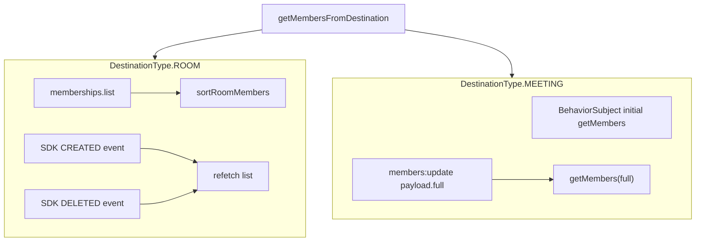
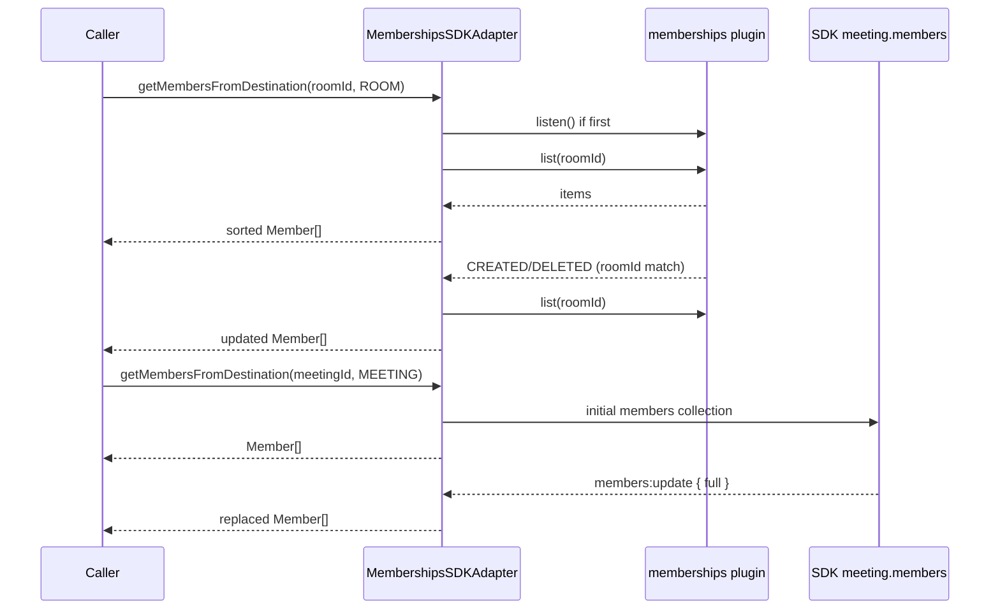
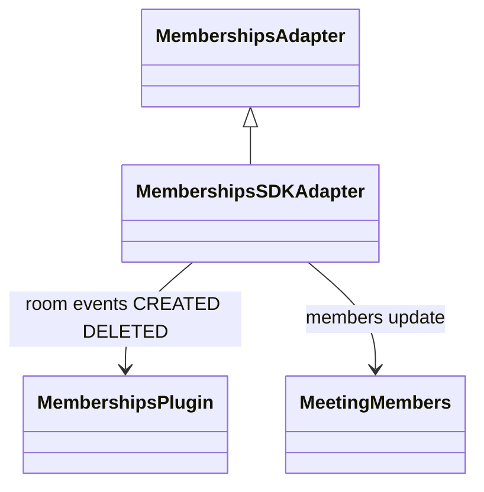

<!-- ───────────────────────────────
  Template:     Module Spec
  Template-ID:  module-spec
  Generates:    src/ai-docs/memberships-sdk-adapter-spec.md
  Library ver:  0.2.1
  Last updated: 2026-08-05
─────────────────────────────── -->

# memberships-sdk-adapter — SPEC

> [`AGENTS.md`](../../AGENTS.md) · [`SPEC_INDEX.md`](../../ai-docs/SPEC_INDEX.md) · [`ARCHITECTURE.md`](../../ai-docs/ARCHITECTURE.md)

## Metadata

| Field | Value |
|---|---|
| Module id | memberships-sdk-adapter |
| Source path(s) | `src/MembershipsSDKAdapter.js` |
| Doc kind | Module spec |
| Coverage score | 89% assessed 2026-08-05 — room SDK CREATED/DELETED vs meeting members:update documented |
| Generated from | `module-spec` @ SDLC template library `0.2.1` |
| generated_by / approved_by / updated_at | cursor-agent / pending PR approval / 2026-08-05 |
| Validation status | not-run |

## Evidence Rules

Every requirement cites concrete source evidence as `file path` only. Test evidence names `src/*.test.js` files.

## Source Material Register

| Source material | Scope | Decision | Detail location or disposition |
|---|---|---|---|
| Implementation | behavior | verified | Requirements and Design Overview in this spec |
| `@webex/component-adapter-interfaces` MembershipsAdapter | contract | reference-only | Public Surface rows |

## Overview

`MembershipsSDKAdapter` implements `MembershipsAdapter`, exposing member lists for **rooms** and **meetings** via distinct event sources. Room membership refreshes on SDK external membership `created` / `deleted` events; meeting membership listens to the SDK meeting object's `members:update` with `payload.full` replacement.

## Purpose / Responsibility

Owns destination-scoped member list observables and `addRoomMember`. Does **not** own person profile details (see `PeopleSDKAdapter`) or meeting media.

## Stack

JavaScript, RxJS 6, Webex SDK `memberships` and `meetings` plugins, `@webex/common` SDK_EVENT constants.

## Folder / Package Structure

```
src/
├── MembershipsSDKAdapter.js
├── MembershipsSDKAdapter.test.js
└── ai-docs/
```

## Key Files (source of truth)

| File | Holds |
|---|---|
| `src/MembershipsSDKAdapter.js` | getMembersFromDestination, room/meeting paths, addRoomMember |
| `src/MembershipsSDKAdapter.test.js` | Unit tests |

## Public Surface

| Contract ID | Symbol | Kind | Signature/Type | Stability | Detail link | Defined at |
|---|---|---|---|---|---|---|
| memberships-adapter.class | `MembershipsSDKAdapter` | class | extends `MembershipsAdapter` | stable | [`CONTRACTS.md`](../../ai-docs/CONTRACTS.md) | `src/MembershipsSDKAdapter.js` |
| memberships-adapter.getMembers | `getMembersFromDestination(id, type)` | method → Observable | `(destinationID, DestinationType) => Observable<Member[]>` | stable | this spec | `src/MembershipsSDKAdapter.js` |
| memberships-adapter.addRoomMember | `addRoomMember(personID, roomID)` | method → Observable | `(personID, roomID) => Observable<Membership>` | stable | this spec | `src/MembershipsSDKAdapter.js` |

## Requires (dependencies)

| Dependency | Purpose |
|---|---|
| `datasource.memberships.list/create/listen/stopListening` | Room members |
| `SDK_EVENT.EXTERNAL.EVENT_TYPE.CREATED` / `DELETED` | Room membership change events |
| `datasource.meetings.getMeetingByType` | Meeting member collection |
| Meeting `members.on('members:update')` | In-meeting roster updates |
| `datasource.people.get('me')` | Sort current user first in rooms |

## Requirements

| ID | WHAT | WHY | Evidence | Test evidence | Gaps | Confidence |
|---|---|---|---|---|---|---|
| MEM-R-001 | Room path listens to memberships plugin `CREATED` and `DELETED` SDK external events, refetching list on matching `roomId` | Room roster driven by membership CRUD events | `src/MembershipsSDKAdapter.js` | `src/MembershipsSDKAdapter.test.js` ROOM positive sorted list | CREATED/DELETED event simulation gap | PRESENT |
| MEM-R-002 | Room path ref-counts `memberships.listen()` / `stopListening()` globally | SDK listens to all membership events once | `src/MembershipsSDKAdapter.js` | none found | listen ref-count untested | PRESENT |
| MEM-R-003 | Meeting path uses `meeting.members.on('members:update')` and replaces roster only when `payload.full` is truthy | Meeting roster snapshot from full member map | `src/MembershipsSDKAdapter.js` | `src/MembershipsSDKAdapter.test.js` MEETING positive | members:update event not simulated | PRESENT |
| MEM-R-004 | Meeting path initial emission from `BehaviorSubject(getMembers(...))` | Late subscribers get last roster | `src/MembershipsSDKAdapter.js` | `src/MembershipsSDKAdapter.test.js` | none | PRESENT |
| MEM-R-005 | Invalid meeting ID errors observable `Meeting {id} not found.` | Distinguish from empty room | `src/MembershipsSDKAdapter.js` | `src/MembershipsSDKAdapter.test.js` negative invalid meeting | none | PRESENT |
| MEM-R-006 | Unsupported `DestinationType` errors on subscribe | Explicit unsupported destinations | `src/MembershipsSDKAdapter.js` | `src/MembershipsSDKAdapter.test.js` negative unsupported type | none | PRESENT |
| MEM-R-007 | `addRoomMember` calls `memberships.create` and maps via `fromSDKMembership` | Add person to room | `src/MembershipsSDKAdapter.js` | `src/MembershipsSDKAdapter.test.js` positive/negative | none | PRESENT |

## Design Overview

`getMembersFromDestination` memoizes observables by `${destinationType}-${destinationID}`. Room flow combines initial `memberships.list` (sorted with current user first) with merged CREATED/DELETED event-driven refetches filtered to the room. Meeting flow attaches to the live SDK meeting object — no memberships plugin listen — and pushes full roster replacements from `members:update` when `payload.full` is provided. These are **different transport and event models** and must not be conflated in host UI logic.

## Data Flow



## Sequence Diagram(s)

Sequence coverage:

| Operation group | Diagram | Failure / recovery coverage |
|---|---|---|
| Room members | list + CREATED/DELETED refetch | finalize → stopListening |
| Meeting members | initial + members:update | alt: meeting not found → error |



## Class / Component Relationships



## Use Cases

- **UC-1 Room roster panel:** ROOM destination → list + live membership changes via SDK external events. Evidence: `src/MembershipsSDKAdapter.js`.
- **UC-2 In-meeting roster:** MEETING destination → BehaviorSubject + `members:update` with full payload. Evidence: `src/MembershipsSDKAdapter.js`.
- **UC-3 Invite to room:** `addRoomMember` one-shot create. Evidence: `src/MembershipsSDKAdapter.test.js`.

## Error Handling & Failure Modes

| Condition | Signal | Caller recovery |
|---|---|---|
| Meeting not found | Observable error | Verify meeting exists and plugin synced |
| Unsupported destination type | Observable error | Use ROOM or MEETING only |
| addRoomMember SDK failure | Observable error rethrown | Show invite failure |

## Concurrency & Reactive Flow

- Room observables use `publishReplay(1)` + `refCount()` with finalize stopping membership listen when last subscriber leaves.
- Meeting `BehaviorSubject` persists for memoized observable lifetime; `members:update` handler registered once per meeting subscription setup.
- Room events use `@webex/common` `SDK_EVENT.EXTERNAL.EVENT_TYPE.CREATED` / `DELETED` — distinct from meeting `members:update` string event.

## Pitfalls

- **Do not expect `members:update` for room rosters** — rooms use memberships plugin CREATED/DELETED.
- **Meeting updates require `payload.full`** — partial deltas ignored.
- **Early `memberships.stopListening`** breaks all room roster subscribers — ref-count must reach zero first.

## Test-Case Strategy (module)

| Behavior / Requirement | Existing test evidence | Gap |
|---|---|---|
| MEM-R-001 | `src/MembershipsSDKAdapter.test.js` ROOM — positive sorted list | Negative: simulate CREATED/DELETED refetch |
| MEM-R-003, MEM-R-004 | `src/MembershipsSDKAdapter.test.js` MEETING — positive sorted list | Simulate members:update with payload.full |
| MEM-R-005 | `src/MembershipsSDKAdapter.test.js` — negative invalid meeting ID | none |
| MEM-R-006 | `src/MembershipsSDKAdapter.test.js` — negative unsupported destination | none |
| MEM-R-007 | `src/MembershipsSDKAdapter.test.js` addRoomMember positive/negative | none |

## Traceability

- Repo architecture: [`ai-docs/ARCHITECTURE.md`](../../ai-docs/ARCHITECTURE.md) · Registry: [`ai-docs/SPEC_INDEX.md`](../../ai-docs/SPEC_INDEX.md)
- Coverage state & contracts baseline: `.sdd/manifest.json`
