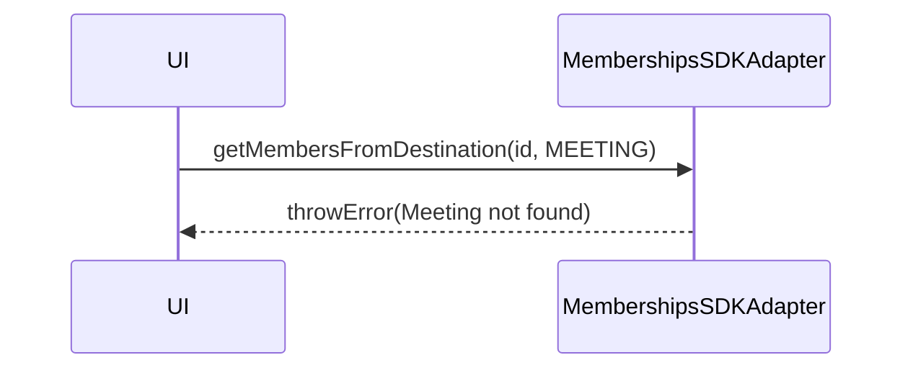

<!-- ───────────────────────────────
  Template:     Module Spec
  Template-ID:  module-spec
  Generates:    src/ai-docs/memberships-sdk-adapter-spec.md
  Library ver:  0.2.1
  Last updated: 2026-08-05
─────────────────────────────── -->

# memberships-sdk-adapter — SPEC

> [`AGENTS.md`](../../AGENTS.md) · [`SPEC_INDEX.md`](../../ai-docs/SPEC_INDEX.md)

## Metadata

| Field | Value |
|---|---|
| Module id | memberships-sdk-adapter |
| Source path(s) | `src/MembershipsSDKAdapter.js` |
| Doc kind | Module spec |
| Coverage score | 89% assessed 2026-08-05 |
| Generated from | `module-spec` @ SDLC template library `0.2.1` |
| generated_by / approved_by / updated_at | cursor-agent / pending PR approval / 2026-08-05 |
| Validation status | not-run |

## Evidence Rules

File path evidence only.

## Source Material Register

| Source material | Scope | Decision | Detail location |
|---|---|---|---|
| Code | behavior | verified | `src/MembershipsSDKAdapter.js` |

## Overview

Room and meeting membership lists with live membership create/delete events.

## Purpose / Responsibility

Expose member rosters for ROOM and MEETING destinations; add members to rooms.

## Stack

JavaScript, RxJS, Webex SDK memberships + meetings roster.

## Folder / Package Structure

```
src/MembershipsSDKAdapter.js
src/MembershipsSDKAdapter.test.js
```

## Key Files (source of truth)

| File | Role |
|---|---|
| `src/MembershipsSDKAdapter.js` | Implementation |

## Public Surface

| Symbol | Kind | Description |
|---|---|---|
| `MembershipsSDKAdapter` | class | Memberships adapter |
| `getMembersFromDestination(destinationID, destinationType)` | Observable | ROOM or MEETING members |
| `addRoomMember(personID, roomID)` | Observable | Add member to room |

## Requires (dependencies)

| Dependency | Purpose |
|---|---|
| webex SDK memberships | Room members |
| webex meetings | In-meeting roster |

## Requirements

| ID | WHAT | WHY | Evidence |
|---|---|---|---|
| R-M1 | Unsupported destinationType throws on subscribe | Fail fast for invalid API use | `src/MembershipsSDKAdapter.js` |
| R-M2 | Meeting not found throws Error | Caller handles missing meeting | `src/MembershipsSDKAdapter.js` |

## Design Overview

Ref-counted membership listener for rooms; BehaviorSubject for meeting rosters.

## Data Flow

getMembersFromDestination → branch on ROOM vs MEETING → respective observable pipeline.

## Sequence Diagram(s)

**getMembersFromDestination — meeting not found**



## Class / Component Relationships

Extends `MembershipsAdapter`.

## Use Cases

Room member list panel; meeting participant roster.

## Concurrency & Reactive Flow

Room members sorted array emissions on change events.

## Error Handling & Failure Modes

| Failure | Behavior | Caller recovery |
|---|---|---|
| Meeting not found | `throwError` | Ensure meeting joined/created |
| Unsupported type | `throwError` | Pass ROOM or MEETING only |
| addRoomMember SDK error | catchError rethrow | Show add-member failure |

Evidence: `src/MembershipsSDKAdapter.js`, `src/MembershipsSDKAdapter.test.js`

## Pitfalls

Meeting roster requires active meeting in SDK collection.

## Test-Case Strategy (module)

`MembershipsSDKAdapter.test.js`

## Traceability

| Requirement | Test |
|---|---|
| R-M2 | `MembershipsSDKAdapter.test.js` |
