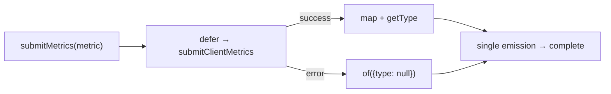
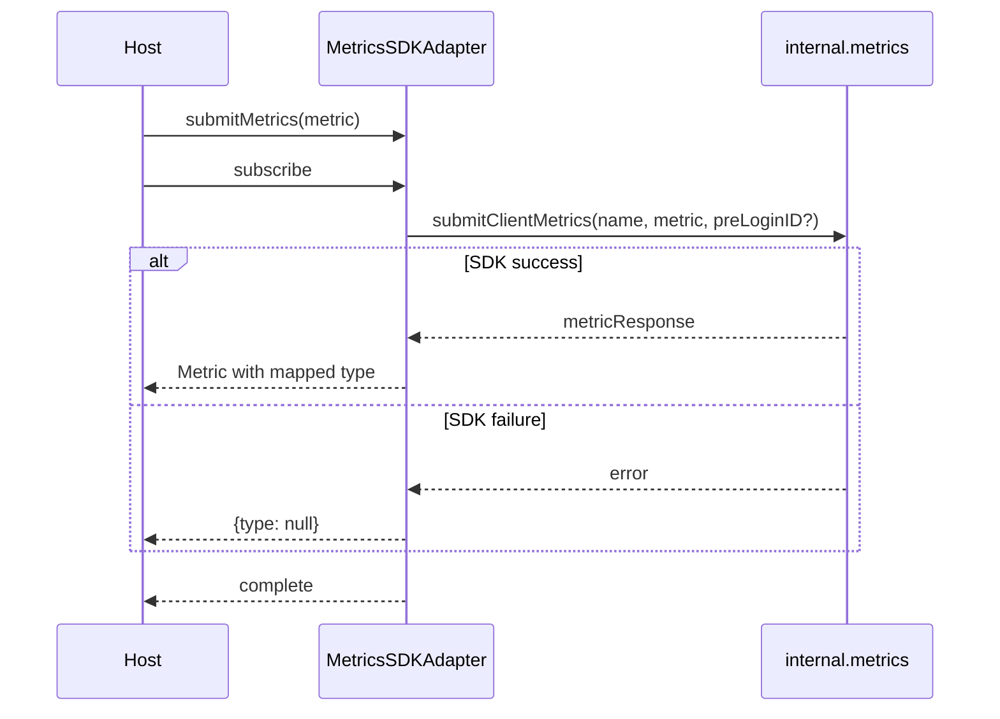
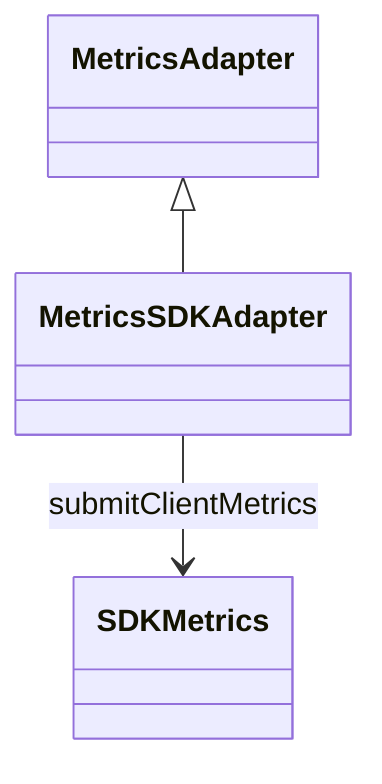

<!-- ───────────────────────────────
  Template:     Module Spec
  Template-ID:  module-spec
  Generates:    src/ai-docs/metrics-sdk-adapter-spec.md
  Library ver:  0.2.1
  Last updated: 2026-08-05
─────────────────────────────── -->

# metrics-sdk-adapter — SPEC

> [`AGENTS.md`](../../AGENTS.md) · [`SPEC_INDEX.md`](../../ai-docs/SPEC_INDEX.md) · [`ARCHITECTURE.md`](../../ai-docs/ARCHITECTURE.md)

## Metadata

| Field | Value |
|---|---|
| Module id | metrics-sdk-adapter |
| Source path(s) | `src/MetricsSDKAdapter.js` |
| Doc kind | Module spec |
| Coverage score | 88% assessed 2026-08-05 — submitMetrics observable, error swallowing, and MetricType mapping documented |
| Generated from | `module-spec` @ SDLC template library `0.2.1` |
| generated_by / approved_by / updated_at | cursor-agent / pending PR approval / 2026-08-05 |
| Validation status | not-run |

## Evidence Rules

Every requirement cites concrete source evidence as `file path` only. Test evidence names `src/*.test.js` files.

## Source Material Register

| Source material | Scope | Decision | Detail location or disposition |
|---|---|---|---|
| Implementation | behavior | verified | All universal sections in this spec |
| `@webex/component-adapter-interfaces` MetricsAdapter | contract | reference-only | Public Surface rows |

## Overview

`MetricsSDKAdapter` implements `MetricsAdapter`, wrapping the Webex SDK internal metrics client API as a one-shot RxJS observable. SDK failures degrade to a benign metric object with `type: null` so telemetry never breaks host UX. Works without facade `connect()` — uses SDK HTTP/internal metrics path on authenticated instance.

## Purpose / Responsibility

Owns client metrics submission observable. Does **not** aggregate, batch, or persist metrics locally.

## Stack

JavaScript, RxJS 6, Webex SDK `internal.metrics.submitClientMetrics`, `@webex/component-adapter-interfaces` `MetricType` enum.

## Folder / Package Structure

```
src/
├── MetricsSDKAdapter.js
├── MetricsSDKAdapter.test.js
└── ai-docs/
```

## Key Files (source of truth)

| File | Holds |
|---|---|
| `src/MetricsSDKAdapter.js` | submitMetrics, getType helper |
| `src/MetricsSDKAdapter.test.js` | Unit tests |

## Public Surface

| Contract ID | Symbol | Kind | Signature/Type | Stability | Detail link | Defined at |
|---|---|---|---|---|---|---|
| metrics-adapter.class | `MetricsSDKAdapter` | class | extends `MetricsAdapter` | stable | [`CONTRACTS.md`](../../ai-docs/CONTRACTS.md) | `src/MetricsSDKAdapter.js` |
| metrics-adapter.submitMetrics | `submitMetrics(metric, preLoginID?)` | method → Observable | `(metric: Metric, preLoginID?: string) => Observable<Metric>` | stable | this spec | `src/MetricsSDKAdapter.js` |

## Requires (dependencies)

| Dependency | Purpose |
|---|---|
| Authenticated Webex SDK | Metrics authorization |
| `datasource.internal.metrics.submitClientMetrics` | Upload metric payload |
| `MetricType` from adapter interfaces | Response type normalization |

## Requirements

| ID | WHAT | WHY | Evidence | Test evidence | Gaps | Confidence |
|---|---|---|---|---|---|---|
| MET-R-001 | `submitMetrics` returns cold `defer` observable wrapping SDK submit promise | Lazy execution per subscription | `src/MetricsSDKAdapter.js` | `src/MetricsSDKAdapter.test.js` (positive emit) | none | PRESENT |
| MET-R-002 | SDK rejection caught and mapped to `{type: null}` emission via `of()` | Telemetry must not throw to host | `src/MetricsSDKAdapter.js` | `src/MetricsSDKAdapter.test.js` (negative plug-in error → null type) | none | PRESENT |
| MET-R-003 | Success response merges SDK body and maps `type` through `getType()` to MetricType key or null | Consistent adapter metric shape | `src/MetricsSDKAdapter.js` | `src/MetricsSDKAdapter.test.js` (positive) | Unknown type mapping untested | PRESENT |
| MET-R-004 | Optional `preLoginID` forwarded to `submitClientMetrics` third argument | Onboarding metrics before full auth | `src/MetricsSDKAdapter.js` | none found | preLoginID path untested | PRESENT |
| MET-R-005 | Observable completes after single emission | One-shot submit semantics | `src/MetricsSDKAdapter.js` | `src/MetricsSDKAdapter.test.js` (completes after one emission) | none | PRESENT |
| MET-R-006 | Does not require WebexSDKAdapter.connect() | Metrics SDK path independent of Mercury/device | `src/MetricsSDKAdapter.js` | none found | Integration without connect untested | PRESENT |

## Design Overview

Single-method adapter: defer to promise, catch all errors into benign success-shaped object, map enum type on success path. No shared state or caching. Logging at debug on invoke.

## Data Flow



## Sequence Diagram(s)

Sequence coverage:

| Operation group | Diagram | Failure / recovery coverage |
|---|---|---|
| submitMetrics | Single trivial pass-through | alt: SDK error → type null emission (no error) |

This module has one operation group — a single sequence diagram covers all behavior.



## Class / Component Relationships



## Use Cases

- **UC-1 Usage telemetry:** Host submits client metric after user action → receives acknowledgment or silent `{type: null}` on failure. Evidence: `src/MetricsSDKAdapter.test.js`.
- **UC-2 Pre-login onboarding:** Host passes `preLoginID` during signup funnel. Evidence: `src/MetricsSDKAdapter.js`.

## Concurrency & Reactive Flow

- Cold observable per `submitMetrics` call — each subscription triggers separate SDK submit.
- No shared mutable adapter state.
- Errors never propagate as observable errors — always swallowed to `{type: null}`.

## Pitfalls

- **Cannot detect SDK failure from stream** — error and empty type both yield `{type: null}` on failure path; success with unknown type also maps to null via `getType`.
- **Do not rely on connect()** — but SDK must still be authenticated for metrics upload.
- **Silent degradation by design** — do not use this stream for critical audit trails without SDK-level confirmation.

## Test-Case Strategy (module)

| Behavior / Requirement | Existing test evidence | Gap |
|---|---|---|
| MET-R-001 | `src/MetricsSDKAdapter.test.js` — positive: returns observable, emits Metric | none |
| MET-R-002 | `src/MetricsSDKAdapter.test.js` — negative: plug-in error → null type | none |
| MET-R-005 | `src/MetricsSDKAdapter.test.js` — completes after one emission | none |
| MET-R-004 | none found | Positive/negative with preLoginID argument |
| MET-R-006 | none found | Submit without facade connect |

## Traceability

- Repo architecture: [`ai-docs/ARCHITECTURE.md`](../../ai-docs/ARCHITECTURE.md) · Registry: [`ai-docs/SPEC_INDEX.md`](../../ai-docs/SPEC_INDEX.md)
- Coverage state & contracts baseline: `.sdd/manifest.json`
