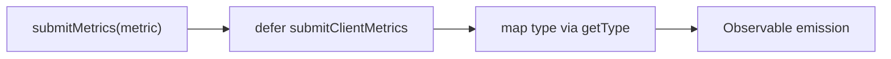
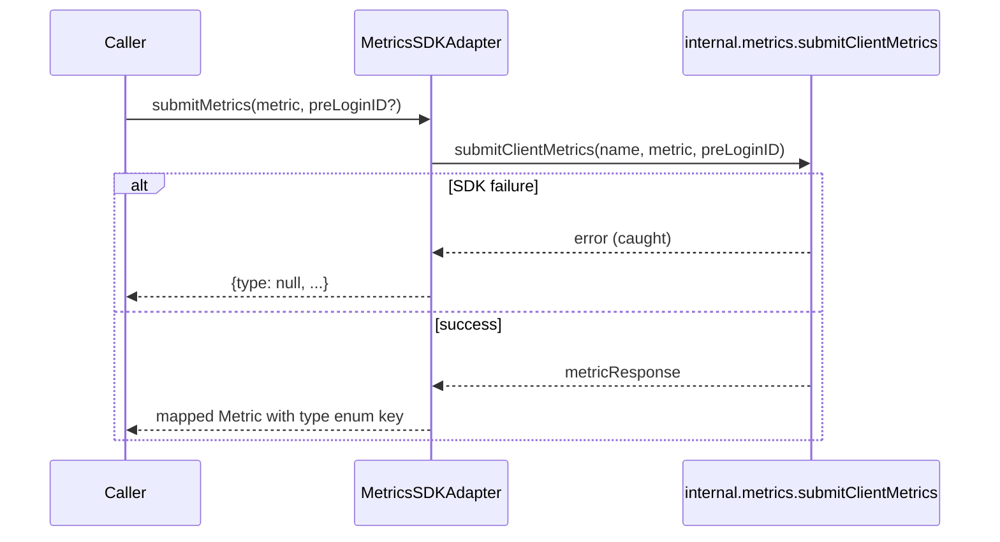
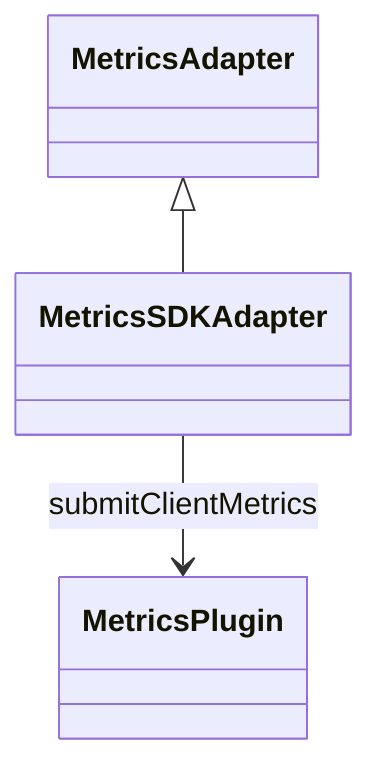

<!-- ───────────────────────────────
  Template:     Module Spec
  Template-ID:  module-spec
  Description:  Per-module canonical spec — orientation plus requirements, design, invariants, flows, pitfalls, and tests.
  Generates:    src/ai-docs/metrics-sdk-adapter-spec.md
  Library ver:  0.2.2
  Last updated: 2026-08-05
─────────────────────────────── -->

# metrics-sdk-adapter — SPEC

> [`AGENTS.md`](../../AGENTS.md) · [`SPEC_INDEX.md`](../../ai-docs/SPEC_INDEX.md) · [`ARCHITECTURE.md`](../../ai-docs/ARCHITECTURE.md)

## Metadata

| Field | Value |
|---|---|
| Module id | metrics-sdk-adapter |
| Source path(s) | `src/MetricsSDKAdapter.js` |
| Parent spec | `src/ai-docs/webex-sdk-adapter-spec.md` |
| Doc kind | Module spec |
| Coverage score | 91% assessed 2026-08-05 — single submitMetrics operation group documented |
| Generated from | `module-spec` @ SDLC template library `0.2.2` |
| generated_by / approved_by / updated_at | cursor-agent / Akula Uday / 2026-08-05 |
| Validation status | not-run — pending codex-agent Session B at committed HEAD (cursor preflight 2026-09-02: 0 content Blocking; unit 19/19 suites, 194/194 passed) |

## Evidence Rules

Every requirement cites concrete source evidence as `file path` only. Test evidence names `src/*.test.js` files.

## Source Material Register

| Source material | Scope | Decision | Detail location or disposition |
|---|---|---|---|
| Implementation | behavior | verified | Requirements, Sequence Diagram(s) |
| `@webex/component-adapter-interfaces` MetricsAdapter | contract | reference-only | Public Surface rows |

## Overview

`MetricsSDKAdapter` implements `MetricsAdapter` with one public method: `submitMetrics` forwards client metrics to the SDK internal metrics service and maps the response type to `MetricType` enum keys.

## Purpose / Responsibility

Owns client metrics submission observables. Does **not** own analytics storage or server-side aggregation.

## Stack

JavaScript, RxJS 6, Webex SDK `internal.metrics.submitClientMetrics`.

## Folder / Package Structure

```
src/
├── MetricsSDKAdapter.js
├── MetricsSDKAdapter.test.js
└── ai-docs/
```

## Key Files (source of truth)

| File | Holds |
|---|---|
| `src/MetricsSDKAdapter.js` | submitMetrics, getType helper |
| `src/MetricsSDKAdapter.test.js` | Unit tests |

## Public Surface

| Contract ID | Type | Surface | Purpose | Compatibility / deprecation | Schema / detail link | Root index |
|---|---|---|---|---|---|---|
| metrics-adapter.class | SDK class | `MetricsSDKAdapter extends MetricsAdapter` | Domain adapter entry | stable | `src/MetricsSDKAdapter.js` | [`CONTRACTS.md`](../../ai-docs/CONTRACTS.md) |
| metrics-adapter.submitMetrics | SDK method | `submitMetrics(metric: Metric, preLoginID?: string): Observable<Metric>` | Submit client metrics | stable | `src/MetricsSDKAdapter.js` | [`CONTRACTS.md`](../../ai-docs/CONTRACTS.md) |

This module exposes **one operation group** (`submitMetrics`); a single sequence diagram covers the full public surface.

## Requires (dependencies)

| Dependency | Purpose |
|---|---|
| `datasource.internal.metrics.submitClientMetrics` | SDK metrics pipeline |

## Requirements

| ID | WHAT | WHY | Source Evidence | Test / Example Evidence | Assumptions / Gaps | Confidence |
|---|---|---|---|---|---|---|
| MET-R-001 | `submitMetrics` calls `submitClientMetrics(metric.name, metric, preLoginID)` | SDK API contract for client metrics | `src/MetricsSDKAdapter.js` | `src/MetricsSDKAdapter.test.js` | none | PRESENT |
| MET-R-002 | SDK submit failure swallowed — emits `{type: null}` via catchError | Avoid breaking host UI on metrics failures | `src/MetricsSDKAdapter.js` | `src/MetricsSDKAdapter.test.js` | none | PRESENT |
| MET-R-003 | Response `type` mapped through `MetricType` enum lookup | Adapter-facing enum keys | `src/MetricsSDKAdapter.js` | none found | Unknown type → null | PRESENT |

## Design Overview

Cold defer wraps SDK promise; errors convert to benign `{type: null}` emission rather than observable error — callers should not rely on error channel for submit failures.

## Data Flow



## Sequence Diagram(s)

Sequence coverage:

| Operation group | Diagram | Failure / recovery coverage |
|---|---|---|
| submitMetrics (sole public operation group) | Metrics submit | alt: SDK error → emit type null (no error) |



## Class / Component Relationships



## Use Cases

- **UC-1 Telemetry:** Host submits UI metric → observable completes with mapped response or silent failure shape. Evidence: `src/MetricsSDKAdapter.test.js`.

## Concurrency & Reactive Flow

- Each `submitMetrics` call returns independent cold defer observable.
- No shared state on adapter instance.

## Host Integration & Theming

Host application is `@webex/components`. Pass an **authenticated** Webex JS SDK instance to `WebexSDKAdapter`. `submitMetrics(metric)` does not require facade `connect()` — subscribe to the returned observable in host telemetry hooks; errors are swallowed and emit `{type: null}` rather than observable errors.

## Pitfalls

- **Submit errors do not propagate** — monitor metrics via SDK/logging separately if failures must be visible.
- **`preLoginID` optional** — used during onboarding flows per interface.

## Test-Case Strategy (module)

| Behavior / Requirement | Existing test evidence | Gap |
|---|---|---|
| MET-R-001, MET-R-002 | `src/MetricsSDKAdapter.test.js` | MET-R-003 unknown type mapping |

## Traceability

- Repo architecture: [`ai-docs/ARCHITECTURE.md`](../../ai-docs/ARCHITECTURE.md) · Registry: [`ai-docs/SPEC_INDEX.md`](../../ai-docs/SPEC_INDEX.md)
- Coverage state & contracts baseline: `.sdd/manifest.json`
