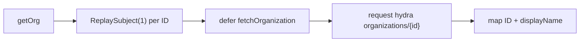
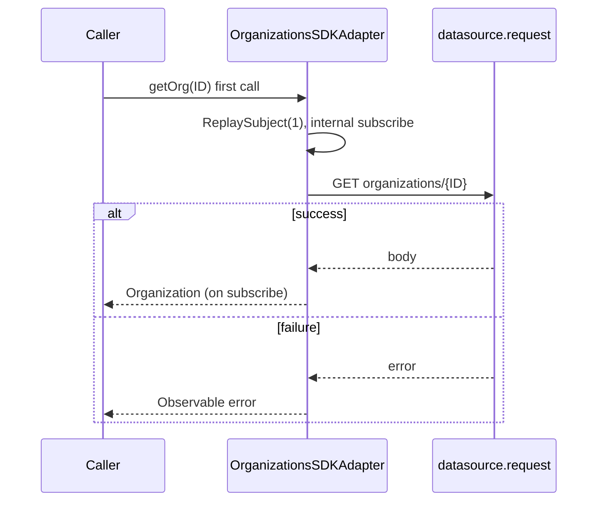
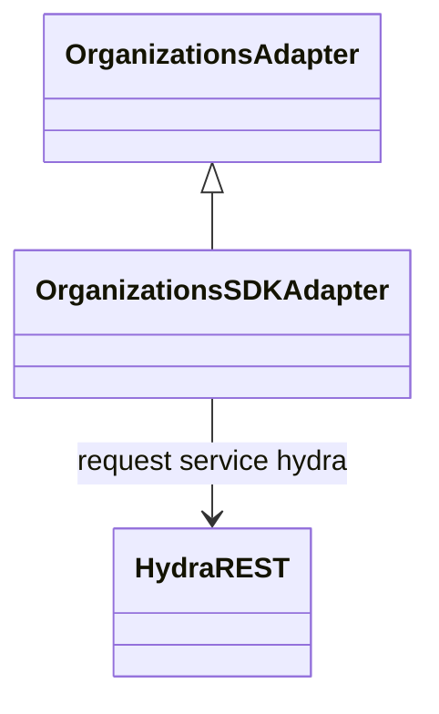

<!-- ───────────────────────────────
  Template:     Module Spec
  Template-ID:  module-spec
  Generates:    src/ai-docs/organizations-sdk-adapter-spec.md
  Library ver:  0.2.1
  Last updated: 2026-08-05
─────────────────────────────── -->

# organizations-sdk-adapter — SPEC

> [`AGENTS.md`](../../AGENTS.md) · [`SPEC_INDEX.md`](../../ai-docs/SPEC_INDEX.md) · [`ARCHITECTURE.md`](../../ai-docs/ARCHITECTURE.md)

## Metadata

| Field | Value |
|---|---|
| Module id | organizations-sdk-adapter |
| Source path(s) | `src/OrganizationsSDKAdapter.js` |
| Doc kind | Module spec |
| Coverage score | 88% assessed 2026-08-05 — eager getOrg subscription and ReplaySubject(1) documented |
| Generated from | `module-spec` @ SDLC template library `0.2.1` |
| generated_by / approved_by / updated_at | cursor-agent / pending PR approval / 2026-08-05 |
| Validation status | not-run |

## Evidence Rules

Every requirement cites concrete source evidence as `file path` only. Test evidence names `src/*.test.js` files.

## Source Material Register

| Source material | Scope | Decision | Detail location or disposition |
|---|---|---|---|
| Implementation | behavior | verified | Requirements in this spec |
| `@webex/component-adapter-interfaces` OrganizationsAdapter | contract | reference-only | Public Surface rows |

## Overview

`OrganizationsSDKAdapter` implements `OrganizationsAdapter`, fetching organization display data via Hydra REST (`datasource.request`) and exposing it as a memoized RxJS observable per organization ID.

## Purpose / Responsibility

Owns organization lookup by ID. Does **not** require facade `connect()` — uses HTTP request path only.

## Stack

JavaScript, RxJS 6, Webex SDK HTTP request API (Hydra service).

## Folder / Package Structure

```
src/
├── OrganizationsSDKAdapter.js
├── OrganizationsSDKAdapter.test.js
└── ai-docs/
```

## Key Files (source of truth)

| File | Holds |
|---|---|
| `src/OrganizationsSDKAdapter.js` | getOrg, fetchOrganization |
| `src/OrganizationsSDKAdapter.test.js` | Unit tests |

## Public Surface

| Contract ID | Symbol | Kind | Signature/Type | Stability | Detail link | Defined at |
|---|---|---|---|---|---|---|
| orgs-adapter.class | `OrganizationsSDKAdapter` | class | extends `OrganizationsAdapter` | stable | [`CONTRACTS.md`](../../ai-docs/CONTRACTS.md) | `src/OrganizationsSDKAdapter.js` |
| orgs-adapter.getOrg | `getOrg(ID)` | method → Observable | `(orgID: string) => Observable<Organization>` | stable | this spec | `src/OrganizationsSDKAdapter.js` |

## Requires (dependencies)

| Dependency | Purpose |
|---|---|
| `datasource.request({service: 'hydra', resource: 'organizations/{id}'})` | Organization fetch |
| Authenticated SDK (no Mercury connect required) | Authorization header on REST |

## Requirements

| ID | WHAT | WHY | Evidence | Test evidence | Gaps | Confidence |
|---|---|---|---|---|---|---|
| ORG-R-001 | First `getOrg(ID)` call eagerly subscribes to internal fetch pipeline even without external subscriber | Same pattern as activities — fetch starts on method call | `src/OrganizationsSDKAdapter.js` | `src/OrganizationsSDKAdapter.test.js` (positive emit on subscribe) | No test for fetch before external subscribe | PRESENT |
| ORG-R-002 | Per-ID cache uses `new ReplaySubject(1)` | Replay last organization emission to late subscribers | `src/OrganizationsSDKAdapter.js` | none found | Buffer size not asserted | PRESENT |
| ORG-R-003 | Success maps `{ID: response.id, name: response.displayName}` | Adapter organization shape | `src/OrganizationsSDKAdapter.js` | `src/OrganizationsSDKAdapter.test.js` (positive) | none | PRESENT |
| ORG-R-004 | Fetch failure calls `subject.error` with message `Could't find organization with ID "{ID}"` | Observable error for invalid org | `src/OrganizationsSDKAdapter.js` | `src/OrganizationsSDKAdapter.test.js` (negative invalid ID) | none | PRESENT |
| ORG-R-005 | Works without WebexSDKAdapter.connect() | Hydra REST only — no Mercury/device dependency | `src/OrganizationsSDKAdapter.js` | none found | Integration without connect untested | PRESENT |

## Design Overview

`getOrg` memoizes one `ReplaySubject(1)` per organization ID. On first invocation the adapter immediately subscribes to `defer(() => fetchOrganization(ID))`, maps the Hydra body, and pushes to the subject. External subscribers attach to the same subject. There is no live update stream — organization data is fetch-once unless a new adapter instance is created.

## Data Flow



## Sequence Diagram(s)

Sequence coverage:

| Operation group | Diagram | Failure / recovery coverage |
|---|---|---|
| getOrg | Eager fetch on first call | alt: request error → subject.error |



## Class / Component Relationships



## Use Cases

- **UC-1 Org label:** Host calls `getOrg(orgId)` without facade connect → receives name for UI. Evidence: `src/OrganizationsSDKAdapter.js`.

## Error Handling & Failure Modes

| Condition | Signal | Caller recovery |
|---|---|---|
| Invalid org ID / Hydra error | Observable error with quoted ID | Show fallback; verify org ID |
| Success | Single next on ReplaySubject(1) | Cache in host if needed |

## Concurrency & Reactive Flow

- Eager internal subscription on first `getOrg` call per ID.
- `ReplaySubject(1)` retains last value for subsequent subscribers.
- No refCount — subject persists for adapter lifetime once created.

## Pitfalls

- **Fetch starts on first `getOrg` call, not on subscribe** — side effect even if return value unused.
- **Typo preserved in error message** (`Could't`) — changing breaks tests expecting exact string.
- **No live updates** — org rename requires new fetch/subject (not implemented).

## Test-Case Strategy (module)

| Behavior / Requirement | Existing test evidence | Gap |
|---|---|---|
| ORG-R-003 | `src/OrganizationsSDKAdapter.test.js` — positive emit on subscribe | none |
| ORG-R-004 | `src/OrganizationsSDKAdapter.test.js` — negative invalid organization ID | none |
| ORG-R-001 | none found | Assert fetch invoked before external subscribe |
| ORG-R-005 | none found | Integration test without facade connect |

## Traceability

- Repo architecture: [`ai-docs/ARCHITECTURE.md`](../../ai-docs/ARCHITECTURE.md) · Registry: [`ai-docs/SPEC_INDEX.md`](../../ai-docs/SPEC_INDEX.md)
- Coverage state & contracts baseline: `.sdd/manifest.json`
