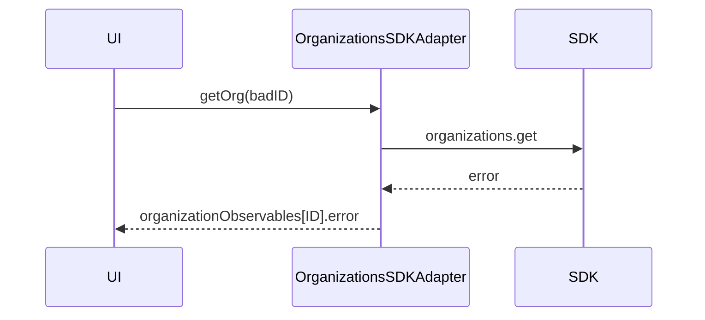

<!-- ───────────────────────────────
  Template:     Module Spec
  Template-ID:  module-spec
  Generates:    src/ai-docs/organizations-sdk-adapter-spec.md
  Library ver:  0.2.1
  Last updated: 2026-08-05
─────────────────────────────── -->

# organizations-sdk-adapter — SPEC

> [`AGENTS.md`](../../AGENTS.md) · [`SPEC_INDEX.md`](../../ai-docs/SPEC_INDEX.md)

## Metadata

| Field | Value |
|---|---|
| Module id | organizations-sdk-adapter |
| Source path(s) | `src/OrganizationsSDKAdapter.js` |
| Doc kind | Module spec |
| Coverage score | 90% assessed 2026-08-05 |
| Generated from | `module-spec` @ SDLC template library `0.2.1` |
| generated_by / approved_by / updated_at | cursor-agent / pending PR approval / 2026-08-05 |
| Validation status | not-run |

## Evidence Rules

File path evidence only.

## Source Material Register

| Source material | Scope | Decision | Detail location |
|---|---|---|---|
| Code | behavior | verified | `src/OrganizationsSDKAdapter.js` |

## Overview

Fetches organization records by ID via Hydra API through the SDK.

## Purpose / Responsibility

Expose `getOrg(ID)` observable returning `{ID, name}`.

## Stack

JavaScript, RxJS, Webex SDK organizations.

## Folder / Package Structure

```
src/OrganizationsSDKAdapter.js
src/OrganizationsSDKAdapter.test.js
```

## Key Files (source of truth)

| File | Role |
|---|---|
| `src/OrganizationsSDKAdapter.js` | Implementation |

## Public Surface

| Symbol | Kind | Description |
|---|---|---|
| `OrganizationsSDKAdapter` | class | Organizations adapter |
| `getOrg(ID)` | Observable | Organization by ID |

## Requires (dependencies)

| Dependency | Purpose |
|---|---|
| webex SDK | Organization hydra fetch |

## Requirements

| ID | WHAT | WHY | Evidence |
|---|---|---|---|
| R-O1 | Failed org fetch errors observable with org ID | Caller distinguishes not-found | `src/OrganizationsSDKAdapter.js` |

## Design Overview

ReplaySubject cache per org ID; single fetch on first subscription.

## Data Flow

getOrg → fetchOrganization → map to {ID,name} → ReplaySubject.

## Sequence Diagram(s)

**getOrg — not found**



## Class / Component Relationships

Extends `OrganizationsAdapter`; `organizationObservables` map.

## Use Cases

Display organization name for admin UI given org ID.

## Concurrency & Reactive Flow

ReplaySubject(1) per ID.

## Error Handling & Failure Modes

| Failure | Behavior | Caller recovery |
|---|---|---|
| Org not found / API error | `organizationObservables[ID].error(Error)` | Show fallback; verify ID |

Evidence: `src/OrganizationsSDKAdapter.js`, `src/OrganizationsSDKAdapter.test.js`

## Pitfalls

Typo in error message string (`Could't`) is existing behavior — preserve until intentional fix.

## Test-Case Strategy (module)

`OrganizationsSDKAdapter.test.js` — success and error paths.

## Traceability

| Requirement | Test |
|---|---|
| R-O1 | `OrganizationsSDKAdapter.test.js` |
