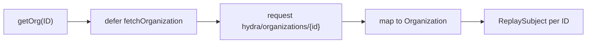
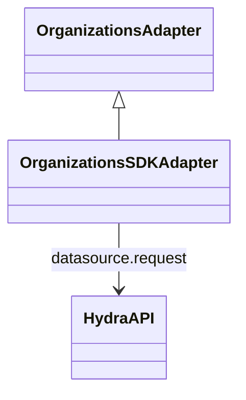

<!-- ───────────────────────────────
  Template:     Module Spec
  Template-ID:  module-spec
  Generates:    src/ai-docs/organizations-sdk-adapter-spec.md
  Library ver:  0.2.1
  Last updated: 2026-08-05
─────────────────────────────── -->

# organizations-sdk-adapter — SPEC

> [`AGENTS.md`](../../AGENTS.md) · [`SPEC_INDEX.md`](../../ai-docs/SPEC_INDEX.md) · [`ARCHITECTURE.md`](../../ai-docs/ARCHITECTURE.md)

## Metadata

| Field | Value |
|---|---|
| Module id | organizations-sdk-adapter |
| Source path(s) | `src/OrganizationsSDKAdapter.js` |
| Doc kind | Module spec |
| Coverage score | 91% assessed 2026-08-05 — single getOrg operation group, fetch error path, and sequence documented |
| Generated from | `module-spec` @ SDLC template library `0.2.1` |
| generated_by / approved_by / updated_at | cursor-agent / Akula Uday / 2026-08-05 |
| Validation status | not-run |

## Evidence Rules

Every requirement cites concrete source evidence as `file path` only. Test evidence names `src/*.test.js` files.

## Source Material Register

| Source material | Scope | Decision | Detail location or disposition |
|---|---|---|---|
| Implementation | behavior | verified | Requirements, Error Handling, Sequence Diagram(s) |
| `@webex/component-adapter-interfaces` OrganizationsAdapter | contract | reference-only | Public Surface rows |

## Overview

`OrganizationsSDKAdapter` implements `OrganizationsAdapter` with a single public read operation: `getOrg(ID)` fetches organization display data via Hydra REST and exposes it through a per-ID `ReplaySubject`.

## Purpose / Responsibility

Owns organization lookup observables. Does **not** own people, rooms, or admin org mutations.

## Stack

JavaScript, RxJS 6, Webex SDK `request` (hydra service).

## Folder / Package Structure

```
src/
├── OrganizationsSDKAdapter.js
├── OrganizationsSDKAdapter.test.js
└── ai-docs/
```

## Key Files (source of truth)

| File | Holds |
|---|---|
| `src/OrganizationsSDKAdapter.js` | getOrg, fetchOrganization |
| `src/OrganizationsSDKAdapter.test.js` | Unit tests |

## Public Surface

| Contract ID | Type | Surface | Purpose | Compatibility / deprecation | Schema / detail link | Root index |
|---|---|---|---|---|---|---|
| orgs-adapter.class | SDK class | `OrganizationsSDKAdapter extends OrganizationsAdapter` | Domain adapter entry | stable | `src/OrganizationsSDKAdapter.js` | [`CONTRACTS.md`](../../ai-docs/CONTRACTS.md) |
| orgs-adapter.getOrg | SDK method | `getOrg(ID: string): Observable<Organization>` | Organization display name lookup | stable | `src/OrganizationsSDKAdapter.js` | [`CONTRACTS.md`](../../ai-docs/CONTRACTS.md) |

This module exposes **one operation group** (`getOrg`); a single sequence diagram covers the full public surface.

## Requires (dependencies)

| Dependency | Purpose |
|---|---|
| `datasource.request({service: 'hydra', resource: 'organizations/{orgID}'})` | Org profile fetch |

## Requirements

| ID | WHAT | WHY | Source Evidence | Test / Example Evidence | Assumptions / Gaps | Confidence |
|---|---|---|---|---|---|---|
| ORG-R-001 | `getOrg` caches `ReplaySubject(1)` per org ID | Avoid duplicate fetch pipelines | `src/OrganizationsSDKAdapter.js` | `src/OrganizationsSDKAdapter.test.js` | none | PRESENT |
| ORG-R-002 | Successful fetch maps `{ID: response.id, name: response.displayName}` | Adapter Organization shape | `src/OrganizationsSDKAdapter.js` | `src/OrganizationsSDKAdapter.test.js` | none | PRESENT |
| ORG-R-003 | Fetch failure emits `Error: Could't find organization with ID "…"` | Caller-visible not-found signal (typo preserved from source) | `src/OrganizationsSDKAdapter.js` | `src/OrganizationsSDKAdapter.test.js` | none | PRESENT |
| ORG-R-004 | First `getOrg(ID)` call eagerly starts internal `defer(fetchOrganization).subscribe()` even when no external subscriber exists yet | Hydra fetch begins on method call, not on first external subscription | `src/OrganizationsSDKAdapter.js` | none found | Matches manifest eager semantics | PRESENT |

## Design Overview

On first `getOrg(ID)` call, the adapter creates a per-ID `ReplaySubject(1)` and **immediately** subscribes to `defer(() => fetchOrganization(ID))` — the Hydra request starts eagerly during the method call, not when an external consumer first subscribes to the returned subject. Subsequent callers for the same ID receive the cached ReplaySubject; late external subscribers replay the prior organization emission or error.

## Data Flow



## Sequence Diagram(s)

Sequence coverage:

| Operation group | Diagram | Failure / recovery coverage |
|---|---|---|
| getOrg (sole public operation group) | getOrg fetch | alt: request failure → observable error |

```mermaid
sequenceDiagram
  participant Caller
  participant Adapter as OrganizationsSDKAdapter
  participant Hydra as request hydra/organizations

  Caller->>Adapter: getOrg(ID)
  alt first call for ID
    Note over Adapter: creates ReplaySubject; internal subscribe starts fetch eagerly
    Adapter->>Hydra: GET organizations/{orgID}
    alt failure
      Hydra-->>Adapter: error
      Adapter-->>Caller: Error Could't find organization
    else success
      Hydra-->>Adapter: {id, displayName}
      Adapter-->>Caller: Organization {ID, name}
    end
  else cached ReplaySubject
    Adapter-->>Caller: replay prior emission or error
  end
```

## Class / Component Relationships



## Use Cases

- **UC-1 Org label:** `getOrg(orgId)` → `{ID, name}` or error. Evidence: `src/OrganizationsSDKAdapter.test.js`.

## Concurrency & Reactive Flow

- One ReplaySubject per org ID; internal `defer(...).subscribe()` runs once on first `getOrg` call — **eager fetch** even if the returned subject has zero external subscribers yet.
- No live updates — single-shot fetch semantics; external subscribers receive replayed value or error.

## Error Handling & Failure Modes

| Condition | Signal (error/code/result) | Caller recovery |
|---|---|---|
| Hydra request fails | Observable error `Could't find organization with ID "…"` | Treat as unknown org; verify ID format |
| Success | Single Organization emission | Bind display name in UI |

## Host Integration & Theming

Host application is `@webex/components`. Construct `WebexSDKAdapter` with an **authenticated** Webex JS SDK instance. `getOrg(orgID)` returns a ReplaySubject-backed observable — subscribe in the host UI to bind organization display name. No facade `connect()` Mercury dependency for this module (Hydra REST only). Calling `getOrg` without subscribing still triggers the eager internal fetch on first call per org ID.

## Pitfalls

- **Typo in error message (`Could't`)** is preserved in implementation — matchers should not expect "Couldn't".
- **No cache invalidation** — org rename requires new page session or manual adapter instance.

## Test-Case Strategy (module)

| Behavior / Requirement | Existing test evidence | Gap |
|---|---|---|
| ORG-R-002, ORG-R-003 | `src/OrganizationsSDKAdapter.test.js` | Second subscriber replay ORG-R-001 |

## Traceability

- Repo architecture: [`ai-docs/ARCHITECTURE.md`](../../ai-docs/ARCHITECTURE.md) · Registry: [`ai-docs/SPEC_INDEX.md`](../../ai-docs/SPEC_INDEX.md)
- Coverage state & contracts baseline: `.sdd/manifest.json`
