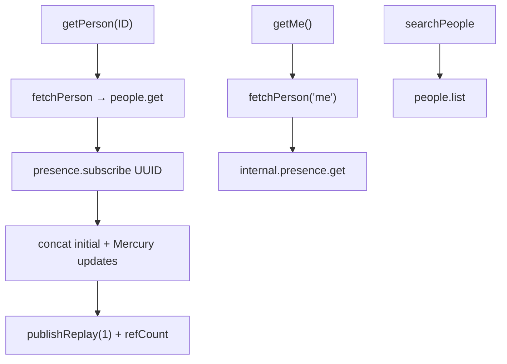
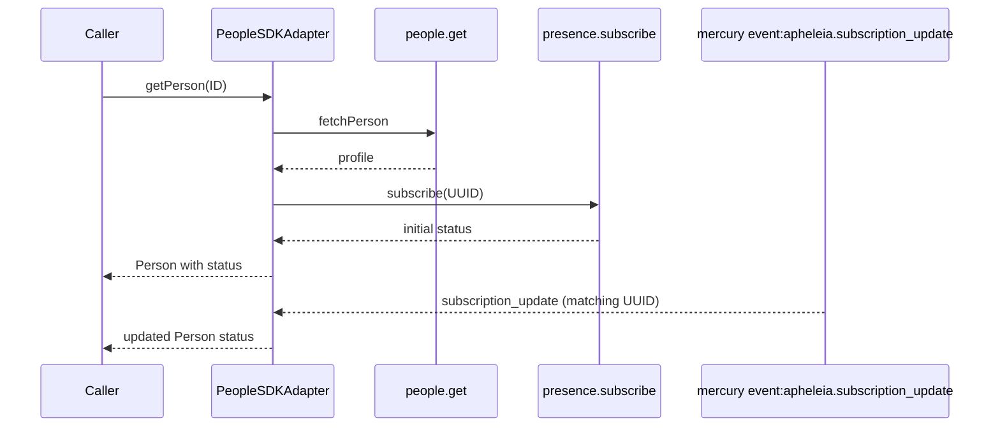
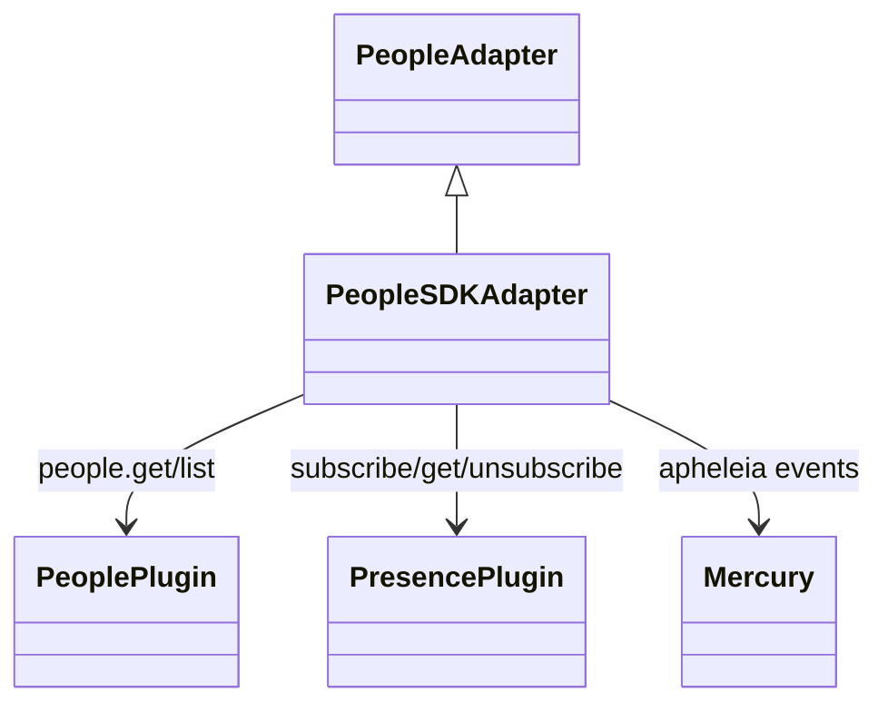

<!-- ───────────────────────────────
  Template:     Module Spec
  Template-ID:  module-spec
  Generates:    src/ai-docs/people-sdk-adapter-spec.md
  Library ver:  0.2.1
  Last updated: 2026-08-05
─────────────────────────────── -->

# people-sdk-adapter — SPEC

> [`AGENTS.md`](../../AGENTS.md) · [`SPEC_INDEX.md`](../../ai-docs/SPEC_INDEX.md) · [`ARCHITECTURE.md`](../../ai-docs/ARCHITECTURE.md)

## Metadata

| Field | Value |
|---|---|
| Module id | people-sdk-adapter |
| Source path(s) | `src/PeopleSDKAdapter.js` |
| Doc kind | Module spec |
| Coverage score | 91% assessed 2026-08-05 — presence via Apheleia subscribe, Mercury updates, publishReplay/refCount, and error propagation documented |
| Generated from | `module-spec` @ SDLC template library `0.2.1` |
| generated_by / approved_by / updated_at | cursor-agent / pending PR approval / 2026-08-05 |
| Validation status | not-run |

## Evidence Rules

Every requirement cites concrete source evidence as `file path` only. Test evidence names `src/*.test.js` files.

## Source Material Register

| Source material | Scope | Decision | Detail location or disposition |
|---|---|---|---|
| Implementation | behavior | verified | Requirements and Concurrency sections in this spec |
| `@webex/component-adapter-interfaces` PeopleAdapter | contract | reference-only | Public Surface rows |

## Overview

`PeopleSDKAdapter` implements `PeopleAdapter`, exposing person profiles and presence status as RxJS observables backed by the Webex JS SDK people plugin and internal Apheleia presence service. `getMe` and `getPerson` enrich people records with presence; search returns mapped lists from `people.list`.

## Purpose / Responsibility

Owns person profile observables (`getMe`, `getPerson`) and people search. Does **not** own membership rosters or meeting participant state.

## Stack

JavaScript, RxJS 6, Webex SDK `people` and `internal.presence` plugins, Mercury for presence update events, `@webex/common` Hydra helpers.

## Folder / Package Structure

```
src/
├── PeopleSDKAdapter.js
├── PeopleSDKAdapter.test.js
├── PeopleSDKAdapter.integration.test.js
└── ai-docs/
```

## Key Files (source of truth)

| File | Holds |
|---|---|
| `src/PeopleSDKAdapter.js` | getMe, getPerson, searchPeople, presence wiring |
| `src/PeopleSDKAdapter.test.js` | Unit tests including error paths |

## Public Surface

| Contract ID | Symbol | Kind | Signature/Type | Stability | Detail link | Defined at |
|---|---|---|---|---|---|---|
| people-adapter.class | `PeopleSDKAdapter` | class | extends `PeopleAdapter` | stable | [`CONTRACTS.md`](../../ai-docs/CONTRACTS.md) | `src/PeopleSDKAdapter.js` |
| people-adapter.getMe | `getMe()` | method → Observable | `() => Observable<Person>` | stable | this spec | `src/PeopleSDKAdapter.js` |
| people-adapter.getPerson | `getPerson(ID)` | method → Observable | `(personID: string) => Observable<Person>` | stable | this spec | `src/PeopleSDKAdapter.js` |
| people-adapter.searchPeople | `searchPeople(query)` | method → Observable | `(query: string) => Observable<Person[]>` | stable | this spec | `src/PeopleSDKAdapter.js` |

## Requires (dependencies)

| Dependency | Purpose |
|---|---|
| `datasource.people.get` / `list` | Profile data |
| `datasource.internal.presence.get` | Initial status for getMe (batch get) |
| `datasource.internal.presence.subscribe` / `unsubscribe` | Apheleia subscription for getPerson |
| `datasource.internal.mercury` event `event:apheleia.subscription_update` | Live presence updates |
| Facade `connect()` (Mercury) | Required for live presence updates on getPerson |

## Requirements

| ID | WHAT | WHY | Evidence | Test evidence | Gaps | Confidence |
|---|---|---|---|---|---|---|
| PPL-R-001 | `getPerson` multicasts via `publishReplay(1)` + `refCount()`, not per-person `ReplaySubject` | Share one hot pipeline across subscribers; replay last person snapshot | `src/PeopleSDKAdapter.js` | none found | publishReplay semantics not directly asserted | PRESENT |
| PPL-R-002 | Initial presence for `getPerson` uses `internal.presence.subscribe(personUUID)` (Apheleia), not `presence.on` | SDK internal API for subscription-based presence | `src/PeopleSDKAdapter.js` | `src/PeopleSDKAdapter.test.js` (positive emit) | Subscribe API shape not mocked explicitly | PRESENT |
| PPL-R-003 | Live presence updates listen to Mercury `event:apheleia.subscription_update` filtered by person UUID | Push updates without polling people API | `src/PeopleSDKAdapter.js` | none found | Mercury event path untested in unit tests | PRESENT |
| PPL-R-004 | `getMe` uses `internal.presence.get([person.id])` for status, not `presence.on` or subscribe | One-shot status fetch for current user | `src/PeopleSDKAdapter.js` | `src/PeopleSDKAdapter.test.js` (positive + presence error → null status) | none | PRESENT |
| PPL-R-005 | Presence subscribe/get failures yield `status: null` without failing the person observable (getMe/getPerson initial) | Profile still usable when presence disabled | `src/PeopleSDKAdapter.js` | `src/PeopleSDKAdapter.test.js` (negative: presence plug-in error) | none | PRESENT |
| PPL-R-006 | `getPerson` fetch failure (`people.get` error) propagates as observable error | Caller must handle unknown person | `src/PeopleSDKAdapter.js` | `src/PeopleSDKAdapter.test.js` (negative: people plug-in error) | none | PRESENT |
| PPL-R-007 | `searchPeople` SDK list failure propagates via `catchError` rethrow | Search errors must not silently return empty | `src/PeopleSDKAdapter.js` | `src/PeopleSDKAdapter.test.js` (negative: SDK fetch failure) | none | PRESENT |
| PPL-R-008 | Finalize on getPerson unsubscribes Apheleia via `presence.unsubscribe`; failure logged as warn only | Cleanup when last subscriber leaves | `src/PeopleSDKAdapter.js` | `src/PeopleSDKAdapter.test.js` (positive: stops listening on unsubscribe) | Unsubscribe failure path untested | PRESENT |

## Design Overview

`getPerson` builds a pipeline: fetch person once, merge initial Apheleia subscription status, then concat ongoing Mercury-driven status updates mapped back onto the person object. The composed stream is multicasted with `publishReplay(1)` and `refCount()` so duplicate subscriptions share work and receive the latest person snapshot. `getMe` is a cold defer chain that completes after one enriched emission. `searchPeople` maps SDK list pages to adapter people arrays.

## Data Flow



## Sequence Diagram(s)

Sequence coverage:

| Operation group | Diagram | Failure / recovery coverage |
|---|---|---|
| getPerson | Subscribe + Mercury updates | alt: people.get error → propagate; presence fail → null status |
| getMe | One-shot profile + presence get | alt: presence error → null status |
| searchPeople | List query | alt: SDK error → rethrow |



## Class / Component Relationships



## Use Cases

- **UC-1 Current user:** `getMe()` → profile + optional status → completes. Evidence: `src/PeopleSDKAdapter.test.js`.
- **UC-2 Contact card:** `getPerson(id)` → initial profile + live presence until unsubscribe. Evidence: `src/PeopleSDKAdapter.js`.
- **UC-3 Typeahead search:** `searchPeople(query)` → array or error. Evidence: `src/PeopleSDKAdapter.test.js`.

## Concurrency & Reactive Flow

- `getPerson` per-ID cache stores refCounted hot observable; last unsubscribe triggers `finalize` cleanup and deletes cache entry.
- Mercury events filtered by `event.data.subject === personUUID` — ordering follows SDK event delivery.
- `getMe` and `searchPeople` are cold per subscription.

## Pitfalls

- **Mercury must be connected** (facade `connect()`) for live `getPerson` status updates after initial emission.
- **`getMe` uses `presence.get`, not subscribe** — status will not live-update for current user via this method.
- **Presence unsubscribe failures are swallowed** when user has presence disabled — cache entry still deleted on finalize.

## Test-Case Strategy (module)

| Behavior / Requirement | Existing test evidence | Gap |
|---|---|---|
| PPL-R-004, PPL-R-005 | `src/PeopleSDKAdapter.test.js` getMe — positive emit; negative presence error → null status | Mercury live update path |
| PPL-R-006 | `src/PeopleSDKAdapter.test.js` getPerson — negative people plug-in error | none |
| PPL-R-007 | `src/PeopleSDKAdapter.test.js` searchPeople — negative SDK failure | none |
| PPL-R-008 | `src/PeopleSDKAdapter.test.js` — stops listening on unsubscribe | Negative unsubscribe failure |
| PPL-R-001 | none found | Assert shared subscription across two subscribers |

## Traceability

- Repo architecture: [`ai-docs/ARCHITECTURE.md`](../../ai-docs/ARCHITECTURE.md) · Registry: [`ai-docs/SPEC_INDEX.md`](../../ai-docs/SPEC_INDEX.md)
- Coverage state & contracts baseline: `.sdd/manifest.json`
