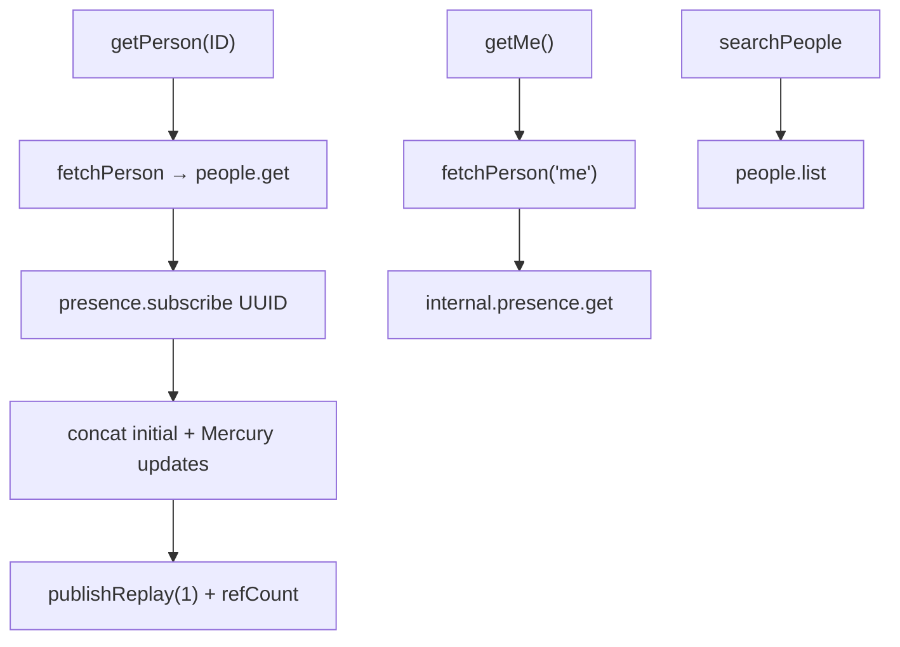
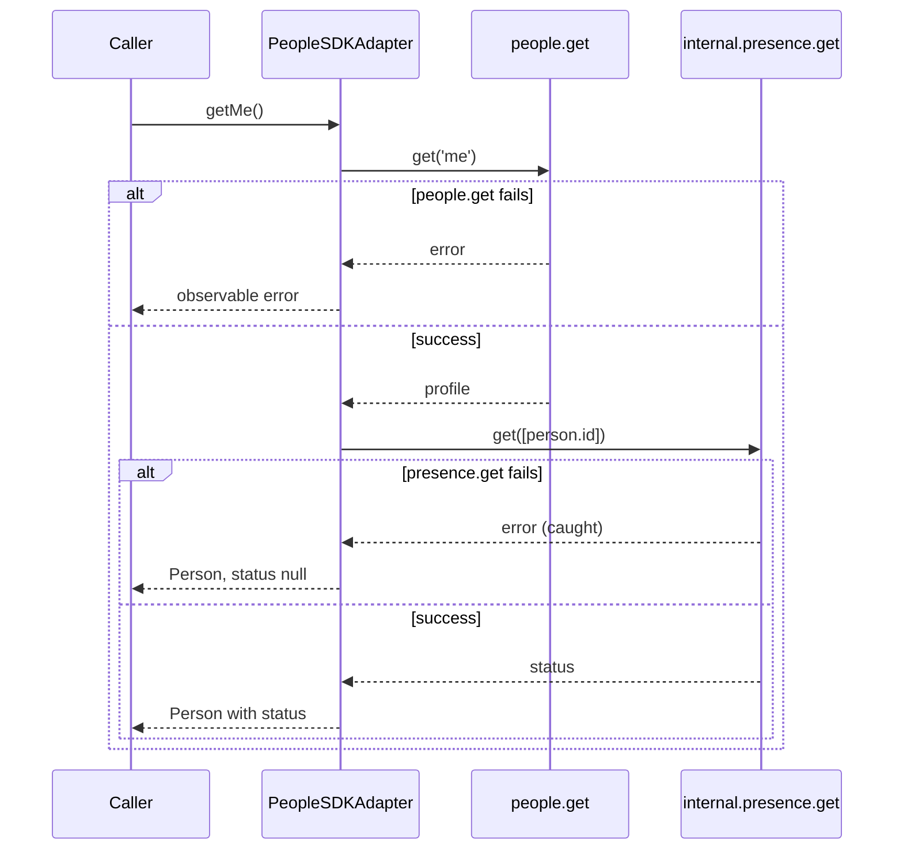
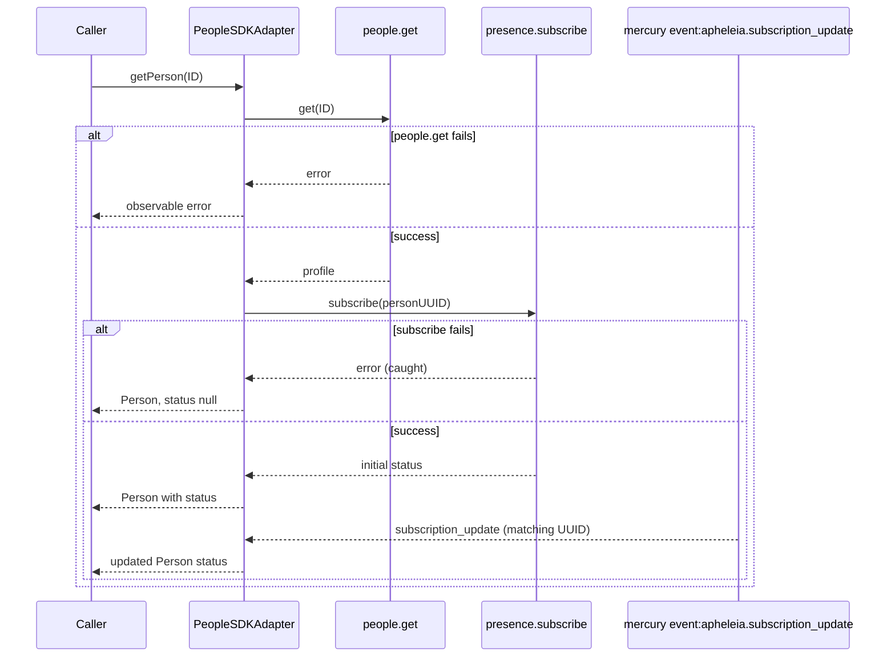
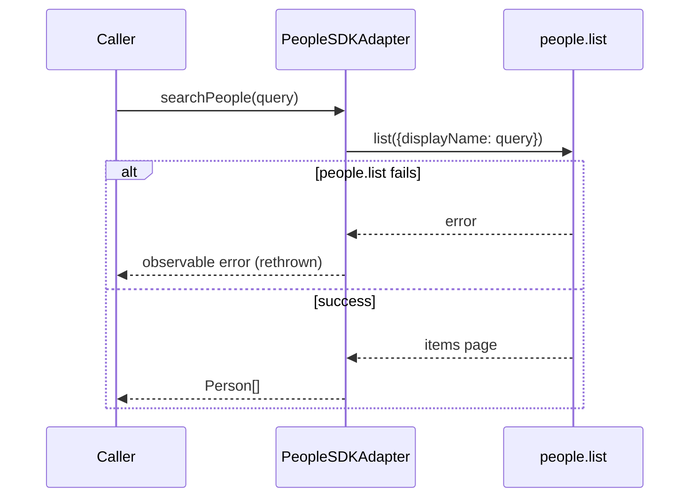
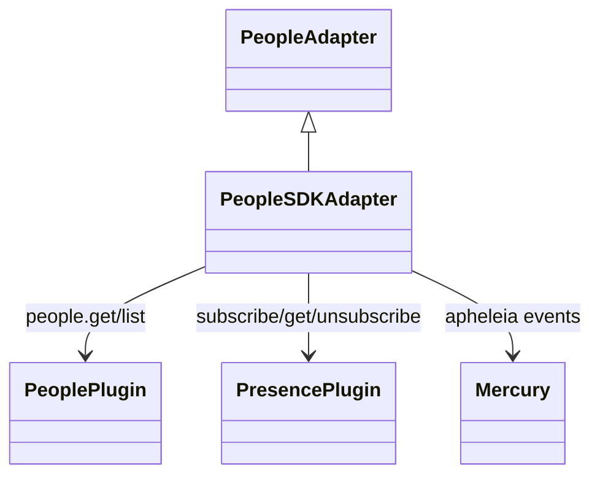

<!-- ───────────────────────────────
  Template:     Module Spec
  Template-ID:  module-spec
  Generates:    src/ai-docs/people-sdk-adapter-spec.md
  Library ver:  0.2.1
  Last updated: 2026-08-05
─────────────────────────────── -->

# people-sdk-adapter — SPEC

> [`AGENTS.md`](../../AGENTS.md) · [`SPEC_INDEX.md`](../../ai-docs/SPEC_INDEX.md) · [`ARCHITECTURE.md`](../../ai-docs/ARCHITECTURE.md)

## Metadata

| Field | Value |
|---|---|
| Module id | people-sdk-adapter |
| Source path(s) | `src/PeopleSDKAdapter.js` |
| Doc kind | Module spec |
| Coverage score | 91% assessed 2026-08-05 — getMe/getPerson/searchPeople, presence wiring, error propagation, and per-operation sequences documented |
| Generated from | `module-spec` @ SDLC template library `0.2.1` |
| generated_by / approved_by / updated_at | cursor-agent / SDLC bootstrap PR #354 review / 2026-08-05 |
| Validation status | not-run |

## Evidence Rules

Every requirement cites concrete source evidence as `file path` only. Test evidence names `src/*.test.js` files. Unverified behavior is recorded under Assumptions / Gaps.

## Source Material Register

| Source material | Scope | Decision | Detail location or disposition |
|---|---|---|---|
| Implementation | behavior | verified | Requirements, Concurrency, Error Handling, Sequence Diagram(s) |
| `@webex/component-adapter-interfaces` PeopleAdapter | contract | reference-only | Public Surface rows; no inherited unsupported methods on this adapter |

## Overview

`PeopleSDKAdapter` implements `PeopleAdapter`, exposing person profiles and presence status as RxJS observables backed by the Webex JS SDK `people` plugin and internal Apheleia presence service. `getMe` returns a one-shot enriched profile; `getPerson` multicasts a hot stream with live Mercury-driven presence updates; `searchPeople` maps directory list results.

## Purpose / Responsibility

Owns person profile observables (`getMe`, `getPerson`) and people search. Does **not** own membership rosters, meeting participant state, or organization records.

## Stack

JavaScript, RxJS 6, Webex SDK `people` and `internal.presence` plugins, Mercury for `event:apheleia.subscription_update`, `@webex/common` Hydra helpers.

## Folder / Package Structure

```
src/
├── PeopleSDKAdapter.js
├── PeopleSDKAdapter.test.js
├── PeopleSDKAdapter.integration.test.js
└── ai-docs/
```

## Key Files (source of truth)

| File | Holds |
|---|---|
| `src/PeopleSDKAdapter.js` | getMe, getPerson, searchPeople, presence wiring |
| `src/PeopleSDKAdapter.test.js` | Unit tests including error paths |

## Public Surface

| Contract ID | Type | Surface | Purpose | Compatibility / deprecation | Schema / detail link | Root index |
|---|---|---|---|---|---|---|
| people-adapter.class | SDK class | `PeopleSDKAdapter extends PeopleAdapter` | Domain adapter entry | stable; semver via npm bundle | `src/PeopleSDKAdapter.js` | [`CONTRACTS.md`](../../ai-docs/CONTRACTS.md) |
| people-adapter.getMe | SDK method | `getMe(): Observable<Person>` | Current access-token bearer profile + optional status | stable; additive Person fields only | `src/PeopleSDKAdapter.js` | [`CONTRACTS.md`](../../ai-docs/CONTRACTS.md) |
| people-adapter.getPerson | SDK method | `getPerson(ID: string): Observable<Person>` | Profile + live presence for a person ID | stable | `src/PeopleSDKAdapter.js` | [`CONTRACTS.md`](../../ai-docs/CONTRACTS.md) |
| people-adapter.searchPeople | SDK method | `searchPeople(query: string): Observable<Person[]>` | Directory search by display name | stable | `src/PeopleSDKAdapter.js` | [`CONTRACTS.md`](../../ai-docs/CONTRACTS.md) |

Compatibility notes:

- Person shape follows `@webex/component-adapter-interfaces` `Person`; adapter maps `orgId` → `orgID`.
- Presence `status` uses `PersonStatus` enum keys or `null` when unavailable.

## Requires (dependencies)

| Dependency | Purpose |
|---|---|
| `datasource.people.get` / `list` | Profile fetch and search |
| `datasource.internal.presence.get` | One-shot status for `getMe` |
| `datasource.internal.presence.subscribe` / `unsubscribe` | Apheleia subscription for `getPerson` |
| `datasource.internal.mercury` event `event:apheleia.subscription_update` | Live presence push updates |
| Facade `connect()` (Mercury) | Required for live `getPerson` status updates after initial emission |

## Requirements

| ID | WHAT | WHY | Source Evidence | Test / Example Evidence | Assumptions / Gaps | Confidence |
|---|---|---|---|---|---|---|
| PPL-R-001 | `getPerson` multicasts via `publishReplay(1)` + `refCount()` per person ID | Share one hot pipeline; replay last person snapshot to late subscribers | `src/PeopleSDKAdapter.js` | none found | publishReplay semantics not directly asserted | PRESENT |
| PPL-R-002 | Initial presence for `getPerson` uses `internal.presence.subscribe(personUUID)` | SDK internal Apheleia API for subscription-based presence | `src/PeopleSDKAdapter.js` | `src/PeopleSDKAdapter.test.js` | Subscribe API shape not mocked explicitly | PRESENT |
| PPL-R-003 | Live presence updates listen to Mercury `event:apheleia.subscription_update` filtered by person UUID | Push updates without polling people API | `src/PeopleSDKAdapter.js` | none found | Mercury event path untested in unit tests | PRESENT |
| PPL-R-004 | `getMe` uses `internal.presence.get([person.id])` for status | One-shot status fetch for current user | `src/PeopleSDKAdapter.js` | `src/PeopleSDKAdapter.test.js` | none | PRESENT |
| PPL-R-005 | Presence subscribe/get failures yield `status: null` without failing the person observable on initial enrichment | Profile still usable when presence disabled | `src/PeopleSDKAdapter.js` | `src/PeopleSDKAdapter.test.js` | none | PRESENT |
| PPL-R-006 | `people.get` failure in `getMe`/`getPerson` propagates as observable error | Caller must handle unknown or inaccessible person | `src/PeopleSDKAdapter.js` | `src/PeopleSDKAdapter.test.js` | none | PRESENT |
| PPL-R-007 | `people.list` failure in `searchPeople` propagates via `catchError` rethrow | Search errors must not silently return empty | `src/PeopleSDKAdapter.js` | `src/PeopleSDKAdapter.test.js` | none | PRESENT |
| PPL-R-008 | Finalize on `getPerson` calls `presence.unsubscribe(personUUID)`; failure logged as warn only | Cleanup when refCount reaches zero | `src/PeopleSDKAdapter.js` | `src/PeopleSDKAdapter.test.js` | Unsubscribe failure path untested | PRESENT |

## Design Overview

`getPerson` builds a pipeline: fetch person once via `fetchPerson`, merge initial Apheleia subscription status, then concat ongoing Mercury-driven status updates mapped back onto the person object. The composed stream is multicasted. `getMe` is a cold `defer` chain that completes after one enriched emission. `searchPeople` maps SDK list pages through `fromSDKPeople`.

## Data Flow



## Sequence Diagram(s)

Sequence coverage:

| Operation group | Diagram | Failure / recovery coverage |
|---|---|---|
| getMe | getMe — one-shot profile | alt: `people.get` error → propagate; presence.get error → null status |
| getPerson | getPerson — subscribe + Mercury | alt: `people.get` error → propagate; presence subscribe error → null status |
| searchPeople | searchPeople — directory list | alt: `people.list` error → rethrow |

### getMe



### getPerson



### searchPeople



## Class / Component Relationships



## Use Cases

- **UC-1 Current user:** `getMe()` → profile + optional status → completes. Evidence: `src/PeopleSDKAdapter.test.js`.
- **UC-2 Contact card:** `getPerson(id)` → initial profile + live presence until unsubscribe. Evidence: `src/PeopleSDKAdapter.js`, `src/PeopleSDKAdapter.test.js`.
- **UC-3 Typeahead search:** `searchPeople(query)` → array or propagated SDK error. Evidence: `src/PeopleSDKAdapter.test.js`.

## Concurrency & Reactive Flow

- `getPerson` per-ID cache stores refCounted hot observable; last unsubscribe triggers `finalize` cleanup and deletes cache entry.
- Mercury events filtered by `event.data.subject === personUUID` — ordering follows SDK event delivery.
- `getMe` and `searchPeople` are cold per subscription.

## Error Handling & Failure Modes

| Condition | Signal (error/code/result) | Caller recovery |
|---|---|---|
| `people.get` fails in `getMe` or `getPerson` | Observable error from underlying SDK rejection | Handle in subscriber `error` callback; do not assume person exists |
| `people.list` fails in `searchPeople` | Observable error (logged then rethrown) | Surface search failure to user; retry or adjust query |
| `internal.presence.get` fails in `getMe` | Emits Person with `status: null` | Treat as presence unavailable; profile still valid |
| `internal.presence.subscribe` fails in `getPerson` initial path | Emits Person with `status: null` then continues Mercury path if connected | Same as above; live updates may still arrive via Mercury |
| `presence.unsubscribe` fails on finalize | Warn logged; cache entry still deleted | No caller action; may leave orphan Apheleia subscription if presence disabled |

## Pitfalls

- **Mercury must be connected** (facade `connect()`) for live `getPerson` status updates after initial emission.
- **`getMe` uses `presence.get`, not subscribe** — status will not live-update for current user via this method.
- **Presence unsubscribe failures are swallowed** when user has presence disabled — cache entry still deleted on finalize.

## Test-Case Strategy (module)

| Behavior / Requirement | Existing test evidence | Gap |
|---|---|---|
| PPL-R-004, PPL-R-005 | `src/PeopleSDKAdapter.test.js` getMe — positive emit; negative presence error → null status | Mercury live update path |
| PPL-R-006 | `src/PeopleSDKAdapter.test.js` getPerson — negative people plug-in error | none |
| PPL-R-007 | `src/PeopleSDKAdapter.test.js` searchPeople — negative SDK failure | none |
| PPL-R-008 | `src/PeopleSDKAdapter.test.js` — stops listening on unsubscribe | Negative unsubscribe failure |
| PPL-R-001 | none found | Assert shared subscription across two subscribers |

## Traceability

- Repo architecture: [`ai-docs/ARCHITECTURE.md`](../../ai-docs/ARCHITECTURE.md) · Registry: [`ai-docs/SPEC_INDEX.md`](../../ai-docs/SPEC_INDEX.md)
- Coverage state & contracts baseline: `.sdd/manifest.json`
