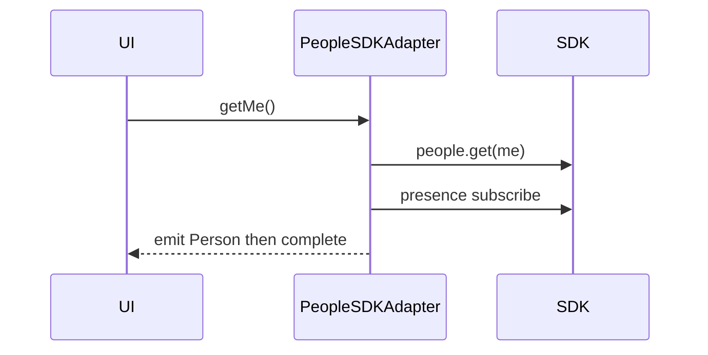

<!-- ───────────────────────────────
  Template:     Module Spec
  Template-ID:  module-spec
  Generates:    src/ai-docs/people-sdk-adapter-spec.md
  Library ver:  0.2.1
  Last updated: 2026-08-05
─────────────────────────────── -->

# people-sdk-adapter — SPEC

> [`AGENTS.md`](../../AGENTS.md) · [`SPEC_INDEX.md`](../../ai-docs/SPEC_INDEX.md)

## Metadata

| Field | Value |
|---|---|
| Module id | people-sdk-adapter |
| Source path(s) | `src/PeopleSDKAdapter.js` |
| Doc kind | Module spec |
| Coverage score | 90% assessed 2026-08-05 |
| Generated from | `module-spec` @ SDLC template library `0.2.1` |
| generated_by / approved_by / updated_at | cursor-agent / pending PR approval / 2026-08-05 |
| Validation status | not-run |

## Evidence Rules

File path evidence only.

## Source Material Register

| Source material | Scope | Decision | Detail location |
|---|---|---|---|
| Code | behavior | verified | `src/PeopleSDKAdapter.js` |

## Overview

People search, person-by-ID streams with presence updates, and current user (`getMe`).

## Purpose / Responsibility

Map SDK people/presence to adapter Person models as observables.

## Stack

JavaScript, RxJS, Webex SDK people + presence.

## Folder / Package Structure

```
src/PeopleSDKAdapter.js
src/PeopleSDKAdapter.test.js
src/PeopleSDKAdapter.integration.test.js
```

## Key Files (source of truth)

| File | Role |
|---|---|
| `src/PeopleSDKAdapter.js` | Implementation |

## Public Surface

| Symbol | Kind | Description |
|---|---|---|
| `PeopleSDKAdapter` | class | People adapter |
| `getMe()` | Observable | Current user + presence |
| `getPerson(ID)` | Observable | Person with status updates |
| `searchPeople(query)` | Observable | Search results array |

## Requires (dependencies)

| Dependency | Purpose |
|---|---|
| webex SDK people/presence | Fetch and subscribe |

## Requirements

| ID | WHAT | WHY | Evidence |
|---|---|---|---|
| R-P1 | getPerson multicasts updates via ReplaySubject | Multiple UI subscribers | `src/PeopleSDKAdapter.js` |
| R-P2 | Presence errors degrade to null status | UI still shows person | `src/PeopleSDKAdapter.js` |
| R-P3 | searchPeople errors propagate | Caller shows search failure | `src/PeopleSDKAdapter.js` |

## Design Overview

Presence merged with person fetch; search returns cold observable from SDK list.

## Data Flow

getPerson → fetchPerson → presence.on('change') → ReplaySubject updates.

## Sequence Diagram(s)

**getMe**



## Class / Component Relationships

Extends `PeopleAdapter`; `getPersonObservables` cache.

## Use Cases

Avatar + display name; people picker search.

## Concurrency & Reactive Flow

getPerson hot stream; getMe single-shot observable.

## Error Handling & Failure Modes

| Failure | Behavior | Caller recovery |
|---|---|---|
| Presence failure | `{status: null}` fallback | Show offline/unknown |
| searchPeople failure | catchError rethrow | Show empty/error state |

Evidence: `src/PeopleSDKAdapter.js`

## Pitfalls

Do not assume getMe re-emits on presence — it completes after first emission.

## Test-Case Strategy (module)

Unit + integration tests for getMe, getPerson, searchPeople.

## Traceability

| Requirement | Test |
|---|---|
| R-P1 | `PeopleSDKAdapter.test.js` |
