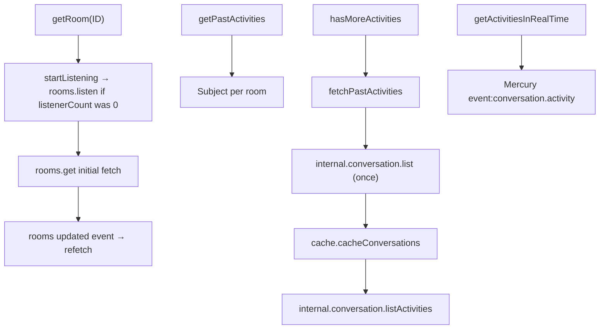
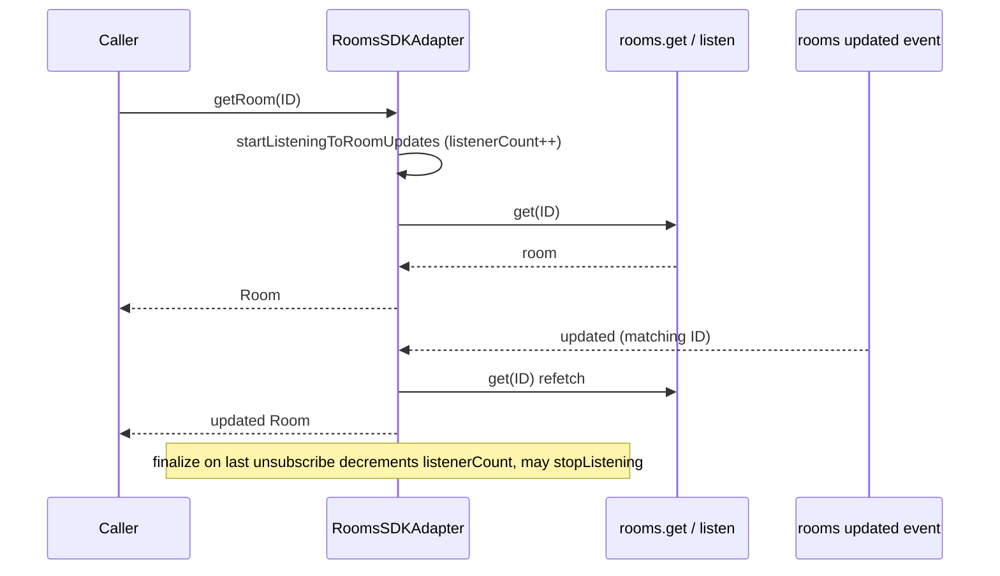
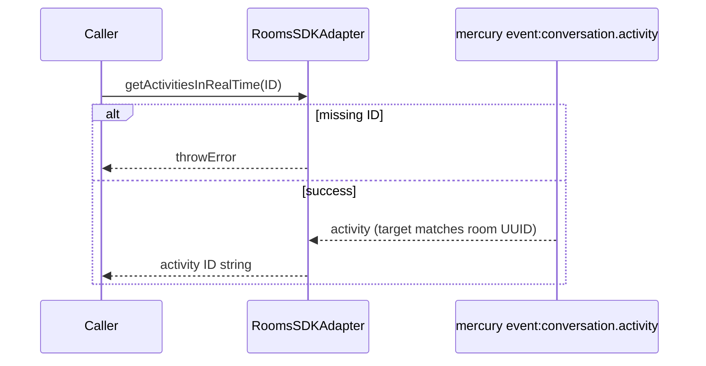
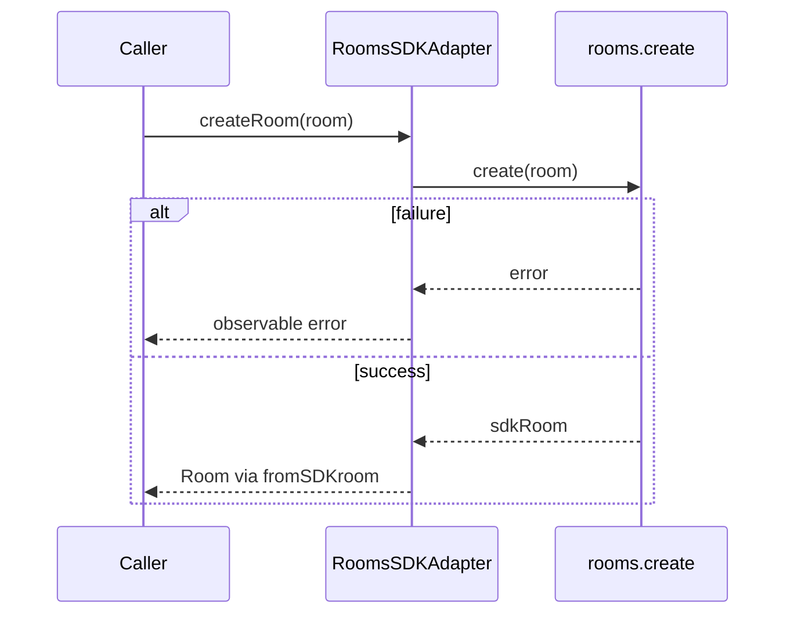
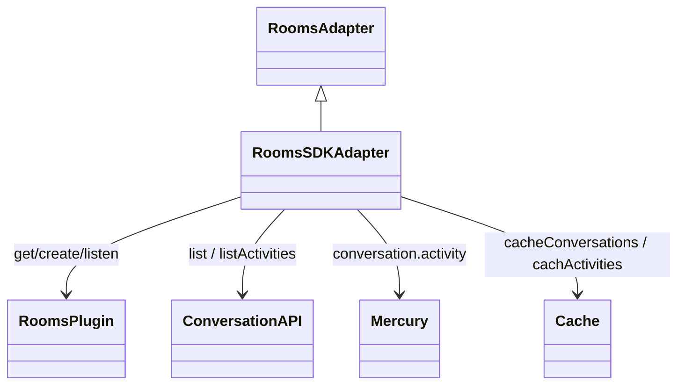

<!-- ───────────────────────────────
  Template:     Module Spec
  Template-ID:  module-spec
  Description:  Per-module canonical spec — orientation plus requirements, design, invariants, flows, pitfalls, and tests.
  Generates:    src/ai-docs/rooms-sdk-adapter-spec.md
  Library ver:  0.2.2
  Last updated: 2026-08-05
─────────────────────────────── -->

# rooms-sdk-adapter — SPEC

> [`AGENTS.md`](../../AGENTS.md) · [`SPEC_INDEX.md`](../../ai-docs/SPEC_INDEX.md) · [`ARCHITECTURE.md`](../../ai-docs/ARCHITECTURE.md)

## Metadata

| Field | Value |
|---|---|
| Module id | rooms-sdk-adapter |
| Source path(s) | `src/RoomsSDKAdapter.js` |
| Parent spec | `src/ai-docs/webex-sdk-adapter-spec.md` |
| Doc kind | Module spec |
| Coverage score | 91% assessed 2026-08-05 — room stream, pagination with conversation.list pre-step, realtime activities, hasMoreActivities documented |
| Generated from | `module-spec` @ SDLC template library `0.2.2` |
| generated_by / approved_by / updated_at | cursor-agent / Akula Uday / 2026-08-05 |
| Validation status | not-run — pending codex-agent Session B at 90f540e (cursor preflight 2026-09-02: 0 content Blocking; unit 19/19 suites, 194/194 passed) |

## Evidence Rules

Every requirement cites concrete source evidence as `file path` only. Test evidence names `src/*.test.js` files.

## Source Material Register

| Source material | Scope | Decision | Detail location or disposition |
|---|---|---|---|
| Implementation | behavior | verified | Requirements, Data Flow, Sequence Diagram(s), Error Handling |
| `@webex/component-adapter-interfaces` RoomsAdapter | contract | reference-only | Public Surface rows |

## Overview

`RoomsSDKAdapter` implements `RoomsAdapter`, exposing room metadata streams, room creation, paginated past activity ID chunks, and real-time activity ID notifications. Past activity pagination first calls `internal.conversation.list()` once to pre-cache conversations before `listActivities`.

## Purpose / Responsibility

Owns room observables, activity ID pagination, and Mercury-backed live activity notifications. Does **not** own full activity body fetch (see `ActivitiesSDKAdapter`) or membership rosters.

## Stack

JavaScript, RxJS 6, Webex SDK `rooms` plugin, `internal.conversation`, Mercury, shared `cache`, `fromSDKActivity` mapper.

## Folder / Package Structure

```
src/
├── RoomsSDKAdapter.js
├── RoomsSDKAdapter.test.js
├── RoomsSDKAdapter.integration.test.js
└── ai-docs/
```

## Key Files (source of truth)

| File | Holds |
|---|---|
| `src/RoomsSDKAdapter.js` | getRoom, createRoom, getPastActivities, hasMoreActivities, getActivitiesInRealTime |
| `src/RoomsSDKAdapter.test.js` | Unit tests |

## Public Surface

| Contract ID | Type | Surface | Purpose | Compatibility / deprecation | Schema / detail link | Root index |
|---|---|---|---|---|---|---|
| rooms-adapter.class | SDK class | `RoomsSDKAdapter extends RoomsAdapter` | Domain adapter entry | stable | `src/RoomsSDKAdapter.js` | [`CONTRACTS.md`](../../ai-docs/CONTRACTS.md) |
| rooms-adapter.getRoom | SDK method | `getRoom(ID: string): Observable<Room>` | Room metadata + websocket updates | stable | `src/RoomsSDKAdapter.js` | [`CONTRACTS.md`](../../ai-docs/CONTRACTS.md) |
| rooms-adapter.createRoom | SDK method | `createRoom(room: Room): Observable<Room>` | Create space | stable | `src/RoomsSDKAdapter.js` | [`CONTRACTS.md`](../../ai-docs/CONTRACTS.md) |
| rooms-adapter.getPastActivities | SDK method | `getPastActivities(ID: string, activityLimit?: number): Observable<string[]>` | Paginated activity ID chunks (newest first) | stable; default limit 50 | `src/RoomsSDKAdapter.js` | [`CONTRACTS.md`](../../ai-docs/CONTRACTS.md) |
| rooms-adapter.hasMoreActivities | SDK method | `hasMoreActivities(ID: string): boolean` | Pagination cursor; triggers fetch when true | stable | `src/RoomsSDKAdapter.js` | [`CONTRACTS.md`](../../ai-docs/CONTRACTS.md) |
| rooms-adapter.getActivitiesInRealTime | SDK method | `getActivitiesInRealTime(ID: string): Observable<string>` | Live activity IDs via Mercury | stable | `src/RoomsSDKAdapter.js` | [`CONTRACTS.md`](../../ai-docs/CONTRACTS.md) |

## Requires (dependencies)

| Dependency | Purpose |
|---|---|
| `datasource.rooms.get` / `create` / `listen` / `stopListening` | Room CRUD and update events |
| `datasource.internal.conversation.list()` | One-time conversation pre-cache before first activity pagination |
| `datasource.internal.conversation.listActivities` | Paginated activity fetch per room |
| `datasource.internal.mercury` `event:conversation.activity` | Real-time activity notifications |
| `src/cache.js` | Conversation and activity body cache |
| Facade `connect()` (Mercury) | Required for `getActivitiesInRealTime` |

## Requirements

| ID | WHAT | WHY | Source Evidence | Test / Example Evidence | Assumptions / Gaps | Confidence |
|---|---|---|---|---|---|---|
| ROM-R-001 | First `fetchActivities` calls `internal.conversation.list()` once, then `cache.cacheConversations` | Pre-cache conversations before listActivities (legacy SDK requirement) | `src/RoomsSDKAdapter.js` | none found | conversation.list failure path untested | PRESENT |
| ROM-R-002 | `fetchActivities` requests `activityLimit + 1` items to detect more pages | Enables hasMore without extra guesswork | `src/RoomsSDKAdapter.js` | `src/RoomsSDKAdapter.test.js` | none | PRESENT |
| ROM-R-003 | Missing room ID on getPastActivities returns throwError | Fail fast on invalid input | `src/RoomsSDKAdapter.js` | `src/RoomsSDKAdapter.test.js` getPastActivities missing ID | none | PRESENT |
| ROM-R-004 | `getRoom` uses refCounted listen/stopListening with listenerCount | SDK rooms.listen is global — ref-count shared listener | `src/RoomsSDKAdapter.js` | `src/RoomsSDKAdapter.test.js` | Multi-subscriber stopListening edge similar to memberships | WEAK |
| ROM-R-005 | `hasMoreActivities` triggers `fetchPastActivities` when hasMore true | Pull-based pagination driver | `src/RoomsSDKAdapter.js` | none found | none | PRESENT |
| ROM-R-006 | Real-time handler filters Mercury events by deconstructed room UUID | Only emit activities for subscribed room | `src/RoomsSDKAdapter.js` | none found | Mercury path untested in unit tests | PRESENT |
| ROM-R-007 | `fetchPastActivities` subscribes to `from(fetchActivities)` with a **next-only** handler — `conversation.list` / `listActivities` rejection does not propagate to the room Subject; `FETCHED_CONVERSATIONS` stays false until success so later pagination retries | Silent failure on first pre-step; retry without reload | `src/RoomsSDKAdapter.js` | none found | Unhandled rejection risk in internal subscription | PRESENT |

## Design Overview

Room metadata streams concat initial REST fetch with `rooms` plugin `updated` events. Past activities use a Subject per room ID with side-effecting fetch triggered by `hasMoreActivities`. Module-level `FETCHED_CONVERSATIONS` flag ensures conversation list runs once per page load.

## Data Flow



## Sequence Diagram(s)

Sequence coverage:

| Operation group | Diagram | Failure / recovery coverage |
|---|---|---|
| getRoom | Fetch + websocket updates | finalize stops listening when refCount zero |
| getPastActivities | Pagination with conversation.list pre-step | alt: missing ID → throwError; empty data → complete |
| getActivitiesInRealTime | Mercury subscription | alt: missing ID → throwError |
| createRoom | Create space | alt: create error → rethrow |

### getRoom



### getPastActivities (includes conversation.list pre-step)

```mermaid
sequenceDiagram
  participant Caller
  participant Adapter as RoomsSDKAdapter
  participant ConvList as internal.conversation.list
  participant Cache as cache
  participant ListAct as internal.conversation.listActivities

  Caller->>Adapter: getPastActivities(ID, limit)
  Caller->>Adapter: hasMoreActivities(ID)
  Adapter->>Adapter: fetchPastActivities → from(fetchActivities(...))
  alt FETCHED_CONVERSATIONS false (first attempt)
    Adapter->>ConvList: list()
    alt conversation.list fails
      ConvList-->>Adapter: rejected promise
      Note over Adapter: fetchActivities aborts — listActivities never reached
      Note over Adapter: Subject receives no next/error; FETCHED_CONVERSATIONS stays false
      Note over Adapter: later hasMoreActivities retries pre-step
    else success
      ConvList-->>Adapter: conversations[]
      Adapter->>Cache: cacheConversations
      Adapter->>ListAct: listActivities({conversationId, limit+1, ...})
      ListAct-->>Adapter: activities[]
      Adapter->>Adapter: update hasMore, earliestActivityDate
      Adapter-->>Caller: activity ID chunk (newest first)
    end
  else FETCHED_CONVERSATIONS true
    Adapter->>ListAct: listActivities(...)
    ListAct-->>Adapter: activities[]
    Adapter->>Adapter: update hasMore, earliestActivityDate
    Adapter-->>Caller: activity ID chunk
  end
```

### getActivitiesInRealTime



### createRoom



## Class / Component Relationships



## Use Cases

- **UC-1 Room header:** `getRoom(id)` → initial room + live title/type updates. Evidence: `src/RoomsSDKAdapter.test.js`.
- **UC-2 Message history:** `getPastActivities` + repeated `hasMoreActivities` → ID chunks. Evidence: `src/RoomsSDKAdapter.js`.
- **UC-3 Live timeline:** `getActivitiesInRealTime` → new activity IDs. Evidence: `src/RoomsSDKAdapter.js`.
- **UC-4 Create space:** `createRoom({title})` → single emission. Evidence: `src/RoomsSDKAdapter.test.js`.

## State Model

- `getRoomObservables` — per-room cached observables for `getRoom`.
- `activitiesObservableCache` / `roomActivities` — per-room pagination Subject state, activity ID maps, `hasMore`, `earliestActivityDate`.
- `getActivitiesInRealTimeCache` — Mercury handler registrations per room ID.
- `listenerCount` — ref-count for `rooms.listen` / `stopListening`.
- Module-level `FETCHED_CONVERSATIONS` — process-wide flag gating one-time `conversation.list()` pre-step.

## Concurrency & Reactive Flow

- `getRoom` observables per ID use `publishReplay(1)` + `refCount()`; finalize decrements global `listenerCount` for rooms.listen.
- `getPastActivities` Subject is shared per room; concurrent `hasMoreActivities` calls may overlap fetches — no explicit in-flight guard.
- `FETCHED_CONVERSATIONS` module flag is process-wide singleton state.

## Error Handling & Failure Modes

| Condition | Signal (error/code/result) | Caller recovery |
|---|---|---|
| Missing ID on `getPastActivities` / `getActivitiesInRealTime` | `throwError` with message containing Must provide room ID | Validate ID before subscribe |
| Missing ID on `fetchPastActivities` internal | Subject error `fetchPastActivities - Must provide room ID` | Same as above |
| `createRoom` SDK failure | Observable error (logged, rethrown) | Show create failure to user |
| `internal.conversation.list()` failure on first pagination | Rejection swallowed by next-only internal subscribe — **returned Subject not errored**; module flag remains false so later `hasMoreActivities` retries | Retry pagination; monitor console for unhandled rejection; ensure SDK conversation plugin healthy |
| `listActivities` returns falsy | Past activities Subject completes | End of history |
| No more activities (`hasMore` false) | `hasMoreActivities` completes Subject | Stop requesting pages |

## Host Integration & Theming

Host application is `@webex/components`. Pass an **authenticated** Webex JS SDK instance to `WebexSDKAdapter`. Await facade `connect()` for `getActivitiesInRealTime` — Mercury must be connected. Subscribe to `getRoom(id)`, `getPastActivities(id)` (with `hasMoreActivities` pagination driver), and real-time activity ID streams in host timeline components.

## Pitfalls

- **Conversation list pre-step is global once per successful list** — until `FETCHED_CONVERSATIONS` is true, each pagination attempt may retry `conversation.list()`; failure does not error the returned Subject but may log unhandled rejection internally.
- **`hasMoreActivities` side-effects fetch** — not a pure predicate; calling it drives network I/O.
- **Real-time cache never removes Mercury listener** — long-lived handler per room ID subscribed.

## Test-Case Strategy (module)

| Behavior / Requirement | Existing test evidence | Gap |
|---|---|---|
| ROM-R-002 | `src/RoomsSDKAdapter.test.js` pagination | conversation.list pre-step ROM-R-001 |
| ROM-R-004 | getRoom listen tests | Multi-subscriber listenerCount |
| ROM-R-003 | `src/RoomsSDKAdapter.test.js` getPastActivities missing room ID | none |
| ROM-R-006 | none found | Mercury realtime unit test |

## Traceability

- Repo architecture: [`ai-docs/ARCHITECTURE.md`](../../ai-docs/ARCHITECTURE.md) · Registry: [`ai-docs/SPEC_INDEX.md`](../../ai-docs/SPEC_INDEX.md)
- Coverage state & contracts baseline: `.sdd/manifest.json`
