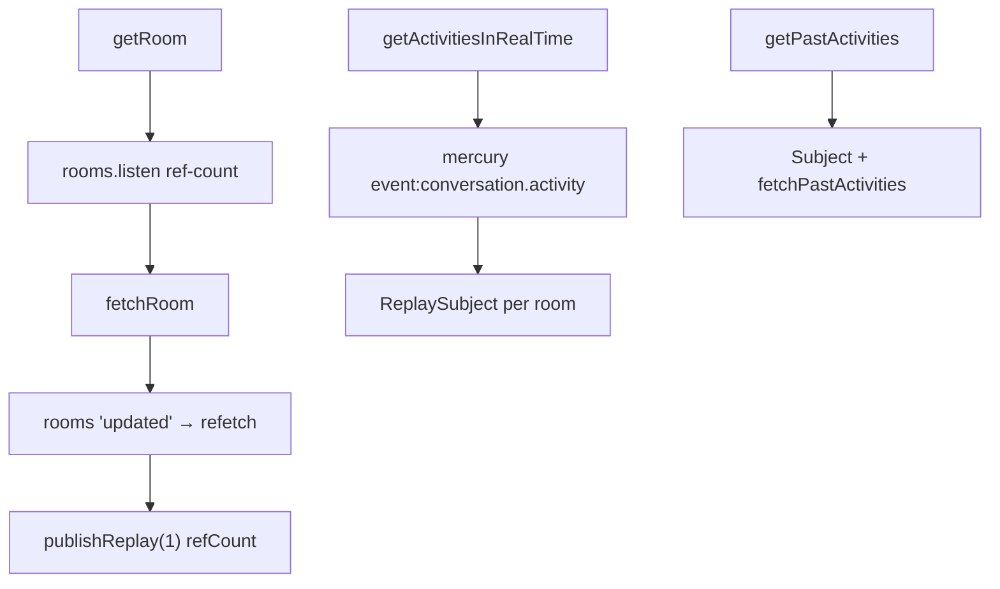
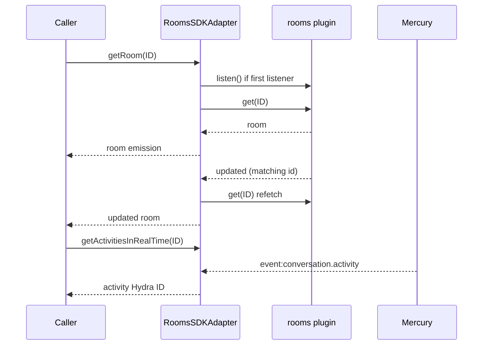
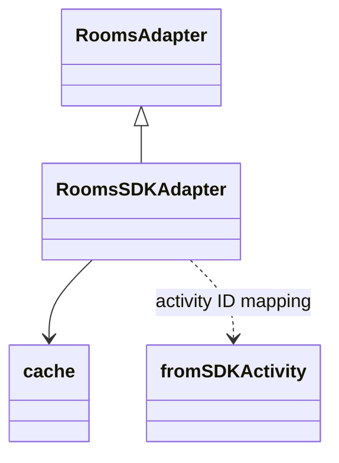

<!-- ───────────────────────────────
  Template:     Module Spec
  Template-ID:  module-spec
  Generates:    src/ai-docs/rooms-sdk-adapter-spec.md
  Library ver:  0.2.1
  Last updated: 2026-08-05
─────────────────────────────── -->

# rooms-sdk-adapter — SPEC

> [`AGENTS.md`](../../AGENTS.md) · [`SPEC_INDEX.md`](../../ai-docs/SPEC_INDEX.md) · [`ARCHITECTURE.md`](../../ai-docs/ARCHITECTURE.md)

## Metadata

| Field | Value |
|---|---|
| Module id | rooms-sdk-adapter |
| Source path(s) | `src/RoomsSDKAdapter.js` |
| Doc kind | Module spec |
| Coverage score | 90% assessed 2026-08-05 — getRoom listen/refCount, realtime Mercury activities, read/create surface, and error paths documented |
| Generated from | `module-spec` @ SDLC template library `0.2.1` |
| generated_by / approved_by / updated_at | cursor-agent / pending PR approval / 2026-08-05 |
| Validation status | not-run |

## Evidence Rules

Every requirement cites concrete source evidence as `file path` only. Test evidence names `src/*.test.js` files.

## Source Material Register

| Source material | Scope | Decision | Detail location or disposition |
|---|---|---|---|
| Implementation | behavior | verified | Requirements and Error Handling in this spec |
| `@webex/component-adapter-interfaces` RoomsAdapter | contract | reference-only | Public Surface rows |

## Overview

`RoomsSDKAdapter` implements `RoomsAdapter` for **read and create** room operations (not full CRUD — no update/delete adapter methods). Room snapshots stream via SDK `rooms.listen` / `updated` events with `publishReplay(1)`/`refCount`. Past activities paginate through conversation list API; realtime activity IDs arrive on Mercury `event:conversation.activity`.

## Purpose / Responsibility

Owns room read/create observables, paginated past activity ID streams, and realtime activity ID notifications. Does **not** own single-activity detail fetch (see `ActivitiesSDKAdapter`) or membership lists.

## Stack

JavaScript, RxJS 6, Webex SDK `rooms` plugin, `internal.conversation` for activities, Mercury, shared `cache.js`.

## Folder / Package Structure

```
src/
├── RoomsSDKAdapter.js
├── RoomsSDKAdapter.test.js
├── RoomsSDKAdapter.integration.test.js
├── ActivitiesSDKAdapter.js   # fromSDKActivity reuse
└── ai-docs/
```

## Key Files (source of truth)

| File | Holds |
|---|---|
| `src/RoomsSDKAdapter.js` | getRoom, createRoom, getPastActivities, getActivitiesInRealTime |
| `src/RoomsSDKAdapter.test.js` | Unit tests |
| `src/cache.js` | Conversation and activity caching for pagination |

## Public Surface

| Contract ID | Symbol | Kind | Signature/Type | Stability | Detail link | Defined at |
|---|---|---|---|---|---|---|
| rooms-adapter.class | `RoomsSDKAdapter` | class | extends `RoomsAdapter` | stable | [`CONTRACTS.md`](../../ai-docs/CONTRACTS.md) | `src/RoomsSDKAdapter.js` |
| rooms-adapter.getRoom | `getRoom(ID)` | method → Observable | `(roomID: string) => Observable<Room>` | stable | this spec | `src/RoomsSDKAdapter.js` |
| rooms-adapter.createRoom | `createRoom(room)` | method → Observable | `(room: Room) => Observable<Room>` | stable | this spec | `src/RoomsSDKAdapter.js` |
| rooms-adapter.getPastActivities | `getPastActivities(ID, limit?)` | method → Observable | `(roomID: string, limit?: number) => Observable<string[]>` | stable | this spec | `src/RoomsSDKAdapter.js` |
| rooms-adapter.hasMoreActivities | `hasMoreActivities(ID)` | method | `(roomID: string) => boolean` | stable | this spec | `src/RoomsSDKAdapter.js` |
| rooms-adapter.getActivitiesInRealTime | `getActivitiesInRealTime(ID)` | method → Observable | `(roomID: string) => Observable<activityID>` | stable | this spec | `src/RoomsSDKAdapter.js` |
| rooms-adapter.ROOM_UPDATED_EVENT | `ROOM_UPDATED_EVENT` | constant | `'updated'` | stable | this spec | `src/RoomsSDKAdapter.js` |

## Requires (dependencies)

| Dependency | Purpose |
|---|---|
| `datasource.rooms.get`, `create`, `listen`, `stopListening` | Room CRUD subset (read/create + events) |
| `datasource.internal.conversation.listActivities` | Paginated history |
| Mercury `event:conversation.activity` | Realtime activity IDs |
| `cache.js` | Conversation preload and activity cache |
| Facade `connect()` | Mercury for realtime activities |

## Requirements

| ID | WHAT | WHY | Evidence | Test evidence | Gaps | Confidence |
|---|---|---|---|---|---|---|
| ROM-R-001 | `getRoom` uses SDK `rooms.listen()` on first subscriber (ref-counted) and `rooms` event `updated` (`ROOM_UPDATED_EVENT`), not Mercury, for room metadata updates | Rooms plugin owns room change events | `src/RoomsSDKAdapter.js` | `src/RoomsSDKAdapter.test.js` (positive: listens on subscribe; stops on unsubscribe) | none | PRESENT |
| ROM-R-002 | Per-room `getRoom` observable uses `publishReplay(1)` + `refCount()`, not per-room `ReplaySubject` | Multicast with last room snapshot replay | `src/RoomsSDKAdapter.js` | none found | refCount sharing untested | PRESENT |
| ROM-R-003 | `getActivitiesInRealTime` alone uses unbounded `new ReplaySubject()` per room ID | Realtime ID stream separate from room snapshot pattern | `src/RoomsSDKAdapter.js` | `src/RoomsSDKAdapter.test.js` (positive: emits activity ID) | none | PRESENT |
| ROM-R-004 | Realtime activities filter Mercury `event:conversation.activity` where `activity.target.id` matches room UUID | Only emit activities for subscribed room | `src/RoomsSDKAdapter.js` | none found | Mercury handler untested in unit tests | PRESENT |
| ROM-R-005 | `getRoom` initial `fetchRoom` failure propagates as observable error from `from(fetchRoom)` | Invalid room ID must error the stream | `src/RoomsSDKAdapter.js` | `src/RoomsSDKAdapter.test.js` (negative: proper error message) | none | PRESENT |
| ROM-R-006 | `fetchPastActivities` uses bare `subscribe` without error handler — fetch rejection is unhandled | Documented sharp edge for callers/pagination | `src/RoomsSDKAdapter.js` | none found | Unhandled rejection not tested | PRESENT |
| ROM-R-007 | Public surface is read (`getRoom`) and create (`createRoom`) only — no adapter update/delete room methods | Matches implemented RoomsAdapter subset | `src/RoomsSDKAdapter.js` | `src/RoomsSDKAdapter.test.js` createRoom positive/negative | Update/delete intentionally absent | PRESENT |
| ROM-R-008 | Missing room ID on `getPastActivities` / `getActivitiesInRealTime` returns `throwError` synchronously | Fail fast before side effects | `src/RoomsSDKAdapter.js` | `src/RoomsSDKAdapter.test.js` (negative: no room id) | none | PRESENT |

## Design Overview

Room updates ref-count global `rooms.listen()` so the SDK starts listening once and stops when all room observables finalize. Each `getRoom` concatenates initial fetch with `updated` events that trigger refetch (event payload lacks full room). Past activities use a `Subject` per room with imperative `hasMoreActivities` / `fetchPastActivities` pagination. Realtime path registers a Mercury listener once per room into a dedicated `ReplaySubject`.

## Data Flow



## Sequence Diagram(s)

Sequence coverage:

| Operation group | Diagram | Failure / recovery coverage |
|---|---|---|
| getRoom | listen + fetch + updated | alt: fetchRoom reject → error |
| getActivitiesInRealTime | Mercury push | missing ID → throwError |
| getPastActivities | pagination | fetchPastActivities rejection unhandled |



## Class / Component Relationships



## Use Cases

- **UC-1 Room header:** Subscribe `getRoom(id)` for title/type updates. Evidence: `src/RoomsSDKAdapter.test.js`.
- **UC-2 Create space:** `createRoom(payload)` one-shot observable. Evidence: `src/RoomsSDKAdapter.test.js`.
- **UC-3 Message list:** `getPastActivities` + `hasMoreActivities` paginate IDs; host resolves details via Activities adapter. Evidence: `src/RoomsSDKAdapter.js`.
- **UC-4 Live feed:** `getActivitiesInRealTime` emits new activity IDs. Evidence: `src/RoomsSDKAdapter.test.js`.

## Error Handling & Failure Modes

| Condition | Signal | Caller recovery |
|---|---|---|
| Invalid/missing room on getRoom fetch | Observable error | Show error state; verify room ID |
| Missing ID on past/realtime methods | Synchronous throwError | Validate ID before subscribe |
| fetchPastActivities promise rejection | Unhandled rejection (no catch) | Host should wrap pagination calls; fix is future work |
| createRoom SDK failure | Observable error rethrown | Display create failure |

## Concurrency & Reactive Flow

- Global `listenerCount` gates `rooms.listen` / `stopListening`.
- `getActivitiesInRealTime` Mercury handler registered once per room ID; persists for adapter lifetime.
- `roomActivities` and `activitiesObservableCache` Maps hold pagination state per room.

## Pitfalls

- **Room updates use `rooms` plugin `updated`, not Mercury** — do not listen to Mercury for room metadata here.
- **`fetchPastActivities` lacks error handling** — network failures may surface as unhandled rejections.
- **Not full CRUD** — only read and create; no adapter methods for room update or delete.
- **Conversation list pre-cache** — first pagination call triggers `internal.conversation.list()` once globally (`FETCHED_CONVERSATIONS` flag).

## Test-Case Strategy (module)

| Behavior / Requirement | Existing test evidence | Gap |
|---|---|---|
| ROM-R-001 | `src/RoomsSDKAdapter.test.js` — listens on subscribe; stops on unsubscribe | none |
| ROM-R-005 | `src/RoomsSDKAdapter.test.js` — negative fetch error | none |
| ROM-R-007 | `src/RoomsSDKAdapter.test.js` createRoom positive/negative | none |
| ROM-R-008 | `src/RoomsSDKAdapter.test.js` getPastActivities missing ID | none |
| ROM-R-003 | `src/RoomsSDKAdapter.test.js` getActivitiesInRealTime positive | Negative Mercury filter mismatch |
| ROM-R-006 | none found | Simulate fetchActivities rejection |

## Traceability

- Repo architecture: [`ai-docs/ARCHITECTURE.md`](../../ai-docs/ARCHITECTURE.md) · Registry: [`ai-docs/SPEC_INDEX.md`](../../ai-docs/SPEC_INDEX.md)
- Coverage state & contracts baseline: `.sdd/manifest.json`
