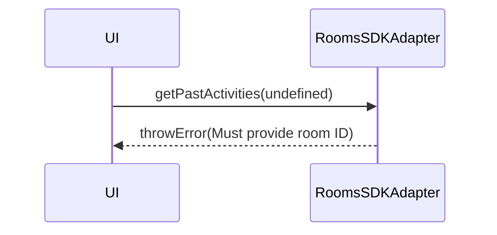

<!-- ───────────────────────────────
  Template:     Module Spec
  Template-ID:  module-spec
  Generates:    src/ai-docs/rooms-sdk-adapter-spec.md
  Library ver:  0.2.1
  Last updated: 2026-08-05
─────────────────────────────── -->

# rooms-sdk-adapter — SPEC

> [`AGENTS.md`](../../AGENTS.md) · [`SPEC_INDEX.md`](../../ai-docs/SPEC_INDEX.md)

## Metadata

| Field | Value |
|---|---|
| Module id | rooms-sdk-adapter |
| Source path(s) | `src/RoomsSDKAdapter.js` |
| Doc kind | Module spec |
| Coverage score | 90% assessed 2026-08-05 |
| Generated from | `module-spec` @ SDLC template library `0.2.1` |
| generated_by / approved_by / updated_at | cursor-agent / pending PR approval / 2026-08-05 |
| Validation status | not-run |

## Evidence Rules

File path evidence only.

## Source Material Register

| Source material | Scope | Decision | Detail location |
|---|---|---|---|
| Code | behavior | verified | `src/RoomsSDKAdapter.js` |

## Overview

Provides room CRUD streams, paginated past activities, and real-time activity ID feeds via Mercury.

## Purpose / Responsibility

Owns room observables, createRoom, activity pagination, and websocket-backed activity notifications.

## Stack

JavaScript, RxJS, Webex SDK rooms + mercury events.

## Folder / Package Structure

```
src/RoomsSDKAdapter.js
src/RoomsSDKAdapter.test.js
src/RoomsSDKAdapter.integration.test.js
```

## Key Files (source of truth)

| File | Role |
|---|---|
| `src/RoomsSDKAdapter.js` | Implementation |
| `src/RoomsSDKAdapter.test.js` | Unit tests |

## Public Surface

| Symbol | Kind | Description |
|---|---|---|
| `RoomsSDKAdapter` | class | Rooms adapter |
| `ROOM_UPDATED_EVENT` | export constant | SDK room update event name |
| `CONVERSATION_ACTIVITY_EVENT` | export constant | Mercury activity event |
| `getRoom(ID)` | Observable | Room with live updates |
| `createRoom(room)` | Observable | Create room |
| `hasMoreActivities(ID)` | boolean | Pagination flag |
| `getPastActivities(ID, limit?)` | Observable | Past activity ID pages |
| `getActivitiesInRealTime(ID)` | Observable | Live activity IDs |

## Requires (dependencies)

| Dependency | Purpose |
|---|---|
| webex SDK rooms API | CRUD |
| Mercury | Real-time activity events |
| `cache.js` | Room cache |

## Requirements

| ID | WHAT | WHY | Evidence |
|---|---|---|---|
| R-R1 | Missing room ID on past/realtime activity methods errors observable | Prevent silent no-op on invalid input | `src/RoomsSDKAdapter.js` |
| R-R2 | getRoom uses ref-counted room listener | Share Mercury subscription | `src/RoomsSDKAdapter.js` |

## Design Overview

Per-room ReplaySubjects; ref-counted `startListeningToRoomUpdates` for websocket efficiency.

## Data Flow

getRoom → fetch/cache → ReplaySubject → ROOM_UPDATED events merge updates.

## Sequence Diagram(s)

**getPastActivities — missing ID**



## Class / Component Relationships

`RoomsSDKAdapter` extends `RoomsAdapter`; maps roomID → observables and activity subjects.

## Use Cases

| Actor | Steps | Outcome |
|---|---|---|
| UI | getRoom(id) | Room header/title updates live |
| UI | getActivitiesInRealTime(id) | New message IDs appended |

## Concurrency & Reactive Flow

Shared listeners with ref counting; multiple subscribers to same room ID share one stream.

## Error Handling & Failure Modes

| Failure | Behavior | Caller recovery |
|---|---|---|
| Missing ID on getPastActivities / getActivitiesInRealTime | `throwError` on subscribe | Validate ID before subscribe |
| Missing ID on fetchPastActivities | `room$.error(...)` | Provide room ID; resubscribe |
| createRoom SDK failure | catchError rethrow | Show create error; retry |

Evidence: `src/RoomsSDKAdapter.js`, `src/RoomsSDKAdapter.test.js`

## Pitfalls

- fetchPastActivities side-effect only — must subscribe via getPastActivities.
- Real-time stream requires connect() / Mercury up.

## Test-Case Strategy (module)

Unit tests for getRoom, createRoom, activity pagination; integration tests for live flows.

## Traceability

| Requirement | Test |
|---|---|
| R-R1 | `RoomsSDKAdapter.test.js` |
