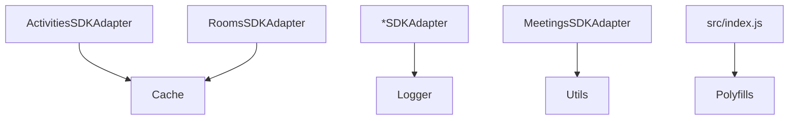
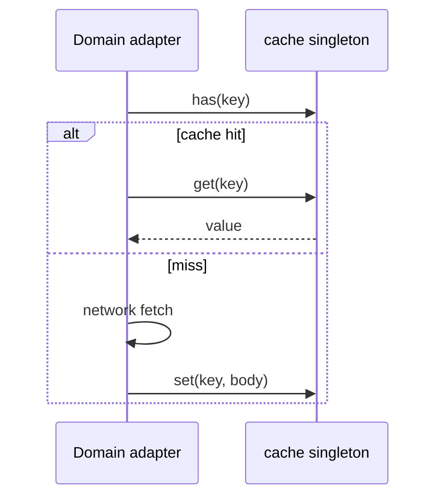
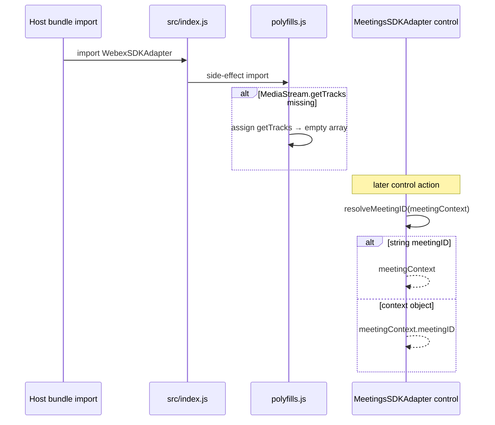
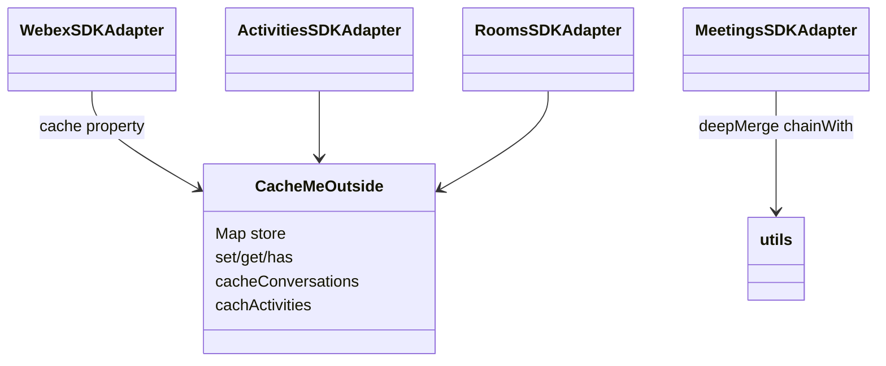

<!-- ───────────────────────────────
  Template:     Module Spec
  Template-ID:  module-spec
  Generates:    src/ai-docs/shared-utilities-spec.md
  Library ver:  0.2.1
  Last updated: 2026-08-05
─────────────────────────────── -->

# shared-utilities — SPEC

> [`AGENTS.md`](../../AGENTS.md) · [`SPEC_INDEX.md`](../../ai-docs/SPEC_INDEX.md) · [`ARCHITECTURE.md`](../../ai-docs/ARCHITECTURE.md)

## Metadata

| Field | Value |
|---|---|
| Module id | shared-utilities |
| Source path(s) | `src/cache.js`, `src/logger.js`, `src/logger/`, `src/utils.js`, `src/polyfills.js` |
| Doc kind | Module spec |
| Coverage score | 91% assessed 2026-08-05 — cache, logger, RxJS utils, polyfills with operation-group sequences documented |
| Generated from | `module-spec` @ SDLC template library `0.2.1` |
| generated_by / approved_by / updated_at | cursor-agent / Akula Uday / 2026-08-05 |
| Validation status | not-run |

## Evidence Rules

Every requirement cites concrete source evidence as `file path` only. Test evidence names `src/*.test.js` files where present.

## Source Material Register

| Source material | Scope | Decision | Detail location or disposition |
|---|---|---|---|
| Implementation | behavior | verified | Requirements, State Model, Sequence Diagram(s) |
| Not a published package surface | scope | N/A | Internal modules consumed by domain adapters |

## Overview

Shared utilities provide cross-cutting support: in-memory cache singleton for activities/conversations, leveled logger with optional console transport and browser hook, RxJS helper operators and meeting ID resolution helpers, and a MediaStream polyfill. This is **not** a trivial composition module — distinct operation groups (cache, logger) warrant separate sequence diagrams.

## Purpose / Responsibility

Owns internal helpers and singleton state used by domain adapters. Does **not** expose a public npm API beyond what domain modules import directly.

## Stack

JavaScript, RxJS 6 (utils operators), browser globals for logger hook and polyfills.

## Folder / Package Structure

```
src/
├── cache.js
├── logger.js
├── logger/
│   ├── logger.js
│   └── consoleTransport.js
├── utils.js
├── polyfills.js
└── ai-docs/
```

## Key Files (source of truth)

| File | Holds |
|---|---|
| `src/cache.js` | CacheMeOutside singleton — set/get/has/remove, bulk cache helpers |
| `src/logger.js` | Logger singleton wiring, console transport gate, window hook |
| `src/logger/logger.js` | createLogger, setLevel, addTransport |
| `src/logger/consoleTransport.js` | Console output transport factory |
| `src/utils.js` | RxJS operators (chainWith, combineLatestImmediate), meeting ID helpers, deepMerge, safeJsonStringify |
| `src/polyfills.js` | MediaStream.prototype.getTracks shim loaded via `src/index.js` |

## Public Surface

Internal Surface — consumed by other modules in this package, not exported from npm entry.

| Contract ID | Type | Surface | Purpose | Compatibility / deprecation | Schema / detail link | Root index |
|---|---|---|---|---|---|---|
| shared.cache.singleton | internal module | `default export` CacheMeOutside singleton | Key/value store for SDK objects | stable internal | `src/cache.js` | [`CONTRACTS.md`](../../ai-docs/CONTRACTS.md) |
| shared.cache.set | internal method | `set(key, value)` | Store or update entry | stable internal | `src/cache.js` | [`CONTRACTS.md`](../../ai-docs/CONTRACTS.md) |
| shared.cache.get | internal method | `get(key)` | Retrieve entry or undefined | stable internal | `src/cache.js` | [`CONTRACTS.md`](../../ai-docs/CONTRACTS.md) |
| shared.cache.has | internal method | `has(key): boolean` | Key existence check | stable internal | `src/cache.js` | [`CONTRACTS.md`](../../ai-docs/CONTRACTS.md) |
| shared.cache.remove | internal method | `remove(key): boolean` | Delete key from cache | stable internal | `src/cache.js` | [`CONTRACTS.md`](../../ai-docs/CONTRACTS.md) |
| shared.cache.values | internal method | `values(): Iterator` | Iterate cached values | stable internal | `src/cache.js` | [`CONTRACTS.md`](../../ai-docs/CONTRACTS.md) |
| shared.cache.size | internal method | `size(): number` | Entry count | stable internal | `src/cache.js` | [`CONTRACTS.md`](../../ai-docs/CONTRACTS.md) |
| shared.cache.keys | internal method | `keys(): Iterator` | Iterate cache keys | stable internal | `src/cache.js` | [`CONTRACTS.md`](../../ai-docs/CONTRACTS.md) |
| shared.cache.cacheConversations | internal method | `cacheConversations(conversations[])` | Bulk cache SDK conversations | stable internal | `src/cache.js` | [`CONTRACTS.md`](../../ai-docs/CONTRACTS.md) |
| shared.cache.cachActivities | internal method | `cachActivities(activities[])` | Bulk cache SDK activities (typo preserved) | stable internal | `src/cache.js` | [`CONTRACTS.md`](../../ai-docs/CONTRACTS.md) |
| shared.cache.cachSDKActivities | internal method | `cachSDKActivities(sdkActivities[])` | Bulk cache SDK activity objects by id | stable internal | `src/cache.js` | [`CONTRACTS.md`](../../ai-docs/CONTRACTS.md) |
| shared.logger.default | internal module | `default export` logger instance | Domain debug/error logging | stable internal | `src/logger.js` | [`CONTRACTS.md`](../../ai-docs/CONTRACTS.md) |
| shared.logger.setLevel | internal method | `setLevel(level)` | Adjust log verbosity | stable internal | `src/logger/logger.js` | [`CONTRACTS.md`](../../ai-docs/CONTRACTS.md) |
| shared.logger.windowHook | internal global | `window.webexSDKAdapterSetLogLevel(level)` | Browser-only level control | stable internal | `src/logger.js` | [`CONTRACTS.md`](../../ai-docs/CONTRACTS.md) |
| shared.utils.chainWith | internal export | RxJS operator | Chain dependent observables | stable internal | `src/utils.js` | [`CONTRACTS.md`](../../ai-docs/CONTRACTS.md) |
| shared.utils.combineLatestImmediate | internal export | RxJS helper | combineLatest with startWith(undefined) per source | stable internal | `src/utils.js` | [`CONTRACTS.md`](../../ai-docs/CONTRACTS.md) |
| shared.utils.deepMerge | internal export | object merge | Meeting state updates | stable internal | `src/utils.js` | [`CONTRACTS.md`](../../ai-docs/CONTRACTS.md) |
| shared.utils.resolveMeetingID | internal export | `(meetingContext) => string` | Control action meeting ID resolution | stable internal | `src/utils.js` | [`CONTRACTS.md`](../../ai-docs/CONTRACTS.md) |
| shared.utils.resolveDeviceSwitchArgs | internal export | device switch arg resolver | switch-* control compatibility | stable internal | `src/utils.js` | [`CONTRACTS.md`](../../ai-docs/CONTRACTS.md) |
| shared.utils.safeJsonStringify | internal export | circular-safe JSON.stringify | Logger transport | stable internal | `src/utils.js` | [`CONTRACTS.md`](../../ai-docs/CONTRACTS.md) |
| shared.utils.isSpeakerSupported | internal export | boolean | Feature detect setSinkId | stable internal | `src/utils.js` | [`CONTRACTS.md`](../../ai-docs/CONTRACTS.md) |
| shared.polyfills.mediaStream | internal side effect | `MediaStream.prototype.getTracks` shim | Legacy browser guard | stable internal | `src/polyfills.js` | [`CONTRACTS.md`](../../ai-docs/CONTRACTS.md) |

## Requires (dependencies)

| Dependency | Purpose |
|---|---|
| `process.env.NODE_ENV` | Gate console transport in logger |
| Browser `window` (optional) | Log level hook |
| RxJS (utils operators) | chainWith, combineLatestImmediate |

## Requirements

| ID | WHAT | WHY | Source Evidence | Test / Example Evidence | Assumptions / Gaps | Confidence |
|---|---|---|---|---|---|---|
| SHU-R-001 | Cache is process-wide singleton Map | Share activity/conversation bodies across adapters | `src/cache.js` | none found | Eviction policy none | PRESENT |
| SHU-R-002 | Logger defaults to level `error`; console transport added when NODE_ENV !== production | Reduce noise in production builds | `src/logger.js` | none found | none | PRESENT |
| SHU-R-003 | Browser exposes `window.webexSDKAdapterSetLogLevel` when window defined | Runtime debug control in demos | `src/logger.js` | none found | none | PRESENT |
| SHU-R-004 | `polyfills.js` imported from `src/index.js` — patches missing getTracks to empty array | Prevent throws on legacy browsers | `src/polyfills.js`, `src/index.js` | none found | none | PRESENT |
| SHU-R-005 | `resolveMeetingID` / `resolveDeviceSwitchArgs` support string ID and PR #346 context objects | Meeting control compatibility | `src/utils.js` | MeetingsSDKAdapter tests indirect | Direct unit tests sparse | PRESENT |

## Design Overview

Cache and logger are singletons imported directly. Utils exports pure functions and RxJS operators consumed heavily by MeetingsSDKAdapter. Polyfills run once at package load via index side effect.

## Data Flow



## Sequence Diagram(s)

Sequence coverage:

| Operation group | Diagram | Failure / recovery coverage |
|---|---|---|
| cache get/set | Cache read-through | miss → undefined; set overwrites |
| logger level hook | Browser setLogLevel | N/A in Node without window |
| polyfill load + utils resolveMeetingID | Package load + control arg resolution | polyfill no-op when getTracks exists; resolveMeetingID returns undefined for bad context |

### cache get / set



### logger hook flow

```mermaid
sequenceDiagram
  participant Dev as Developer / host page
  participant Window as window
  participant Logger as logger singleton

  Note over Logger: init level error; console transport if non-production
  Dev->>Window: webexSDKAdapterSetLogLevel('debug')
  Window->>Logger: setLevel('debug')
  Note over Adapter: subsequent domain logger.debug calls emit
```

### polyfill load and resolveMeetingID (utils group)



## Class / Component Relationships



## Use Cases

- **UC-1 Activity cache:** Activities fetch stores body by id; subsequent fetch hits cache. Evidence: `src/ActivitiesSDKAdapter.js`.
- **UC-2 Room pagination cache:** Rooms pre-cache conversations and activity bodies. Evidence: `src/RoomsSDKAdapter.js`.
- **UC-3 Debug in browser:** Call `window.webexSDKAdapterSetLogLevel('debug')`. Evidence: `src/logger.js`.

## State Model

- `CacheMeOutside.store` — unbounded in-memory Map keyed by SDK object id strings; no TTL or eviction.
- Logger holds level and transport list on singleton instance.

## Concurrency & Reactive Flow

- Cache Map mutations are synchronous; no locking — assumes single-threaded JS.
- `chainWith` operator manages nested subscription teardown on unsubscribe.

## Module Do's / Don'ts

- DO import cache singleton — do not instantiate second CacheMeOutside.
- DO use `resolveMeetingID` in meeting controls for host compatibility.
- DON'T rely on cache invalidation — stale entries persist for session lifetime.

## Pitfalls

- **Unbounded cache growth** during long sessions with many activities.
- **`cachActivities` typo** is public method name on cache — do not rename without adapter updates.
- **`isSpeakerSupported` evaluates at module load** — may be wrong if polyfills change later.

## Test-Case Strategy (module)

| Behavior / Requirement | Existing test evidence | Gap |
|---|---|---|
| SHU-R-005 | indirect via `src/MeetingsSDKAdapter.test.js` | Direct utils unit tests |
| SHU-R-001 | none found | Cache hit/miss characterization |
| SHU-R-003 | none found | window hook manual/browser test |

## Traceability

- Repo architecture: [`ai-docs/ARCHITECTURE.md`](../../ai-docs/ARCHITECTURE.md) · Registry: [`ai-docs/SPEC_INDEX.md`](../../ai-docs/SPEC_INDEX.md)
- Coverage state & contracts baseline: `.sdd/manifest.json`
