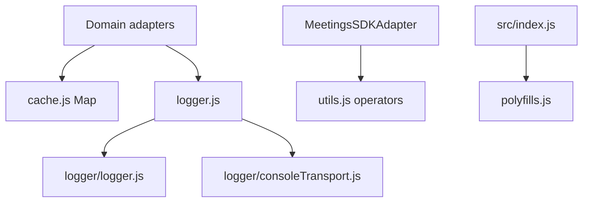
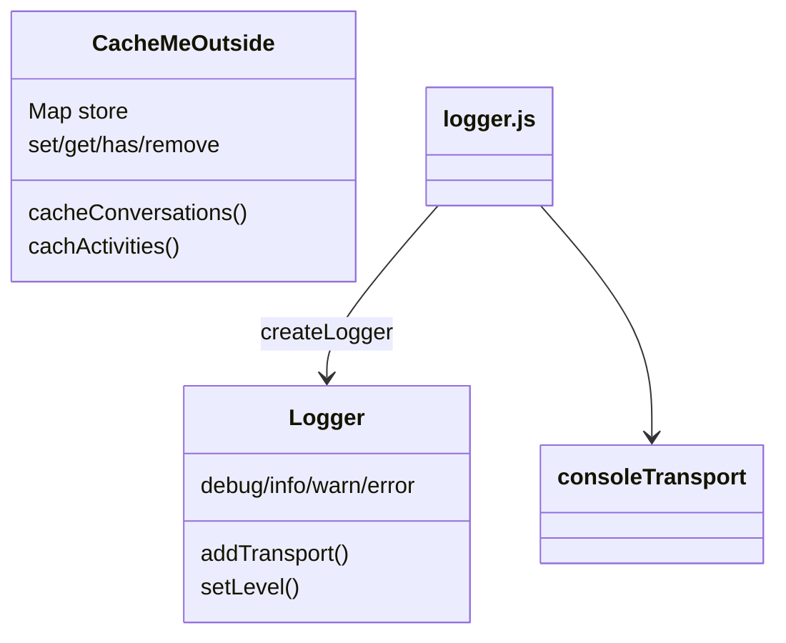

<!-- ───────────────────────────────
  Template:     Module Spec
  Template-ID:  module-spec
  Generates:    src/ai-docs/shared-utilities-spec.md
  Library ver:  0.2.1
  Last updated: 2026-08-05
─────────────────────────────── -->

# shared-utilities — SPEC

> [`AGENTS.md`](../../AGENTS.md) · [`SPEC_INDEX.md`](../../ai-docs/SPEC_INDEX.md) · [`ARCHITECTURE.md`](../../ai-docs/ARCHITECTURE.md)

## Metadata

| Field | Value |
|---|---|
| Module id | shared-utilities |
| Source path(s) | `src/cache.js`, `src/logger.js`, `src/logger/logger.js`, `src/logger/consoleTransport.js`, `src/utils.js`, `src/polyfills.js` |
| Doc kind | Module spec |
| Coverage score | 87% assessed 2026-08-05 — cache singleton, logger stack, RxJS utils, polyfills, and concurrency documented |
| Generated from | `module-spec` @ SDLC template library `0.2.1` |
| generated_by / approved_by / updated_at | cursor-agent / pending PR approval / 2026-08-05 |
| Validation status | not-run |

## Evidence Rules

Every requirement cites concrete source evidence as `file path` only. Test evidence names `src/*.test.js` files.

## Source Material Register

| Source material | Scope | Decision | Detail location or disposition |
|---|---|---|---|
| Implementation | behavior | verified | Requirements and module sections in this spec |
| Consumer adapters | usage | reference-only | cache/logger imported by domain adapters |

## Overview

Shared utilities provide cross-cutting infrastructure for all domain adapters: an in-memory cache singleton, structured logging with pluggable transports, RxJS helper operators, meeting-control argument resolution, safe JSON stringify, and a minimal MediaStream polyfill. Not published as a separate package — consumed via relative imports from `src/`.

## Purpose / Responsibility

Owns reusable non-domain helpers and process-wide singletons (cache, logger). Does **not** implement Webex domain logic.

## Stack

JavaScript (ES modules), RxJS 6 (utils operators), browser APIs (`MediaStream`, `console`).

## Folder / Package Structure

```
src/
├── cache.js                      # CacheMeOutside singleton export
├── cache.test.js
├── logger.js                     # Facade: createLogger + console transport wiring
├── logger/
│   ├── logger.js                 # createLogger, format, LEVELS
│   └── consoleTransport.js       # console[level] transport factory
├── utils.js                      # chainWith, deepMerge, resolveMeetingID, …
├── polyfills.js                  # MediaStream.getTracks shim
└── ai-docs/
```

## Key Files (source of truth)

| File | Holds |
|---|---|
| `src/cache.js` | Map-backed singleton cache API |
| `src/logger.js` | Default logger instance, level, browser hook |
| `src/logger/logger.js` | Logger factory and log formatting |
| `src/logger/consoleTransport.js` | Dev console transport |
| `src/utils.js` | RxJS operators and meeting ID resolution |
| `src/polyfills.js` | Side-effect polyfill imported from `src/index.js` |

## Public Surface

| Contract ID | Symbol | Kind | Signature/Type | Stability | Detail link | Defined at |
|---|---|---|---|---|---|---|
| shared.cache.default | `cache` (default export) | singleton instance | `CacheMeOutside` | internal stable | this spec | `src/cache.js` |
| shared.logger.default | `logger` (default export) | singleton instance | logger with debug/info/warn/error | internal stable | this spec | `src/logger.js` |
| shared.logger.createLogger | `createLogger` | function | `() => Logger` | internal stable | this spec | `src/logger/logger.js` |
| shared.logger.format | `format` | function | log line formatter | internal stable | this spec | `src/logger/logger.js` |
| shared.logger.consoleTransport | `consoleTransport` | function factory | `(prefix?) => TransportFn` | internal stable | this spec | `src/logger/consoleTransport.js` |
| shared.utils.chainWith | `chainWith` | RxJS operator | sequential dependent observable | internal stable | this spec | `src/utils.js` |
| shared.utils.combineLatestImmediate | `combineLatestImmediate` | function | combineLatest with startWith(undefined) | internal stable | this spec | `src/utils.js` |
| shared.utils.deepMerge | `deepMerge` | function | in-place deep merge | internal stable | this spec | `src/utils.js` |
| shared.utils.resolveMeetingID | `resolveMeetingID` | function | string or `{meetingID}` → id | internal stable | this spec | `src/utils.js` |
| shared.utils.resolveDeviceSwitchArgs | `resolveDeviceSwitchArgs` | function | meeting + device id resolution | internal stable | this spec | `src/utils.js` |
| shared.utils.safeJsonStringify | `safeJsonStringify` | function | circular-safe JSON.stringify | internal stable | this spec | `src/utils.js` |
| shared.utils.isSpeakerSupported | `isSpeakerSupported` | boolean constant | setSinkId feature detect | internal stable | this spec | `src/utils.js` |
| shared.polyfills | side-effect import | module | MediaStream.getTracks noop | internal stable | this spec | `src/polyfills.js` |
| shared.window.setLogLevel | `window.webexSDKAdapterSetLogLevel` | function (browser) | `(level) => void` | internal stable | this spec | `src/logger.js` |

## Requires (dependencies)

| Dependency | Purpose |
|---|---|
| RxJS (`utils.js`) | Custom operators |
| Browser `console` | consoleTransport output |
| `process.env.NODE_ENV` | Enable console transport in non-production |

## Requirements

| ID | WHAT | WHY | Evidence | Test evidence | Gaps | Confidence |
|---|---|---|---|---|---|---|
| SHU-R-001 | `cache.js` exports single `CacheMeOutside` singleton with Map store | Shared activity/conversation memoization | `src/cache.js` | `src/cache.test.js` (positive singleton) | Thread safety N/A in JS single-thread | PRESENT |
| SHU-R-002 | Cache supports set/get/has/remove/keys/values/size plus `cacheConversations` and `cachActivities` bulk helpers | Domain adapter batch caching | `src/cache.js` | `src/cache.test.js` positive bulk helpers | Typo `cachActivities` preserved | PRESENT |
| SHU-R-003 | `logger.js` creates logger via `createLogger`, default level `error`, adds `consoleTransport` when not production | Dev visibility without prod noise | `src/logger.js`, `src/logger/logger.js`, `src/logger/consoleTransport.js` | none found | Logger level/transport untested | PRESENT |
| SHU-R-004 | `format()` stringifies objects with circular reference and MediaStream track summary | Readable debug lines | `src/logger/logger.js` | none found | format() edge cases untested | PRESENT |
| SHU-R-005 | Browser exposes `window.webexSDKAdapterSetLogLevel` | Runtime log level tuning | `src/logger.js` | none found | Browser hook untested | PRESENT |
| SHU-R-006 | `chainWith` chains observables on source complete; used by Meetings createMeeting/getLocalMedia | Sequential async media setup | `src/utils.js`, `src/MeetingsSDKAdapter.js` | indirect via Meetings tests | chainWith unit tests absent | PRESENT |
| SHU-R-007 | `resolveMeetingID` / `resolveDeviceSwitchArgs` accept string or PR #346 context object | @webex/components compatibility | `src/utils.js` | control tests indirect | Dedicated utils unit tests absent | PRESENT |
| SHU-R-008 | `polyfills.js` adds no-op `getTracks` when missing on MediaStream prototype | Avoid throws on legacy browsers | `src/polyfills.js` | none found | Polyfill untested | PRESENT |

## Design Overview

Utilities are intentionally small and imperative. Cache and logger are module singletons imported across adapters — no dependency injection container. Logger separates transport registration (`logger.js`) from core logging (`logger/logger.js`) so tests could add transports without console noise. Utils stay free of Webex SDK imports except through consumer adapters.

## Data Flow



## Sequence Diagram(s)

Sequence coverage:

| Operation group | Diagram | Failure / recovery coverage |
|---|---|---|
| Trivial shared utilities | Single module — no cross-actor sequences | N/A |

This module is a pass-through/composition utility layer with no external service calls — one diagram group is sufficient per manifest trivial-module rule.

## Class / Component Relationships



## Use Cases

- **UC-1 Activity cache hit:** Activities adapter `fetchActivity` checks cache before HTTP. Evidence: `src/ActivitiesSDKAdapter.js`, `src/cache.js`.
- **UC-2 Debug trace:** Non-production loads console transport; developer calls `webexSDKAdapterSetLogLevel('debug')`. Evidence: `src/logger.js`.
- **UC-3 Meeting control args:** ShareControl resolves meeting ID from string or object. Evidence: `src/utils.js`.

## State Model

- **Cache:** Process-wide `Map` in singleton — keys are SDK ids (activities, conversations). No TTL eviction.
- **Logger:** Mutable `currentLevel` and `transports[]` on singleton instance.

## Concurrency & Reactive Flow

- **Cache Map** is shared across all adapter instances in the same JS realm — concurrent async fetches may read/write same key; last `set` wins; no locking.
- **Logger** iterates transports synchronously on each log call — transports must not block or re-enter logging.
- **`chainWith`** unsubscribes prior inner subscription on teardown via returned unsubscribe function — safe for sequential media pipelines.
- **`combineLatestImmediate`** uses `startWith(undefined)` so combineLatest emits before all sources emit — consumers must handle undefined slots.
- **Singleton pattern** — importing cache/logger anywhere returns same instance (verified in cache tests).

## Module Do's / Don'ts

- DO import default exports from `cache.js` and `logger.js` — do not instantiate second cache.
- DO use `resolveMeetingID` in meeting controls for host compatibility.
- DON'T log secrets or tokens — logger has no redaction filter.
- DON'T assume cache invalidation — no TTL; stale entries persist until overwritten or `remove`.

## Pitfalls

- **`cachActivities` typo** is public method name — renaming breaks callers.
- **Logger default level is error** — debug lines silent until level raised.
- **Cache never evicts** — long sessions may retain stale activity objects.
- **`isSpeakerSupported` evaluated at module load** — document feature detect timing.

## Test-Case Strategy (module)

| Behavior / Requirement | Existing test evidence | Gap |
|---|---|---|
| SHU-R-001 | `src/cache.test.js` — positive singleton instance | Negative: N/A |
| SHU-R-002 | `src/cache.test.js` — set/get/has/remove; bulk cache positive | Negative: remove missing key |
| SHU-R-003 | none found | Positive: transport added in dev; Negative: production no console |
| SHU-R-006 | indirect via `src/MeetingsSDKAdapter.test.js` createMeeting | Dedicated chainWith unit test |
| SHU-R-007 | indirect via control tests | utils.js unit test file |
| SHU-R-008 | none found | Mock MediaStream without getTracks |

## Traceability

- Repo architecture: [`ai-docs/ARCHITECTURE.md`](../../ai-docs/ARCHITECTURE.md) · Registry: [`ai-docs/SPEC_INDEX.md`](../../ai-docs/SPEC_INDEX.md)
- Coverage state & contracts baseline: `.sdd/manifest.json`
