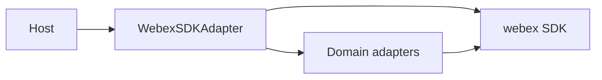
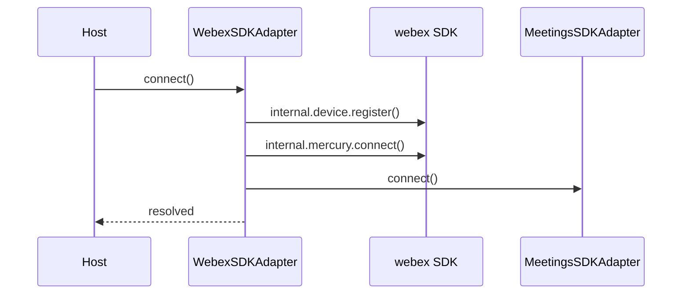
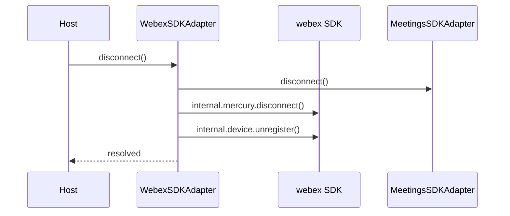
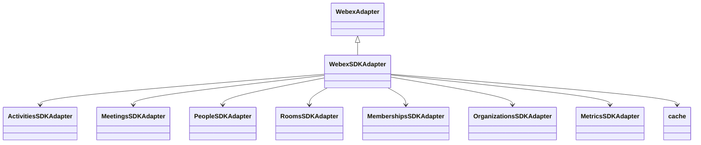

<!-- ───────────────────────────────
  Template:     Module Spec
  Template-ID:  module-spec
  Generates:    src/ai-docs/webex-sdk-adapter-spec.md
  Library ver:  0.2.1
  Last updated: 2026-08-05
─────────────────────────────── -->

# webex-sdk-adapter — SPEC

> [`AGENTS.md`](../../AGENTS.md) · [`SPEC_INDEX.md`](../../ai-docs/SPEC_INDEX.md) · [`ARCHITECTURE.md`](../../ai-docs/ARCHITECTURE.md)

## Metadata

| Field | Value |
|---|---|
| Module id | webex-sdk-adapter |
| Source path(s) | `src/WebexSDKAdapter.js`, `src/index.js` |
| Doc kind | Module spec |
| Coverage score | 92% assessed 2026-08-05 — facade connect/disconnect and export surface documented |
| Generated from | `module-spec` @ SDLC template library `0.2.1` |
| generated_by / approved_by / updated_at | cursor-agent / pending PR approval / 2026-08-05 |
| Validation status | not-run |

## Evidence Rules

Requirements cite `file path` evidence only. Tests referenced by file name.

## Source Material Register

| Source material | Scope | Decision | Detail location |
|---|---|---|---|
| README connect/disconnect | usage | reference-only | Sequence diagrams in this spec; README unchanged (keep-separate) |
| Code | behavior | verified | `src/WebexSDKAdapter.js` |

## Overview

`WebexSDKAdapter` is the **only public export** of this package. It extends `WebexAdapter` from `@webex/component-adapter-interfaces`, instantiates all domain adapters with the same SDK instance, and exposes `connect()` / `disconnect()` to register the device, open Mercury, and synchronize the meetings plugin.

## Purpose / Responsibility

Owns facade composition and lifecycle orchestration for Webex cloud connectivity. Does **not** implement domain queries (delegated to `*Adapter` properties).

## Stack

JavaScript, `@webex/component-adapter-interfaces`, Webex JS SDK, shared `cache` and `logger`.

## Folder / Package Structure

```
src/
├── WebexSDKAdapter.js    # Facade class
├── index.js              # default export only
└── ai-docs/              # Module specs
```

## Key Files (source of truth)

| File | Role |
|---|---|
| `src/index.js` | Public entry — `export default WebexSDKAdapter` |
| `src/WebexSDKAdapter.js` | Facade implementation |
| `src/WebexSDKAdapter.test.js` | connect/disconnect unit tests |

## Public Surface

| Symbol | Kind | Description |
|---|---|---|
| `WebexSDKAdapter` | class (default export) | Facade adapter |
| `constructor(sdk)` | method | Wire sub-adapters to authenticated SDK |
| `connect()` | async method | device.register → mercury.connect → meetingsAdapter.connect |
| `disconnect()` | async method | meetingsAdapter.disconnect → mercury.disconnect → device.unregister |
| `activitiesAdapter` | property | ActivitiesSDKAdapter instance |
| `peopleAdapter` | property | PeopleSDKAdapter instance |
| `roomsAdapter` | property | RoomsSDKAdapter instance |
| `meetingsAdapter` | property | MeetingsSDKAdapter instance |
| `membershipsAdapter` | property | MembershipsSDKAdapter instance |
| `organizationsAdapter` | property | OrganizationsSDKAdapter instance |
| `metricsAdapter` | property | MetricsSDKAdapter instance |
| `sdk` | property | Raw Webex SDK reference |
| `cache` | property | Shared cache singleton |

Evidence: `src/index.js`, `src/WebexSDKAdapter.js`

## Requires (dependencies)

| Dependency | Purpose |
|---|---|
| Authenticated `webex` SDK | Data source for all adapters |
| `@webex/component-adapter-interfaces` | `WebexAdapter` base class |
| Domain `*SDKAdapter` modules | Composed adapters |
| `cache.js`, `logger.js` | Cross-cutting utilities |

## Requirements

| ID | WHAT | WHY | Evidence | Tests |
|---|---|---|---|---|
| R-F1 | Package default export is only `WebexSDKAdapter` | Single entry for `@webex/components` host integration | `src/index.js` | Import tests in consumers |
| R-F2 | `connect()` registers device then Mercury then meetings | SDK requires device + websocket before live updates | `src/WebexSDKAdapter.js` | `src/WebexSDKAdapter.test.js` |
| R-F3 | `disconnect()` reverses connect order (meetings → mercury → unregister) | Clean teardown of media and sockets | `src/WebexSDKAdapter.js` | `src/WebexSDKAdapter.test.js` |
| R-F4 | Constructor creates all domain adapters with same SDK | Shared session across domains | `src/WebexSDKAdapter.js` | Constructor tests |

## Design Overview

Thin facade: no domain RxJS logic here — only lifecycle and dependency injection of sub-adapters.

## Data Flow

Host constructs facade → calls `connect()` → SDK internal services ready → host uses `adapter.<domain>Adapter` observables.



## Sequence Diagram(s)

**connect() — operation group: cloud connectivity**



**disconnect() — operation group: teardown**



Evidence: `src/WebexSDKAdapter.js` — **not** `@webex/components` `withAdapter` / `WebexDataProvider` lifecycle.

## Class / Component Relationships



## Use Cases

| Actor | Steps | Outcome |
|---|---|---|
| Host app | new WebexSDKAdapter(sdk); await connect() | Live updates enabled |
| Host app | await disconnect() on unmount | Resources released |

## Concurrency & Reactive Flow

Async `connect`/`disconnect`; domain data via RxJS on sub-adapters (not facade methods).

## Export Stability

Default export class name and connect/disconnect signatures are semver-sensitive npm contract.

## Host Integration

Host must await `connect()` before subscribing to domain observables. See `ai-docs/CONTRACTS.md`.

## Pitfalls

- Calling domain adapters before `connect()` may yield stale or empty streams.
- Passing unauthenticated SDK breaks all downstream adapters.

## Test-Case Strategy (module)

| Area | Test file | Coverage |
|---|---|---|
| connect/disconnect call order | `src/WebexSDKAdapter.test.js` | Mock SDK internal APIs |
| Sub-adapter construction | `src/WebexSDKAdapter.test.js` | Property presence |

## Traceability

| Requirement | Spec section | Source | Test |
|---|---|---|---|
| R-F2 | Sequence connect | `src/WebexSDKAdapter.js` | `WebexSDKAdapter.test.js` |
| R-F3 | Sequence disconnect | `src/WebexSDKAdapter.js` | `WebexSDKAdapter.test.js` |
