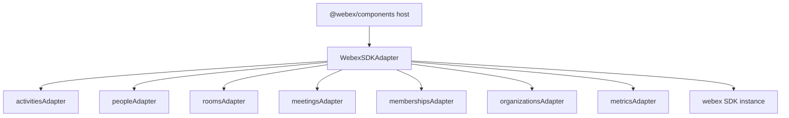
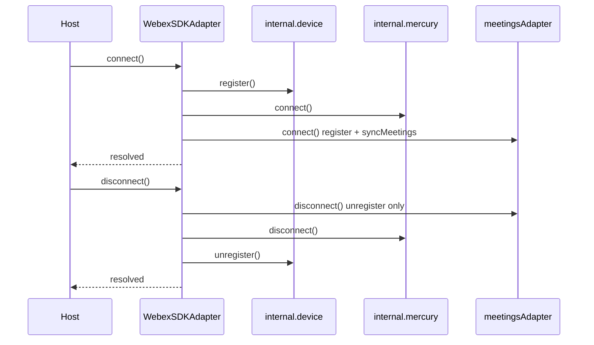
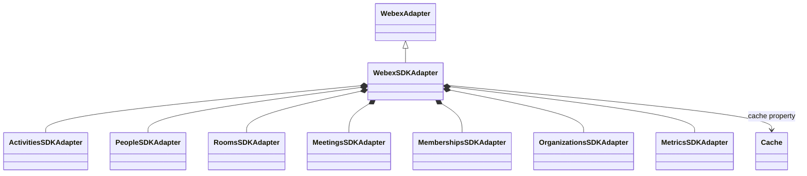

<!-- ───────────────────────────────
  Template:     Module Spec
  Template-ID:  module-spec
  Generates:    src/ai-docs/webex-sdk-adapter-spec.md
  Library ver:  0.2.1
  Last updated: 2026-08-05
─────────────────────────────── -->

# webex-sdk-adapter — SPEC

> [`AGENTS.md`](../../AGENTS.md) · [`SPEC_INDEX.md`](../../ai-docs/SPEC_INDEX.md) · [`ARCHITECTURE.md`](../../ai-docs/ARCHITECTURE.md)

## Metadata

| Field | Value |
|---|---|
| Module id | webex-sdk-adapter |
| Source path(s) | `src/WebexSDKAdapter.js`, `src/index.js` |
| Doc kind | Module spec |
| Coverage score | 91% assessed 2026-08-05 — facade connect/disconnect sequence, sub-adapter wiring, single operation group documented |
| Generated from | `module-spec` @ SDLC template library `0.2.1` |
| generated_by / approved_by / updated_at | cursor-agent / Akula Uday / 2026-08-05 |
| Validation status | Pass, validator `codex-agent`, assessed 2026-08-05 at 5926e8e — 0 Blocking, 0 Important, 0 Medium, 0 Minor; unit tests 19/19 suites, 194/194 passed |

## Evidence Rules

Every requirement cites concrete source evidence as `file path` only. Test evidence names `src/*.test.js` files.

## Source Material Register

| Source material | Scope | Decision | Detail location or disposition |
|---|---|---|---|
| Implementation | behavior | verified | Requirements, Host Integration, Sequence Diagram(s) |
| README.md | usage | reference-only | Host must pass authenticated SDK |

## Overview

`WebexSDKAdapter` is the package default export and facade implementing `WebexAdapter`. It constructs domain sub-adapters (activities, people, rooms, meetings, memberships, organizations, metrics), exposes shared `cache`, and orchestrates connect/disconnect: device register → Mercury connect → meetings plugin register (reverse on disconnect).

## Purpose / Responsibility

Owns adapter composition and SDK connectivity lifecycle. Does **not** implement domain observable logic — delegates to sub-adapters documented in `src/ai-docs/*-spec.md`.

## Stack

JavaScript, Webex JS SDK (peer), RxJS 6 (peer), Rollup-published UMD/ESM bundles.

## Folder / Package Structure

```
src/
├── WebexSDKAdapter.js
├── WebexSDKAdapter.test.js
├── index.js                 # default export + polyfills side effect
├── *SDKAdapter.js           # domain adapters
└── ai-docs/
```

## Key Files (source of truth)

| File | Holds |
|---|---|
| `src/WebexSDKAdapter.js` | Facade constructor, connect, disconnect |
| `src/index.js` | npm default export |
| `rollup.config.js` | Published bundle outputs (peer externals) |

## Public Surface

| Contract ID | Type | Surface | Purpose | Compatibility / deprecation | Schema / detail link | Root index |
|---|---|---|---|---|---|---|
| pkg.default | SDK class | `export default WebexSDKAdapter` from `src/index.js` | npm package entry | semver via semantic-release | `src/index.js` | [`CONTRACTS.md`](../../ai-docs/CONTRACTS.md) |
| webex-sdk-adapter.default | SDK class | `WebexSDKAdapter extends WebexAdapter` | Facade wiring sub-adapters | stable | `src/WebexSDKAdapter.js` | [`CONTRACTS.md`](../../ai-docs/CONTRACTS.md) |
| webex-sdk-adapter.connect | SDK method | `connect(): Promise<void>` | device.register → mercury.connect → meetingsAdapter.connect | stable | `src/WebexSDKAdapter.js` | [`CONTRACTS.md`](../../ai-docs/CONTRACTS.md) |
| webex-sdk-adapter.disconnect | SDK method | `disconnect(): Promise<void>` | meetingsAdapter.disconnect → mercury.disconnect → device.unregister | stable | `src/WebexSDKAdapter.js` | [`CONTRACTS.md`](../../ai-docs/CONTRACTS.md) |
| webex-sdk-adapter.activitiesAdapter | SDK property | ActivitiesSDKAdapter instance | Domain delegate | stable | `src/ai-docs/activities-sdk-adapter-spec.md` | [`CONTRACTS.md`](../../ai-docs/CONTRACTS.md) |
| webex-sdk-adapter.peopleAdapter | SDK property | PeopleSDKAdapter instance | Domain delegate | stable | `src/ai-docs/people-sdk-adapter-spec.md` | [`CONTRACTS.md`](../../ai-docs/CONTRACTS.md) |
| webex-sdk-adapter.roomsAdapter | SDK property | RoomsSDKAdapter instance | Domain delegate | stable | `src/ai-docs/rooms-sdk-adapter-spec.md` | [`CONTRACTS.md`](../../ai-docs/CONTRACTS.md) |
| webex-sdk-adapter.meetingsAdapter | SDK property | MeetingsSDKAdapter instance | Domain delegate | stable | `src/ai-docs/meetings-sdk-adapter-spec.md` | [`CONTRACTS.md`](../../ai-docs/CONTRACTS.md) |
| webex-sdk-adapter.membershipsAdapter | SDK property | MembershipsSDKAdapter instance | Domain delegate | stable | `src/ai-docs/memberships-sdk-adapter-spec.md` | [`CONTRACTS.md`](../../ai-docs/CONTRACTS.md) |
| webex-sdk-adapter.organizationsAdapter | SDK property | OrganizationsSDKAdapter instance | Domain delegate | stable | `src/ai-docs/organizations-sdk-adapter-spec.md` | [`CONTRACTS.md`](../../ai-docs/CONTRACTS.md) |
| webex-sdk-adapter.metricsAdapter | SDK property | MetricsSDKAdapter instance | Domain delegate | stable | `src/ai-docs/metrics-sdk-adapter-spec.md` | [`CONTRACTS.md`](../../ai-docs/CONTRACTS.md) |
| webex-sdk-adapter.cache | SDK property | shared cache singleton | Cross-adapter activity/conversation cache | stable | `src/ai-docs/shared-utilities-spec.md` | [`CONTRACTS.md`](../../ai-docs/CONTRACTS.md) |

This facade exposes **one connect/disconnect operation group** for lifecycle; domain methods live on sub-adapters. A single sequence diagram covers connect and disconnect.

## Requires (dependencies)

| Dependency | Purpose |
|---|---|
| Authenticated `webex` SDK instance (constructor arg) | All adapter operations |
| Peer `webex`, `rxjs` | Runtime (Rollup externals) |
| `@webex/component-adapter-interfaces` | WebexAdapter base type |

## Requirements

| ID | WHAT | WHY | Source Evidence | Test / Example Evidence | Assumptions / Gaps | Confidence |
|---|---|---|---|---|---|---|
| FAC-R-001 | Constructor instantiates all seven domain adapters with same SDK datasource | Single SDK session shared across domains | `src/WebexSDKAdapter.js` | `src/WebexSDKAdapter.test.js` | none | PRESENT |
| FAC-R-002 | `connect()` order: device.register → mercury.connect → meetingsAdapter.connect | Documented bootstrap sequence for live data | `src/WebexSDKAdapter.js` | `src/WebexSDKAdapter.test.js` | none | PRESENT |
| FAC-R-003 | `disconnect()` order: meetingsAdapter.disconnect → mercury.disconnect → device.unregister | Reverse connect; meetings disconnect only unregisters plugin | `src/WebexSDKAdapter.js` | `src/WebexSDKAdapter.test.js` | Does not stop meeting media — see meetings spec | PRESENT |
| FAC-R-004 | `cache` exposed on facade instance | Host/debug access to shared cache module | `src/WebexSDKAdapter.js` | none found | none | PRESENT |

## Design Overview

Thin composition root: no domain RxJS pipelines in facade file. Host applications construct with authenticated SDK, await `connect()` before relying on Mercury-backed observables, and call domain methods on named adapter properties matching `@webex/component-adapter-interfaces` consumer patterns.

## Data Flow



## Sequence Diagram(s)

Sequence coverage:

| Operation group | Diagram | Failure / recovery coverage |
|---|---|---|
| connect / disconnect (sole facade lifecycle group) | Facade lifecycle | alt: any step rejection propagates to caller Promise |



## Class / Component Relationships



## Use Cases

- **UC-1 Host bootstrap:** Construct with SDK → `await connect()` → use sub-adapters. Evidence: `README.md`, `src/WebexSDKAdapter.test.js`.
- **UC-2 Teardown:** `await disconnect()` on logout — note meeting media may require `leaveMeeting` first. Evidence: `src/MeetingsSDKAdapter.js`, meetings spec.

## Concurrency & Reactive Flow

- Facade methods are async; no shared observable state on facade itself.
- Sub-adapters manage their own hot/cold observables independently.

## Export Stability

- Default export only from `src/index.js`; Rollup emits UMD (`UMDWebexSDKComponentAdapter`) and ESM bundles with `webex` and `rxjs` as externals — do not bundle peers.
- Semver governed by semantic-release; breaking adapter interface changes require major bump.

## Host Integration & Theming

- Host must supply **authenticated** Webex SDK before constructing adapter.
- `connect()` must complete before Mercury-dependent features (live room activities, person presence updates, etc.).
- `@webex/components` `withAdapter` lifecycle differs — this adapter uses explicit connect/disconnect, not React mount/unmount alone.

## Pitfalls

- **`disconnect()` does not leave meetings or stop MediaStreams** — call `meetingsAdapter.leaveMeeting(ID)` per active meeting when media cleanup is required.
- **Missing `connect()`** — domain observables may lack live Mercury updates or meetings plugin registration.

## Test-Case Strategy (module)

| Behavior / Requirement | Existing test evidence | Gap |
|---|---|---|
| FAC-R-002, FAC-R-003 | `src/WebexSDKAdapter.test.js` | Connect failure mid-sequence rollback |

## Traceability

- Repo architecture: [`ai-docs/ARCHITECTURE.md`](../../ai-docs/ARCHITECTURE.md) · Registry: [`ai-docs/SPEC_INDEX.md`](../../ai-docs/SPEC_INDEX.md)
- Coverage state & contracts baseline: `.sdd/manifest.json`
