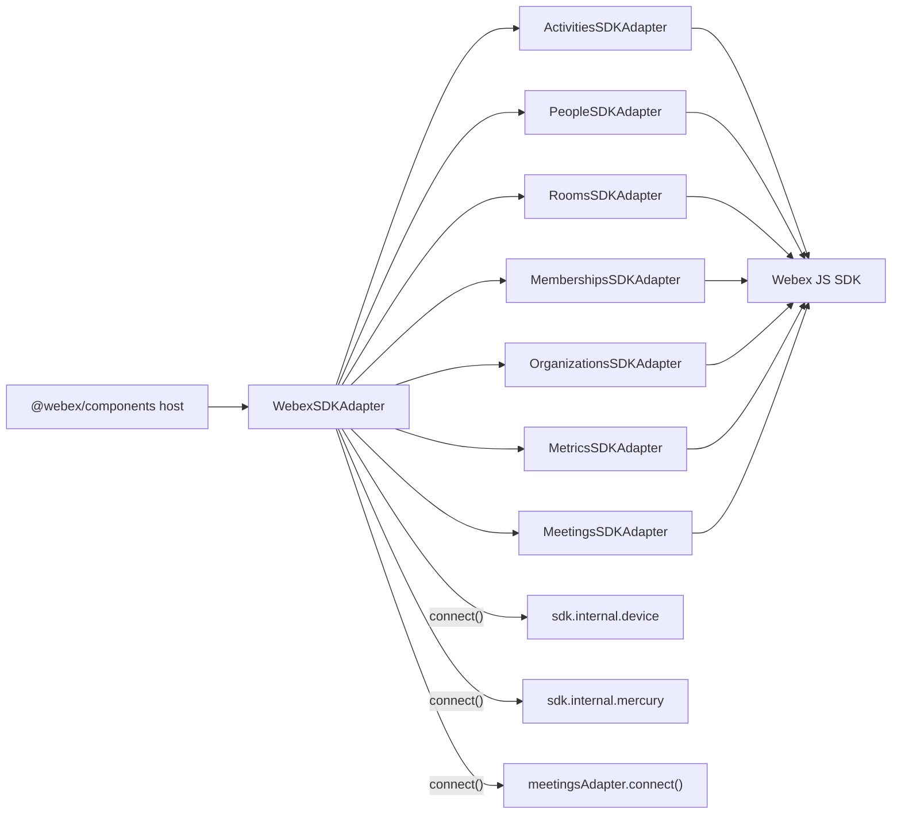
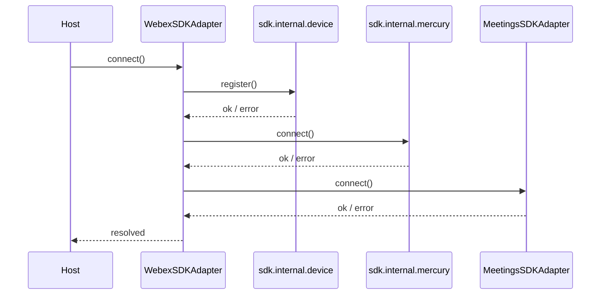
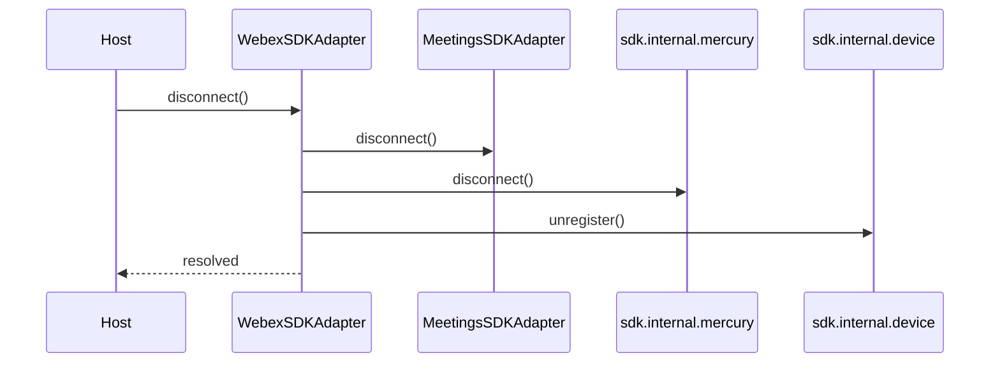
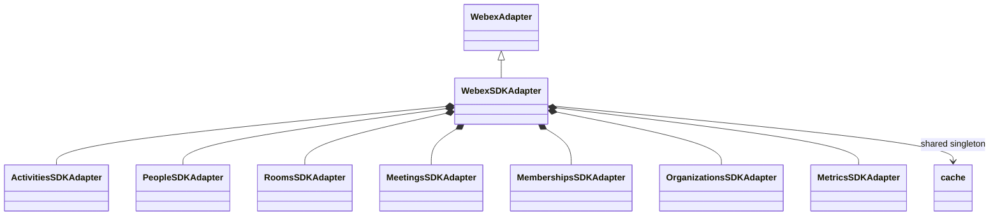

<!-- ───────────────────────────────
  Template:     Module Spec
  Template-ID:  module-spec
  Generates:    src/ai-docs/webex-sdk-adapter-spec.md
  Library ver:  0.2.1
  Last updated: 2026-08-05
─────────────────────────────── -->

# webex-sdk-adapter — SPEC

> [`AGENTS.md`](../../AGENTS.md) · [`SPEC_INDEX.md`](../../ai-docs/SPEC_INDEX.md) · [`ARCHITECTURE.md`](../../ai-docs/ARCHITECTURE.md)

## Metadata

| Field | Value |
|---|---|
| Module id | webex-sdk-adapter |
| Source path(s) | `src/WebexSDKAdapter.js`, `src/index.js` |
| Doc kind | Module spec |
| Coverage score | 92% assessed 2026-08-05 — facade composition, connect/disconnect scope, and export surface documented against source |
| Generated from | `module-spec` @ SDLC template library `0.2.1` |
| generated_by / approved_by / updated_at | cursor-agent / pending PR approval / 2026-08-05 |
| Validation status | not-run |

## Evidence Rules

Every requirement cites concrete source evidence as `file path` only. Test evidence names `src/*.test.js` files. Gaps and confidence are recorded per row.

## Source Material Register

| Source material | Scope | Decision | Detail location or disposition |
|---|---|---|---|
| README connect/disconnect | usage | reference-only | Sequence diagrams; README unchanged (keep-separate policy) |
| Implementation | behavior | verified | Requirements and Design Overview in this spec |

## Overview

`WebexSDKAdapter` is the **only public export** of `@webex/sdk-component-adapter`. It extends `WebexAdapter` from `@webex/component-adapter-interfaces`, instantiates all domain adapters with the same authenticated Webex JS SDK instance, and exposes `connect()` / `disconnect()` to orchestrate device registration, Mercury WebSocket connectivity, and the meetings plugin lifecycle.

Domain adapters are exposed as properties (`activitiesAdapter`, `peopleAdapter`, etc.) so `@webex/components` can subscribe to RxJS observables without importing sub-modules directly. The facade also exposes the raw `sdk` reference and the shared `cache` singleton.

## Purpose / Responsibility

Owns facade composition and **selective** lifecycle orchestration for Webex cloud connectivity (device + Mercury + meetings). Does **not** implement domain queries — those delegate to `*SDKAdapter` properties.

## Stack

JavaScript (ES modules), `@webex/component-adapter-interfaces`, Webex JS SDK (peer), RxJS 6 (peer), Rollup build, Jest unit tests.

## Folder / Package Structure

```
src/
├── WebexSDKAdapter.js    # Facade class
├── index.js              # default export + polyfills side-effect
├── *SDKAdapter.js        # Domain adapters (wired in constructor)
├── cache.js, logger.js   # Shared utilities
└── ai-docs/              # Module specs
```

## Key Files (source of truth)

| File | Holds |
|---|---|
| `src/index.js` | Public entry — `export default WebexSDKAdapter` |
| `src/WebexSDKAdapter.js` | Facade implementation and connect/disconnect |
| `src/WebexSDKAdapter.test.js` | Sub-adapter wiring unit tests |
| `package.json` | Package name/version logged at construction |

## Public Surface

| Contract ID | Symbol | Kind | Signature/Type | Stability | Detail link | Defined at |
|---|---|---|---|---|---|---|
| webex-sdk-adapter.default | `WebexSDKAdapter` | class (default export) | `class WebexSDKAdapter extends WebexAdapter` | stable | [`CONTRACTS.md`](../../ai-docs/CONTRACTS.md) | `src/index.js` |
| webex-sdk-adapter.constructor | `constructor(sdk)` | method | `(sdk: WebexSDK) => WebexSDKAdapter` | stable | this spec | `src/WebexSDKAdapter.js` |
| webex-sdk-adapter.connect | `connect()` | async method | `() => Promise<void>` | stable | this spec | `src/WebexSDKAdapter.js` |
| webex-sdk-adapter.disconnect | `disconnect()` | async method | `() => Promise<void>` | stable | this spec | `src/WebexSDKAdapter.js` |
| webex-sdk-adapter.activities | `activitiesAdapter` | property | `ActivitiesSDKAdapter` | stable | [`activities-sdk-adapter-spec.md`](activities-sdk-adapter-spec.md) | `src/WebexSDKAdapter.js` |
| webex-sdk-adapter.people | `peopleAdapter` | property | `PeopleSDKAdapter` | stable | [`people-sdk-adapter-spec.md`](people-sdk-adapter-spec.md) | `src/WebexSDKAdapter.js` |
| webex-sdk-adapter.rooms | `roomsAdapter` | property | `RoomsSDKAdapter` | stable | [`rooms-sdk-adapter-spec.md`](rooms-sdk-adapter-spec.md) | `src/WebexSDKAdapter.js` |
| webex-sdk-adapter.meetings | `meetingsAdapter` | property | `MeetingsSDKAdapter` | stable | [`meetings-sdk-adapter-spec.md`](meetings-sdk-adapter-spec.md) | `src/WebexSDKAdapter.js` |
| webex-sdk-adapter.memberships | `membershipsAdapter` | property | `MembershipsSDKAdapter` | stable | [`memberships-sdk-adapter-spec.md`](memberships-sdk-adapter-spec.md) | `src/WebexSDKAdapter.js` |
| webex-sdk-adapter.organizations | `organizationsAdapter` | property | `OrganizationsSDKAdapter` | stable | [`organizations-sdk-adapter-spec.md`](organizations-sdk-adapter-spec.md) | `src/WebexSDKAdapter.js` |
| webex-sdk-adapter.metrics | `metricsAdapter` | property | `MetricsSDKAdapter` | stable | [`metrics-sdk-adapter-spec.md`](metrics-sdk-adapter-spec.md) | `src/WebexSDKAdapter.js` |
| webex-sdk-adapter.sdk | `sdk` | property | authenticated Webex SDK instance | stable | this spec | `src/WebexSDKAdapter.js` |
| webex-sdk-adapter.cache | `cache` | property | shared cache singleton | stable | [`shared-utilities-spec.md`](shared-utilities-spec.md) | `src/WebexSDKAdapter.js` |

Compatibility notes:

- Additive optional properties on sub-adapters are minor-compatible; removing or renaming facade properties is breaking.
- Peer dependencies `webex` and `rxjs` must remain external in Rollup bundles.

## Requires (dependencies)

| Dependency | Purpose |
|---|---|
| Authenticated Webex JS SDK instance | Data source for all sub-adapters |
| `@webex/component-adapter-interfaces` | `WebexAdapter` base class |
| `webex` (peer) | SDK runtime |
| `rxjs` (peer) | Observable streams from sub-adapters |
| `./cache`, `./logger` | Shared singleton utilities |

## Requirements

| ID | WHAT | WHY | Evidence | Test evidence | Gaps | Confidence |
|---|---|---|---|---|---|---|
| WSA-R-001 | Constructor instantiates all seven domain adapters and assigns `sdk` and `cache` | Host receives a fully wired facade from one SDK instance | `src/WebexSDKAdapter.js` | `src/WebexSDKAdapter.test.js` (positive: adapter instance types) | No test for organizations/metrics/memberships/activities adapter types | PRESENT |
| WSA-R-002 | `connect()` awaits `device.register()`, `mercury.connect()`, then `meetingsAdapter.connect()` in order | Live Mercury events and meeting sync require registered device and open WebSocket | `src/WebexSDKAdapter.js` | none found | connect/disconnect sequence untested | PRESENT |
| WSA-R-003 | `connect()` is required only for Mercury-dependent and meetings-plugin flows; organizations and metrics adapters work without facade `connect()` | Orgs use Hydra REST; metrics use SDK internal metrics — neither depends on device/Mercury/meetings registration | `src/WebexSDKAdapter.js`, `src/OrganizationsSDKAdapter.js`, `src/MetricsSDKAdapter.js` | none found | Integration proof of orgs/metrics without connect not automated | PRESENT |
| WSA-R-004 | `disconnect()` reverses connect: meetings disconnect, Mercury disconnect, device unregister | Releases WebSocket and device registration in safe order | `src/WebexSDKAdapter.js` | none found | disconnect sequence untested | PRESENT |
| WSA-R-005 | Package default export is only `WebexSDKAdapter` | Published npm contract is a single facade entry | `src/index.js` | none found | Export surface not asserted in tests | PRESENT |

## Design Overview

The facade follows composition over inheritance for domain logic: each `*SDKAdapter` implements its `@webex/component-adapter-interfaces` counterpart while sharing one SDK datasource. Connect/disconnect is intentionally narrow — only the cross-cutting infrastructure (device, Mercury, meetings plugin) that multiple adapters implicitly rely on is centralized here. Callers that only need REST-backed org lookup or fire-and-forget metrics can invoke those sub-adapters immediately after construction without awaiting `connect()`.

## Data Flow



## Sequence Diagram(s)

Sequence coverage:

| Operation group | Diagram | Failure / recovery coverage |
|---|---|---|
| Facade connect | Connect lifecycle | Errors propagate from SDK register/connect — host must catch |
| Facade disconnect | Disconnect lifecycle | Reverse teardown; errors from SDK propagate |





## Class / Component Relationships



## Use Cases

- **UC-1 Host bootstrap:** Authenticated SDK passed to constructor → sub-adapters available → host calls `connect()` before live meeting/presence/room-update flows. Evidence: `src/WebexSDKAdapter.js`.
- **UC-2 Org/metrics without connect:** Host reads organization or submits metrics via sub-adapters without awaiting facade `connect()`. Evidence: `src/OrganizationsSDKAdapter.js`, `src/MetricsSDKAdapter.js`.
- **UC-3 Teardown:** Host calls `disconnect()` to unregister device and close Mercury. Evidence: `src/WebexSDKAdapter.js`.

## Concurrency & Reactive Flow

- `connect()` and `disconnect()` are async and must be awaited serially by the host; concurrent connect calls are not guarded in the facade.
- Sub-adapters return cold/hot RxJS observables independently; the facade does not serialize observable subscriptions.

## Export Stability

Default export semver follows package releases. Sub-adapter property names mirror interface domains and are stable public composition API.

## Host Integration & Theming

Host must supply an **authenticated** Webex SDK instance. `@webex/components` typically wraps the facade with `withAdapter`; connect/disconnect lifecycle is the host's responsibility before relying on Mercury or meeting state.

## Pitfalls

- **Do not assume all adapters need `connect()`** — only Mercury-backed realtime (people presence updates, room `updated` events, conversation activities) and meetings plugin sync require facade connect. Organizations (`getOrg`) and metrics (`submitMetrics`) use REST/SDK calls that work without connect.
- **Meetings adapter connect is separate from facade connect** — facade `connect()` delegates to `meetingsAdapter.connect()` which registers the meetings plugin; skipping facade connect leaves meetings unsynced.
- **Authenticated SDK required at construction** — unauthenticated SDK instances cause downstream adapter failures unrelated to connect order.

## Test-Case Strategy (module)

| Behavior / Requirement | Existing test evidence | Gap |
|---|---|---|
| WSA-R-001 | `src/WebexSDKAdapter.test.js` — positive: rooms/people/meetings adapter instance types | Negative: missing adapter type assertions for activities, memberships, organizations, metrics |
| WSA-R-002 | none found | Positive: connect calls register/mercury/meetings in order; Negative: SDK register failure propagates |
| WSA-R-003 | none found | Positive: getOrg/submitMetrics without connect; documented as integration gap |
| WSA-R-004 | none found | Positive/negative disconnect teardown tests |
| WSA-R-005 | none found | Assert default export shape from `src/index.js` |

## Traceability

- Repo architecture: [`ai-docs/ARCHITECTURE.md`](../../ai-docs/ARCHITECTURE.md) · Registry: [`ai-docs/SPEC_INDEX.md`](../../ai-docs/SPEC_INDEX.md)
- Coverage state & contracts baseline: `.sdd/manifest.json`
